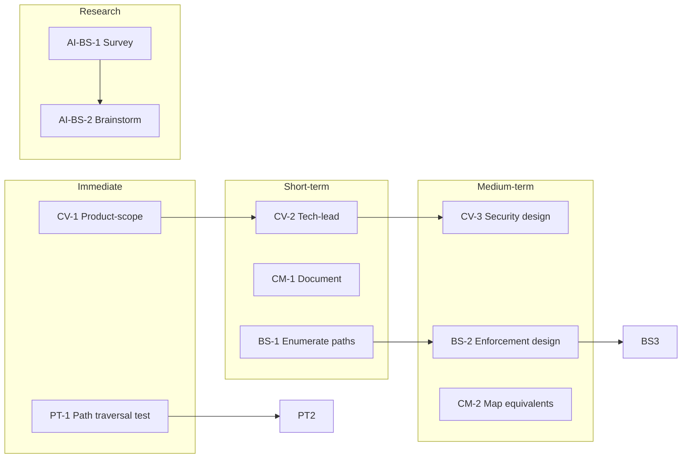

# Security Vectors Task Decomposition and AI Pools Research

## 1. Task Decomposition by Vector

### 1.1 Credential Vault (High Risk)

**Current state:** APPROVAL_NEEDED is policy-only in [TOOL_SAFEGUARDS.md](D:\portfolio-harness\local-proto\docs\TOOL_SAFEGUARDS.md) and [.cursor/docs/TOOL_SAFEGUARDS.md](D:\portfolio-harness.cursor\docs\TOOL_SAFEGUARDS.md). The credential-vault MCP server executes `create`, `update`, `revoke`, `export` on call—no server-side gate.


| Task ID | Task                                                                                                                          | Owner | Dependencies | Verification                                                |
| ------- | ----------------------------------------------------------------------------------------------------------------------------- | ----- | ------------ | ----------------------------------------------------------- |
| CV-1    | **Product-scope:** Document requirements for credential vault server-side gate (pre-execution check, human confirmation flow) | Human | —            | Scope doc in `.cursor/state/scope_credential_vault_gate.md` |
| CV-2    | **Tech-lead:** Decide placement—credential-vault MCP fork vs wrapper vs Cursor feature request                                | Human | CV-1         | Architect proposal: path, layer, rationale                  |
| CV-3    | **Security-sentinel:** Design pre-execution gate (block until human confirms; audit log; timeout/abort)                       | Human | CV-2         | Threat model; no credential leak on abort                   |
| CV-4    | **Implement:** Add server-side gate to credential-vault MCP (or wrapper)                                                      | Dev   | CV-3         | Unit test: unapproved call returns error                    |
| CV-5    | **Agent-native:** Ensure credential_vault_* tools remain discoverable; document gate in MCP_CAPABILITY_MAP                    | Dev   | CV-4         | Capability discovery audit                                  |


**Tech-lead placement options:**

- **A:** Fork credential-vault MCP, add gate before handler
- **B:** Wrapper/proxy MCP that intercepts credential-vault calls
- **C:** Cursor feature request (long-term; no immediate control)

---

### 1.2 Cursor-Provided MCPs (Medium Risk)

**Current state:** Documented in [known-issues.md](D:\portfolio-harness.cursor\state\known-issues.md) and [TOOL_SAFEGUARDS.md](D:\portfolio-harness\local-proto\docs\TOOL_SAFEGUARDS.md) § Audit gaps. cursor-ide-browser and built-in Playwright bypass audit_wrapper; no mcp_audit.jsonl or intent_decisions.jsonl.


| Task ID | Task                                                                                                                        | Owner | Dependencies | Verification                            |
| ------- | --------------------------------------------------------------------------------------------------------------------------- | ----- | ------------ | --------------------------------------- |
| CM-1    | **Document:** Add "Cursor-provided MCP audit gap" to TOOL_SAFEGUARDS with explicit mitigation (prefer mcp.json equivalents) | Dev   | —            | TOOL_SAFEGUARDS updated                 |
| CM-2    | **Tech-lead:** Map cursor-ide-browser and Playwright MCP equivalents in mcp.json; document which tools have audit coverage  | Dev   | —            | Table: Cursor MCP → mcp.json equivalent |
| CM-3    | **Agent-native:** Audit action parity—ensure mcp.json Playwright/browser tools cover same user actions as Cursor MCPs       | Dev   | CM-2         | Action parity score                     |
| CM-4    | **Optional:** Add Cursor feature request for audit_wrapper integration with built-in MCPs                                   | Human | —            | Tracking only                           |


---

### 1.3 Bitcoin-Sourced Data (Medium Risk)

**Current state:** Policy in [.cursorrules](D:\portfolio-harness.cursorrules) and [blue-hat-bitcoin SKILL](D:\portfolio-harness.cursor\skills\blue-hat-bitcoin\SKILL.md). No enforcement on ingestion paths (observation_log_append, provenance, AI Trends, etc.).


| Task ID | Task                                                                                                                 | Owner | Dependencies | Verification                                                            |
| ------- | -------------------------------------------------------------------------------------------------------------------- | ----- | ------------ | ----------------------------------------------------------------------- |
| BS-1    | **Product-scope:** Enumerate all Bitcoin ingestion paths (observation MCP, provenance MCP, ai_trends, scripts, etc.) | Dev   | —            | List in scope doc                                                       |
| BS-2    | **Security-sentinel:** Design enforcement—where to gate (MCP handler vs caller vs pre-commit)                        | Human | BS-1         | Threat model; no bypass paths                                           |
| BS-3    | **Implement:** Add SCP gate + provenance recording to observation_log_append when content is Bitcoin-sourced         | Dev   | BS-2         | Test: Bitcoin tx content → scp_run_pipeline + bitcoin_provenance_record |
| BS-4    | **Implement:** Add SCP gate to provenance MCP bitcoin_provenance_record caller path (if content flows to LLM)        | Dev   | BS-2         | Same as BS-3                                                            |
| BS-5    | **Document:** Update BITCOIN_AGENT_CAPABILITIES.md with enforced paths                                               | Dev   | BS-3, BS-4   | Doc reflects implementation                                             |


**Ingestion paths to audit:**

- `observation_log_append` (observation MCP)
- `bitcoin_provenance_record` / `document_provenance_record` (provenance MCP)
- AI Trends ingestion (YouTube, FutureTools, newsletters)
- Any script that fetches mempool.space, blockstream, inscriptions

---

### 1.4 Path Traversal — Filesystem MCP (Medium Risk)

**Current state:** V6 in [security_audit plan](D:\software.cursor\plans\security_audit_scp_testing_observability_617191e9.plan.md). `../` resolution not yet confirmed. Filesystem MCP uses `list_allowed_directories`; behavior of `../` within or across allowed dirs is unknown.


| Task ID | Task                                                                                                                                      | Owner | Dependencies | Verification                    |
| ------- | ----------------------------------------------------------------------------------------------------------------------------------------- | ----- | ------------ | ------------------------------- |
| PT-1    | **Security-sentinel:** Confirm Filesystem MCP `../` resolution—test read_file, edit_file, write_file with paths containing `../`          | Dev   | —            | Test report: safe or vulnerable |
| PT-2    | **Implement (if vulnerable):** Add path normalization and allowlist check before any file op; reject paths resolving outside allowed dirs | Dev   | PT-1         | Unit tests for `../` escape     |
| PT-3    | **Document:** Add path traversal mitigation to TOOL_SAFEGUARDS or known-issues                                                            | Dev   | PT-1         | Doc updated                     |


**Note:** Filesystem MCP is Cursor-provided (mcp_filesystem_*). If it is a built-in, PT-2 may require Cursor feature request or wrapper; PT-1 is still valuable to confirm behavior.

---

## 2. Cross-Cutting: Agent-Native Audit

Per `/agent-native-audit`, run an audit against the 8 principles. Security vectors map to:


| Principle           | Relevant Vectors                                         |
| ------------------- | -------------------------------------------------------- |
| Action Parity       | CM (Cursor MCPs vs mcp.json equivalents)                 |
| Tools as Primitives | CV (credential vault—gate is policy, not primitive)      |
| CRUD Completeness   | BS (provenance, observation—ensure full CRUD with gates) |
| Shared Workspace    | All (audit log, credential vault—same data space?)       |


**Task:** Schedule agent-native-audit subagents (or single-principle audits) after security vector tasks complete. Add to [pending_tasks.md](D:\portfolio-harness.cursor\state\pending_tasks.md) as PENDING_AGENT_NATIVE.

---

## 3. AI Pools + Bitcoin Block Space Research (New To-Do)

**Topic:** AI pools using Bitcoin block space/data as prompts for sovereign decentralized AI compute pools.

**Rationale:** Emerging space (Gonka AI, x402 Stacks, Lumerin, DeltaHash, Cocoon). Bitcoin block space as data layer for AI prompts/compute coordination aligns with harness Bitcoin-Chaos and local-first themes. Research fits PENDING_FUTURE / PENDING_RESEARCH pattern (like G6).

**Proposed placement:**

- **pending_tasks.md:** Add to `PENDING_FUTURE` or new `PENDING_RESEARCH` section
- **Brainstorm doc:** `docs/brainstorms/2026-03-16-ai-pools-bitcoin-block-space-brainstorm.md` (created when research starts)

**Task decomposition for research:**


| Task ID | Task                                                                                                                                                     | Owner      | Verification                            |
| ------- | -------------------------------------------------------------------------------------------------------------------------------------------------------- | ---------- | --------------------------------------- |
| AI-BS-1 | **Best-practices-researcher:** Survey projects (Gonka AI, x402 Stacks, Lumerin, DeltaHash, Cocoon, Routstr); Bitcoin block space as data vs payment rail | Subagent   | Summary doc                             |
| AI-BS-2 | **Brainstorm:** Run `/brainstorm` on "AI pools using Bitcoin block space/data as prompts for sovereign decentralized AI compute"                         | Human + AI | Brainstorm doc in docs/brainstorms/     |
| AI-BS-3 | **Scope:** Decide if harness integrates (e.g. observation source, Routstr skill extension) or tracking only                                              | Human      | Decision in scope-notes or decision-log |


**Suggested pending_tasks entry:**

```markdown
| G9 | pending | **Research: AI pools + Bitcoin block space** — AI compute pools using Bitcoin block space/data as prompts for sovereign decentralized AI. Survey: Gonka AI, x402 Stacks, Lumerin, DeltaHash, Routstr. Brainstorm: docs/brainstorms/2026-03-16-ai-pools-bitcoin-block-space-brainstorm.md. | [BITCOIN_OBSERVATION_SOURCES](../../docs/BITCOIN_OBSERVATION_SOURCES.md), [Routstr SKILL](../skills/routstr/SKILL.md) |
```

---

## 4. Implementation Order




---

## 5. File References


| Area                        | Path                                                                                                                                            |
| --------------------------- | ----------------------------------------------------------------------------------------------------------------------------------------------- |
| Security plan               | [security_audit_scp_testing_observability_617191e9.plan.md](D:\software.cursor\plans\security_audit_scp_testing_observability_617191e9.plan.md) |
| TOOL_SAFEGUARDS             | [local-proto/docs/TOOL_SAFEGUARDS.md](D:\portfolio-harness\local-proto\docs\TOOL_SAFEGUARDS.md)                                                 |
| Pending tasks               | [.cursor/state/pending_tasks.md](D:\portfolio-harness.cursor\state\pending_tasks.md)                                                            |
| Known issues                | [.cursor/state/known-issues.md](D:\portfolio-harness.cursor\state\known-issues.md)                                                              |
| Brainstorms                 | [docs/brainstorms/](D:\portfolio-harness\docs\brainstorms/)                                                                                     |
| Bitcoin observation sources | [docs/BITCOIN_OBSERVATION_SOURCES.md](D:\portfolio-harness\docs\BITCOIN_OBSERVATION_SOURCES.md)                                                 |


---

## 6. Summary

- **4 vectors** decomposed into **~20 tasks** with IDs, owners, dependencies, verification.
- **Tech-lead:** Placement proposals for credential vault gate; MCP equivalent mapping.
- **Security-sentinel:** Pre-execution gate design; path traversal test; Bitcoin ingestion enforcement design.
- **Product-scope:** Scope docs for credential vault and Bitcoin ingestion paths.
- **Agent-native:** Action parity, capability discovery, CRUD completeness checks.
- **AI pools research:** New G9 (or equivalent) in pending_tasks; brainstorm doc path; best-practices-researcher + brainstorm workflow.

