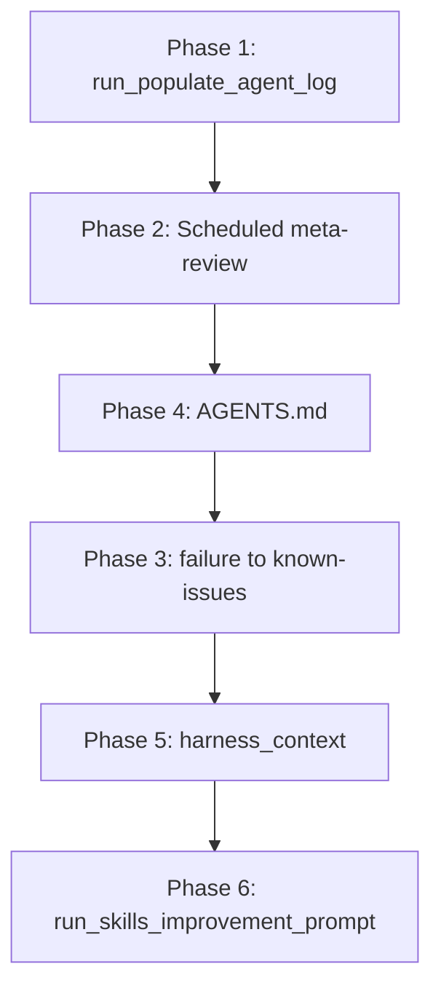

# Skills Self-Improvement Wins Implementation Plan

Implement the six remaining wins from [SKILL_SELF_IMPROVEMENT_WINS.md](D:\portfolio-harness.cursor\docs\SKILL_SELF_IMPROVEMENT_WINS.md) in the recommended order. Win 5 (AGENT_ENTRY_INDEX row) is already done.

---

## Phase 1: Win 1 — Populate agent_log

**Goal:** Ensure meta-review has signal; agents append skill_load and failure events.

### 1.1 Add run_populate_agent_log_prompt.ps1

Create `[.cursor/scripts/run_populate_agent_log_prompt.ps1](D:\portfolio-harness\.cursor\scripts\run_populate_agent_log_prompt.ps1)` following the pattern of [run_meta_review.ps1](D:\portfolio-harness.cursor\scripts\run_meta_review.ps1):

- Output a pasteable prompt: "Append skill_load and failure events from this session to agent_log per AGENT_TELEMETRY.md. Use `python .cursor/scripts/log_agent_event.py` for each event. Events: [list from session]. Path: .cursor/state/agent_log.jsonl."
- Include usage hint: "Run at end of session when agent loaded skills or encountered failures but did not log them."

### 1.2 Add "populate agent_log" to handoff template

In `[.cursor/state/README.md](D:\portfolio-harness\.cursor\state\README.md)`, under the handoff schema or delegation checklist, add an optional ritual:

- When writing handoff: "If agent_log was not populated this session (skill_load, failure, critic_score), consider Next: 'Populate agent_log from this session per AGENT_TELEMETRY.md' or run `run_populate_agent_log_prompt.ps1` and paste into new chat."

**Verification:** `.\\.cursor\\scripts\\run_populate_agent_log_prompt.ps1` outputs a pasteable prompt.

---

## Phase 2: Win 2 — Scheduled meta-review

**Goal:** Make meta-review a recurring ritual; add to handoff and weekly checklist.

### 2.1 Expand harness_context in state/README.md

In `[.cursor/state/README.md](D:\portfolio-harness\.cursor\state\README.md)`, expand the `harness_context` bullet (around line 86) with examples:

- `harness_context: meta-review due` — when N handoffs since last run (e.g. 5+)
- `harness_context: meta-review session; check agent_log` — (existing)
- Add: "Weekly: run `.\.cursor\scripts\run_meta_review.ps1`; paste prompt into new chat."

### 2.2 Add weekly checklist to HANDOFF_FLOW.md

In `[.cursor/HANDOFF_FLOW.md](D:\portfolio-harness\.cursor\HANDOFF_FLOW.md)`, add a "Weekly rituals" or "Governance checklist" section after the flow:

- Weekly: Run `.\.cursor\scripts\run_meta_review.ps1`; paste prompt into new chat. Consider running after 5+ handoffs.
- Link to [SKILL_SELF_IMPROVEMENT_WINS.md](D:\portfolio-harness.cursor\docs\SKILL_SELF_IMPROVEMENT_WINS.md).

**Verification:** HANDOFF_FLOW mentions run_meta_review.ps1; state/README harness_context examples include meta-review due.

---

## Phase 3: Win 4 — Wire continual-learning to AGENTS.md

**Goal:** Give continual-learning a target file; create .cursor/state/AGENTS.md.

### 3.1 Create .cursor/state/AGENTS.md

Create `[.cursor/state/AGENTS.md](D:\portfolio-harness\.cursor\state\AGENTS.md)` with minimal schema:

```markdown
# Agent Memory (continual-learning output)

Updated by continual-learning skill from transcript deltas. See continual-learning skill.

## Learned User Preferences

- (populated by continual-learning)

## Learned Workspace Facts

- (populated by continual-learning)
```

### 3.2 Document in state/README.md

In `[.cursor/state/README.md](D:\portfolio-harness\.cursor\state\README.md)`, add AGENTS.md to the "Schema artifacts" list (around line 7–16):

- `AGENTS.md` — continual-learning output; Learned User Preferences, Learned Workspace Facts. See continual-learning skill.

### 3.3 Add run_continual_learning_prompt.ps1

Create `[.cursor/scripts/run_continual_learning_prompt.ps1](D:\portfolio-harness\.cursor\scripts\run_continual_learning_prompt.ps1)`:

- Output pasteable prompt: "Run continual-learning. Transcript root: ~/.cursor/projects//agent-transcripts/. Update .cursor/state/AGENTS.md per skill. Existing memory: .cursor/state/AGENTS.md."
- Note: Workspace slug may need to be inferred (e.g. `d-portfolio-harness` or similar). Document in script comment or use a placeholder.

**Verification:** AGENTS.md exists; continual-learning skill can read/write it.

---

## Phase 4: Win 3 — failure to known-issues

**Goal:** Meta-review suggestions become copy-pasteable known-issues entries; human-gated.

### 4.1 Add meta-review output template to SKILL_SELF_IMPROVEMENT_WINS

In `[.cursor/docs/SKILL_SELF_IMPROVEMENT_WINS.md](D:\portfolio-harness\.cursor\docs\SKILL_SELF_IMPROVEMENT_WINS.md)`, add a "Suggested known-issues format" section with the exact format meta-review should output:

```markdown
- **Symptom:** "<context from failure event>". **Location:** TBD. **Issue:** <one-line>. **Note:** Suggested from agent_log failure YYYY-MM-DD.
```

### 4.2 Create append_known_issues_candidates.ps1

Create `[.cursor/scripts/append_known_issues_candidates.ps1](D:\portfolio-harness\.cursor\scripts\append_known_issues_candidates.ps1)`:

- Accept stdin or `-InputFile` with meta-review report (or raw text).
- Parse or extract suggested known-issues bullets (regex or simple line-based).
- Output formatted bullets to stdout for user to paste into known-issues.md. **No auto-append** (human-gated).
- Usage: `Get-Content meta_review_report.md | .\.cursor\scripts\append_known_issues_candidates.ps1` or `.\append_known_issues_candidates.ps1 -InputFile report.md`

### 4.3 Document in AGENT_TELEMETRY.md

In `[.cursor/docs/AGENT_TELEMETRY.md](D:\portfolio-harness\.cursor\docs\AGENT_TELEMETRY.md)`, add a short section "After meta-review":

- Suggested known-issues entries go to known-issues.md per state/README schema. Human approves. Use append_known_issues_candidates.ps1 to format output for paste.

**Verification:** Meta-review output can be piped to script; script outputs pasteable bullets.

---

## Phase 5: Win 6 — Skill creation in handoff

**Goal:** When Next involves creating/updating a skill, standard checklist applies.

### 5.1 Expand harness_context in state/README.md

In `[.cursor/state/README.md](D:\portfolio-harness\.cursor\state\README.md)`, add to harness_context examples:

- `harness_context: skill creation; use writing-skills RED-GREEN-REFACTOR` — when Next is create/update skill X

### 5.2 Add to HANDOFF_FLOW or session_start

In `[.cursor/HANDOFF_FLOW.md](D:\portfolio-harness\.cursor\HANDOFF_FLOW.md)` or `[.cursor/state/session_start_prompt.txt](D:\portfolio-harness\.cursor\state\session_start_prompt.txt)`:

- Add a note: "When Next involves creating or updating a skill: Load writing-skills and create-skill; run verification-before-completion before claiming done. Set harness_context: skill creation."

**Verification:** Handoff with skill-creation Next can include harness_context; session_start or HANDOFF_FLOW references the checklist.

---

## Phase 6: Win 7 — run_skills_improvement_prompt.ps1

**Goal:** One-shot prompt to run the full skills-improvement loop.

### 6.1 Create run_skills_improvement_prompt.ps1

Create `[.cursor/scripts/run_skills_improvement_prompt.ps1](D:\portfolio-harness\.cursor\scripts\run_skills_improvement_prompt.ps1)`:

- Param: `-Phase` with values: `observe`, `learn`, `design`, `implement`, `verify`, `full` (default: full)
- **observe:** Output meta-review prompt (delegate to run_meta_review.ps1 or inline)
- **learn:** Output continual-learning prompt (delegate to run_continual_learning_prompt.ps1 or inline)
- **design:** Output brainstorming + document-review prompt
- **implement:** Output writing-skills + create-skill prompt
- **verify:** Output verification-before-completion prompt
- **full:** Output combined prompt: meta-review → continual-learning → if suggestions, brainstorm → document-review → writing-skills → verification

Follow pattern of [run_meta_review.ps1](D:\portfolio-harness.cursor\scripts\run_meta_review.ps1): Write-Host the prompt, then hint to copy and paste.

**Verification:** `.\\.cursor\\scripts\\run_skills_improvement_prompt.ps1 -Phase full` outputs a pasteable prompt.

---

## File summary


| File                                                 | Action                                             |
| ---------------------------------------------------- | -------------------------------------------------- |
| `.cursor/scripts/run_populate_agent_log_prompt.ps1`  | Create                                             |
| `.cursor/scripts/run_continual_learning_prompt.ps1`  | Create                                             |
| `.cursor/scripts/append_known_issues_candidates.ps1` | Create                                             |
| `.cursor/scripts/run_skills_improvement_prompt.ps1`  | Create                                             |
| `.cursor/state/AGENTS.md`                            | Create                                             |
| `.cursor/state/README.md`                            | Edit (harness_context, AGENTS.md, populate ritual) |
| `.cursor/HANDOFF_FLOW.md`                            | Edit (weekly checklist, skill creation note)       |
| `.cursor/docs/SKILL_SELF_IMPROVEMENT_WINS.md`        | Edit (known-issues template)                       |
| `.cursor/docs/AGENT_TELEMETRY.md`                    | Edit (after meta-review section)                   |
| `.cursor/state/session_start_prompt.txt`             | Edit (optional; skill creation hint)               |


---

## Dependency order




Phases 1, 2, 4 can be done in parallel. Phase 3 depends on 4 only for script placement. Phase 5 and 6 are independent of 3.

---

## Risk

- **Low:** All changes are docs and scripts; no production code or config changes.
- **Human-gated:** append_known_issues_candidates.ps1 does not auto-append; user pastes manually.

