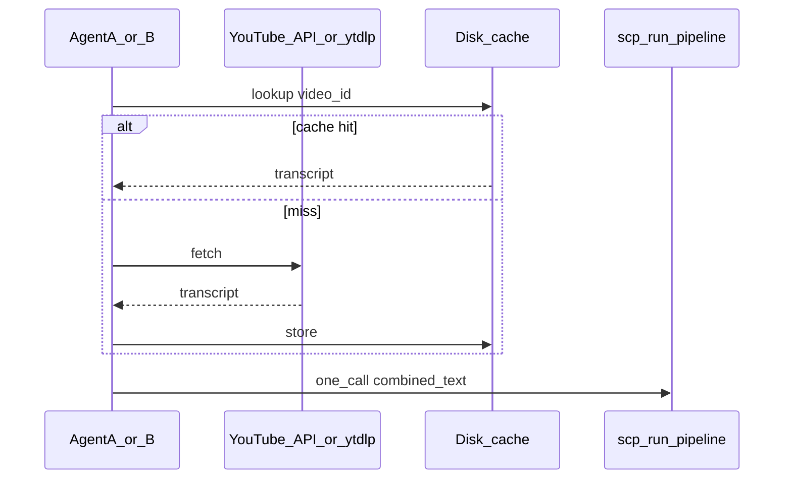

# Improve latency: YouTube + SCP + curated excerpts

## What is actually slow (ordered by typical impact)

### 1. YouTube captions (`[D:/local-proto/scripts/ai_trends_mcp.py](D:/local-proto/scripts/ai_trends_mcp.py)` + `[D:/local-proto/scripts/ai_trends_utils.py](D:/local-proto/scripts/ai_trends_utils.py)`)

- **Primary path:** `YouTubeTranscriptApi.get_transcript(video_id)` — usually one HTTP round-trip; fast when it succeeds.
- **Fallback:** Any exception triggers `fetch_captions_ytdlp`, which runs **yt-dlp** with subtitle download into a temp dir and parses VTT/SRT. That is **much slower** (extra process, YouTube extraction, file I/O).
- **No cache:** Every agent run repeats network work for the same `video_id`.

**Improvements**

- Add a **disk cache** keyed by `video_id` under something like `.cursor/state/ai_trends/transcripts/{video_id}.json` (store `transcript`, `source`, `fetched_at`). Skip network if fresh (TTL, e.g. 7–30 days) unless `force=true`.
- If the transcript API fails often, **diagnose why** (rate limits, YouTube changes) rather than always paying the yt-dlp cost; optional cookie/proxy config is a separate ops concern.
- For this one-off workflow, **paste or save the transcript once** next to the plan and reuse — avoids duplicate fetches when two agents run the same pipeline.

### 2. SCP `run_pipeline` (`[D:/scp/src/scp/scp_utils.py](D:/scp/src/scp/scp_utils.py)`)

- Default path: `inspect` → optional sanitize/contain. **String-size linear** work (regex/structural scans); large combined excerpts + full transcript can add noticeable CPU.
- **Semantic judge** (`semantic_judge` option or `SCP_SEMANTIC_JUDGE=1`): runs only when `tier == "clean"` **and** `sink in ("handoff", "state")` — **not** for `sink='llm_context'`. So for ingest-to-LLM, ensure the agent uses `llm_context` if you want to avoid an extra LLM call here.
- Prefer **one** `scp_run_pipeline` on the **concatenated** blob (excerpts + transcript) rather than multiple calls per fragment (fewer inspect passes and MCP round-trips).

### 3. Other ai-trends tools (only if the agent uses them)

- `[summarize_content](D:/local-proto/scripts/ai_trends_mcp.py)` calls **Ollama** (`OLLAMA_BASE_URL`, `OLLAMA_MODEL`) with up to **60s** timeout — very slow if accidentally invoked.
- `run_ingestion_pipeline` subprocess has a **300s** timeout — irrelevant unless the workflow triggers full ingest.
- If you use `**scp_analyze_ai_trends`**-style flows that SCP **each ingested file**, wall time scales with file count — batch or scope dates.

### 4. MCP / Cursor transport

- Very large `content` strings can stress JSON serialization or hit limits; the plan already noted `scp_inspect` **MCP JSON errors** (`[repo_landscape_reflection` plan](D:/software/.cursor/plans/repo_landscape_reflection_0a147e4f.plan.md)). Mitigations: **bounded excerpts** for README pulls, or split into labeled sections with **one** SCP call still possible if you concatenate with clear delimiters (policy: still one inspect over full trusted assembly — if you split SCP, you change assurance).

### 5. Two agents in parallel

- Duplicate work: double caption fetch, double SCP. **Mitigation:** shared transcript file or cache dir; or **serialize** (second agent waits / reads artifact from first).

## Recommended implementation order (when you exit plan-only mode)

1. **Transcript cache** in `ai_trends_mcp.py` / shared util — highest ROI for repeated `video_id`s.
2. **Workflow discipline:** one concatenation + one `scp_run_pipeline(..., sink='llm_context')`; avoid accidental `summarize_content` / full ingest.
3. **Multi-agent:** artifact path or lock so only one fetch runs.
4. **Optional:** cap README excerpt size before merge if JSON/MCP limits appear.

## What we are not doing without explicit approval

- Skipping SCP on third-party text (violates your harness policy).
- Disabling structural inspection for speed.

