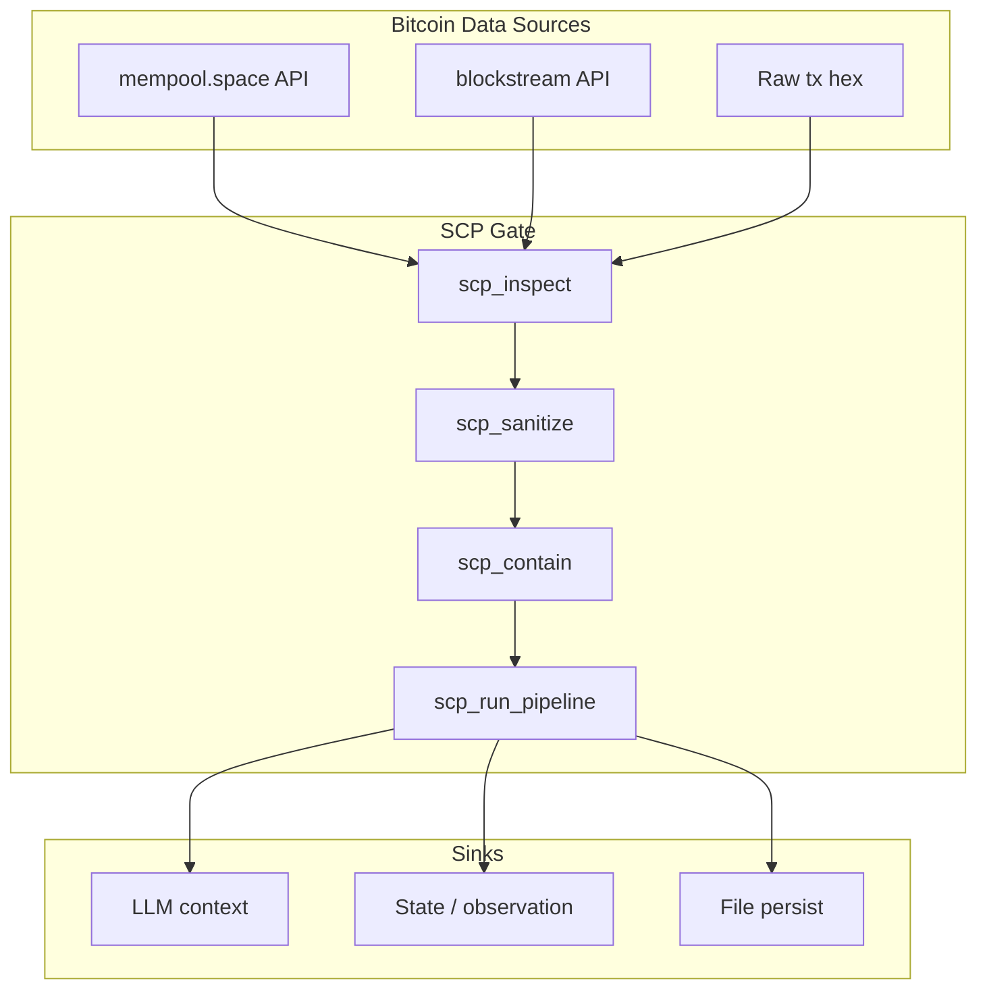

# Stack Integration: Workshop Resources and SCP Bitcoin Targets

Integrate the workshop prep content (videos, debate materials, leading questions) into the stack and add Bitcoin transactions and mempool as explicit SCP targets.

---

## 1. SCP: Bitcoin Transactions and Mempool as Targets

### Current state

- [scp_threat_registry.json](D:\scp\src\scp\scp_threat_registry.json) has `bitcoin_inscription_override` for OP_RETURN/inscriptions
- [scope_bitcoin_ingestion_paths.md](D:\portfolio-harness.cursor\state\scope_bitcoin_ingestion_paths.md) lists "Scripts fetching mempool.space, blockstream" as **Caller responsibility** (no enforced gate)
- [blue-hat-bitcoin SKILL](D:\portfolio-harness.cursor\skills\blue-hat-bitcoin\SKILL.md) and [TOOL_SAFEGUARDS](D:\local-proto\docs\TOOL_SAFEGUARDS.md) require SCP gate for tx, inscription, OP_RETURN, script output

### Gaps

- Raw transaction data (hex, decoded tx, witness data) and mempool API responses are not explicitly enumerated as SCP targets
- No programmatic enforcement for scripts/MCPs that fetch mempool or tx content

### Actions

| Action                                               | Location                                                                                               | Detail                                                                                                                                                                                  |
| ---------------------------------------------------- | ------------------------------------------------------------------------------------------------------ | --------------------------------------------------------------------------------------------------------------------------------------------------------------------------------------- |
| Add `bitcoin_tx_mempool_override` to threat registry | [scp_threat_registry.json](D:\scp\src\scp\scp_threat_registry.json)                                    | New pattern key for tx hex, witness, mempool payloads that may contain injection. Reuse or extend `bitcoin_inscription_override` patterns; mempool/tx can carry same injection vectors. |
| Wire new key in sanitize_input                       | [scp/sanitize_input.py](D:\scp\src\scp\sanitize_input.py)                                              | Add `bitcoin_tx_mempool_override` to the keys iterated (line 251).                                                                                                                      |
| Enumerate mempool/tx as ingestion paths              | [scope_bitcoin_ingestion_paths.md](D:\portfolio-harness.cursor\state\scope_bitcoin_ingestion_paths.md) | Add rows: `mempool.space API (tx/hex)`, `blockstream API (tx)`, `any script returning raw tx content`. Status: SCP gate required; document caller responsibility until scripts exist.   |
| Document in BITCOIN_AGENT_CAPABILITIES               | [BITCOIN_AGENT_CAPABILITIES.md](D:\portfolio-harness\docs\BITCOIN_AGENT_CAPABILITIES.md)               | Add "Mempool and raw tx" to SCP gate section: before feeding mempool tx list, decoded tx, or tx hex to LLM/state, run `scp_run_pipeline`; record provenance.                            |
| Update blue-hat-bitcoin SKILL                        | [blue-hat-bitcoin/SKILL.md](D:\portfolio-harness.cursor\skills\blue-hat-bitcoin\SKILL.md)              | Extend SCP Gate to include "mempool tx list, raw tx hex, decoded tx, witness data."                                                                                                     |

---

## 2. local-proto: Workshop Resources Integration

### Add workshop resources to reference docs

| Action                                         | Location                                                                                                                               | Detail                                                                                                                                                                                                                                                                                       |
| ---------------------------------------------- | -------------------------------------------------------------------------------------------------------------------------------------- | -------------------------------------------------------------------------------------------------------------------------------------------------------------------------------------------------------------------------------------------------------------------------------------------- |
| Add "Workshop / Panel Prep" section            | [BITCOIN_OBSERVATION_SOURCES.md](D:\portfolio-harness\docs\BITCOIN_OBSERVATION_SOURCES.md)                                             | New table: Workshop prep videos (TFTC Jim Carucci, Matt Corallo, Lightning Labs L402, Cashu Calle), debate materials (Spiral, open vs proprietary), leading questions. Link to [2026-03-18-panel-workshop-prep.md](D:\portfolio-harness\docs\brainstorms\2026-03-18-panel-workshop-prep.md). |
| Add to CASHU_L402_REFERENCE or TOOL_SAFEGUARDS | [CASHU_L402_REFERENCE.md](D:\local-proto\docs\CASHU_L402_REFERENCE.md) or [TOOL_SAFEGUARDS.md](D:\local-proto\docs\TOOL_SAFEGUARDS.md) | Optional: "Workshop prep" subsection with links to L402, x402, Routstr, Cashu, Spiral—already in workshop doc; cross-link from TOOL_SAFEGUARDS Bitcoin section.                                                                                                                              |
| Catalog workshop prep as context resource      | [TOOLS_TO_INTEGRATE.md](D:\local-proto\docs\TOOLS_TO_INTEGRATE.md)                                                                     | Add "Workshop / Panel Prep (Bitcoin+AI)" to Tier 3 Context: path to workshop prep doc; use for agent prep before Bitcoin/agentic-payment tasks.                                                                                                                                              |

---

## 3. local-first: Traceability and Resources

| Action                              | Location                                                                                    | Detail                                                                                                                                                                                          |
| ----------------------------------- | ------------------------------------------------------------------------------------------- | ----------------------------------------------------------------------------------------------------------------------------------------------------------------------------------------------- |
| Add workshop resources reference    | [local-first/RESOURCES.md](D:\local-first\RESOURCES.md) or new `BITCOIN_AGENT_RESOURCES.md` | If RESOURCES.md exists: add "Bitcoin + AI agent payments" subsection with workshop prep link. Otherwise: document in portfolio-harness only; local-first stays domain-agnostic per DELINEATION. |
| Align with AI_SECURITY traceability | [AI_SECURITY.md](D:\local-first\AI_SECURITY.md)                                             | No code change. When agents use workshop prep for Bitcoin tasks, ensure audit log captures tool/resource access. Already covered by observability layer.                                        |

---

## 4. harness: Core vs Implementation

| Action                                           | Location                                                                                                                               | Detail                                                                                                                                                                        |
| ------------------------------------------------ | -------------------------------------------------------------------------------------------------------------------------------------- | ----------------------------------------------------------------------------------------------------------------------------------------------------------------------------- |
| Keep workshop content in implementation          | [DELINEATION.md](D:\harness\docs\DELINEATION.md)                                                                                       | Workshop prep is domain-specific (Bitcoin, AI agents, panel). Stays in portfolio-harness.                                                                                     |
| Promote SCP + Bitcoin tx/mempool pattern to core | [harness/.cursor/skills/secure-contain-protect](D:\harness.cursor\skills\secure-contain-protect\SKILL.md) or reference                 | If secure-contain-protect skill references Bitcoin: add "Bitcoin tx and mempool" as SCP target. Harness core = portable pattern; Bitcoin-specific registry stays in scp repo. |
| Document in harness docs                         | [HARNESS_ARCHITECTURE.md](D:\harness\docs\HARNESS_ARCHITECTURE.md) or [CONTEXT_ENGINEERING.md](D:\harness\docs\CONTEXT_ENGINEERING.md) | Optional: one-line note that Bitcoin-sourced data (tx, mempool, inscriptions) requires SCP gate per TOOL_SAFEGUARDS.                                                          |

---

## 5. Reflection Points: How Else to Use This Information

| Reflection                   | Where                                                                                                 | Action                                                                                                                                                                                                 |
| ---------------------------- | ----------------------------------------------------------------------------------------------------- | ------------------------------------------------------------------------------------------------------------------------------------------------------------------------------------------------------ |
| **Decision log**             | [.cursor/state/decision-log.md](D:\portfolio-harness.cursor\state\decision-log.md)                    | Add: "SCP: Bitcoin tx and mempool as explicit targets; workshop resources integrated into BITCOIN_OBSERVATION_SOURCES."                                                                                |
| **Observation log**          | observation MCP                                                                                       | After workshop: `observation_log_append` with learnings (e.g. "L402 vs Cashu flow; data layer vs payment; 402 handling in frameworks"). Source: workshop, obs_type: design_decision or community_norm. |
| **Known issues / playbooks** | [TROUBLESHOOTING_AND_PLAYBOOKS.md](D:\portfolio-harness.cursor\docs\TROUBLESHOOTING_AND_PLAYBOOKS.md) | If workshop surfaces new patterns (e.g. "agent hits 402, doesn't retry"): add playbook entry.                                                                                                          |
| **Skills and triggers**      | blue-hat-bitcoin, price-deals, Routstr                                                                | Workshop reinforces: load blue-hat-bitcoin when processing Bitcoin data; Routstr for pay-per-token; prefer L402/Cashu over x402/ACP. No code change if already in skills.                              |
| **Org-intent**               | org-intent.bitcoin-inspired.json                                                                      | Workshop aligns with hb-3 (no trust for unverified URLs), open rails preference. No change unless new boundary emerges.                                                                                |
| **Agent entry index**        | [AGENT_ENTRY_INDEX.md](D:\portfolio-harness.cursor\docs\AGENT_ENTRY_INDEX.md)                         | Add workshop prep doc to "Bitcoin infrastructure" or "Panel/event prep" section if not already linked.                                                                                                 |

---

## 6. Data Flow: SCP for Bitcoin Tx and Mempool

---

## 7. Implementation Order

1. **SCP**: Add `bitcoin_tx_mempool_override` to registry and sanitize_input
2. **scope_bitcoin_ingestion_paths**: Enumerate mempool/tx paths
3. **BITCOIN_AGENT_CAPABILITIES**: Document mempool/tx SCP requirement
4. **blue-hat-bitcoin SKILL**: Extend SCP Gate list
5. **BITCOIN_OBSERVATION_SOURCES**: Add Workshop / Panel Prep section
6. **TOOLS_TO_INTEGRATE**: Add workshop prep to Tier 3
7. **decision-log**: Append entry
8. **AGENT_ENTRY_INDEX**: Link workshop prep if missing

---

## 8. Files to Modify (Summary)

| Repo/Path         | File                                           | Changes                         |
| ----------------- | ---------------------------------------------- | ------------------------------- |
| scp               | src/scp/scp_threat_registry.json               | Add bitcoin_tx_mempool_override |
| scp               | src/scp/sanitize_input.py                      | Wire new key                    |
| portfolio-harness | .cursor/state/scope_bitcoin_ingestion_paths.md | Add mempool/tx rows             |
| portfolio-harness | docs/BITCOIN_AGENT_CAPABILITIES.md             | Mempool/tx SCP requirement      |
| portfolio-harness | .cursor/skills/blue-hat-bitcoin/SKILL.md       | Extend SCP Gate                 |
| portfolio-harness | docs/BITCOIN_OBSERVATION_SOURCES.md            | Workshop / Panel Prep section   |
| local-proto       | docs/TOOLS_TO_INTEGRATE.md                     | Workshop prep in Tier 3         |
| portfolio-harness | .cursor/state/decision-log.md                  | Decision entry                  |
| portfolio-harness | .cursor/docs/AGENT_ENTRY_INDEX.md              | Link workshop prep (if missing) |

