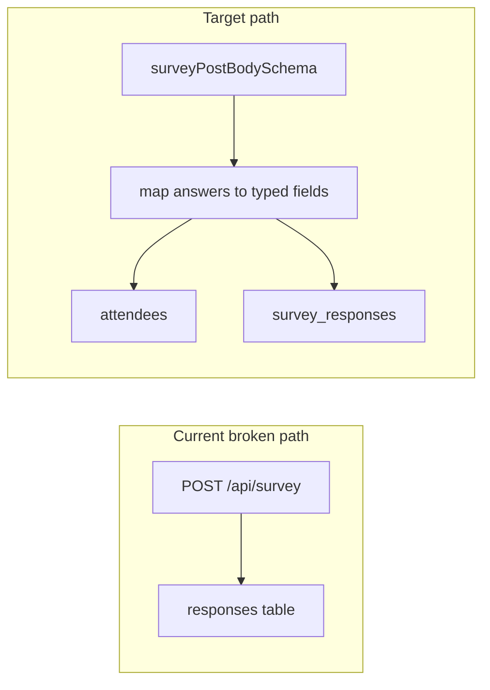

# Patch series: Survey Zod, DB alignment, tests

## Context (repo and drift)

Target app: **[portfolio-harness/OpenAtlas](D:/portfolio-harness/OpenAtlas)** (`open-atlas` package).

| Area                                                                                                | Finding                                                                                                                                                                                                                                                                                                                      |
| --------------------------------------------------------------------------------------------------- | ---------------------------------------------------------------------------------------------------------------------------------------------------------------------------------------------------------------------------------------------------------------------------------------------------------------------------- |
| Current `[src/app/api/survey/route.ts](D:/portfolio-harness/OpenAtlas/src/app/api/survey/route.ts)` | Parses JSON loosely; inserts into `**responses`** with `question_id` / `answer` — **no `responses` table** in `[src/lib/supabase/types.ts](D:/portfolio-harness/OpenAtlas/src/lib/supabase/types.ts)`.                                                                                                                       |
| Ground-truth DB shape                                                                               | `**attendees`** + `**survey_responses`** (normalized columns: `tenure_years`, `learning_style`, `shaped_by`, `peak_performance`, `motivation`, `unique_quality`) — matches `[createAttendee` / `createSurveyResponse](D:/portfolio-harness/OpenAtlas/src/lib/supabase/db.ts)`.                                               |
| Production UI                                                                                       | `[useSurveyForm](D:/portfolio-harness/OpenAtlas/src/lib/hooks/useSurveyForm.ts)` + `[SurveyForm/index.tsx](D:/portfolio-harness/OpenAtlas/src/components/SurveyForm/index.tsx)` submits **directly to Supabase** — **does not call** `/api/survey` today.                                                                    |
| Demo / alternate form                                                                               | `[components/form/SurveyForm.tsx](D:/portfolio-harness/OpenAtlas/src/components/form/SurveyForm.tsx)` already uses `firstName` / `answers[{ questionId, answer }]` (q1/q2 placeholders) — aligns with your API shape.                                                                                                        |
| Alignment routes                                                                                    | `[alignment-context` routes](D:/portfolio-harness/OpenAtlas/src/app/api/alignment-context/route.ts) already use `safeParse` + **400** + `parsed.error.flatten()`. `[alignmentContextPatchBodySchema](D:/portfolio-harness/OpenAtlas/src/lib/alignment-context/schemas.ts)` uses `.strict()`; **create** schema does **not**. |

Additional drift (out of scope for this series unless you expand scope): `[db.ts](D:/portfolio-harness/OpenAtlas/src/lib/supabase/db.ts)` references `survey_responses.status`, `moderated_at`, `test_data` in some queries, but those columns are **not** present on `survey_responses` in `types.ts` — consider a separate “regenerate types from Supabase” task.

---

## 1) Add `src/lib/survey/schemas.ts`

- Export `**surveyPostBodySchema**` (and inferred type) using existing `**zod**` dependency ([package.json](D:/portfolio-harness/OpenAtlas/package.json)).
- **Outer object**: `.strict()` to reject unknown keys (as you suggested).
- **Fields**:
  - `firstName`, `lastName`: `z.string().trim().min(1).max(...)` (pick sane max, e.g. 120–200).
  - `email`: `z.string().email().max(320)` (or `optional()` if anonymous submissions are required — see note below).
  - `isAnonymous`: optional boolean default `false` to align with `[SurveyFormData](D:/portfolio-harness/OpenAtlas/src/lib/hooks/types.ts)` (recommended).
  - `answers`: `z.array(z.object({ questionId: z.string().max(64), answer: z.string().max(8000) })).min(1)` — tune `max` per column in refinement if you want stricter caps per field.
- **Canonical `questionId` values**: use stable IDs that match **DB column names** (recommended): `tenure_years`, `learning_style`, `shaped_by`, `peak_performance`, `motivation`, `unique_quality`. Add a `z.enum([...])` **or** `superrefine` / separate parse step that validates each `(questionId, answer)` pair:
  - Enum fields: reuse unions from `types.ts` (`LearningStyle`, `ShapedBy`, etc.) via `z.enum([...])` literals aligned with `[Database](D:/portfolio-harness/OpenAtlas/src/lib/supabase/types.ts)`.
  - `tenure_years`: coerce from string to `z.number().int().min(0).max(80)` (or similar).
  - `unique_quality`: string with reasonable max length.

This keeps the wire format as `**answers[]`** while making the **meaning** align with `survey_responses`.

---

## 2) Add mapper: `answers` → `createSurveyResponse` payload

- New small module e.g. `**src/lib/survey/mapAnswersToSurveyResponse.ts`** (or functions colocated in `schemas.ts` if tiny).
- Input: validated `answers` array.
- Output: object matching `createSurveyResponse`’s parameter type (and optionally flags missing required questions).
- Behavior: **duplicate `questionId`**: last wins or 400 via refinement — pick one and document in code comment.
- On validation failure of individual values (bad enum): prefer returning a **structured Zod-like error** or throw a small discriminated error the route maps to 400.

---

## 3) Rewrite `[src/app/api/survey/route.ts](D:/portfolio-harness/OpenAtlas/src/app/api/survey/route.ts)`

- `await request.json()` inside try/catch → **400** `{ error: 'Invalid JSON body' }` (same pattern as alignment-context).
- `surveyPostBodySchema.safeParse(json)` → on failure **400** `{ error: 'Validation failed', issues: parsed.error.flatten() }`.
- **Only after success**: call `**createAttendee`** + `**createSurveyResponse`** from `[db.ts](D:/portfolio-harness/OpenAtlas/src/lib/supabase/db.ts)` with:
  - attendee: `first_name`, `last_name`, `email`, `is_anonymous` (from body).
  - response: mapped fields from `answers`.
- Remove inserts targeting `**responses`** entirely.
- Map **Supabase errors** to appropriate status codes where reasonable (e.g. unique constraint → 409 or 400 with message); keep generic 500 for unexpected failures.
- Optional small helper `**formatZodErrorFlat(error: ZodError)`** if reused — alignment routes already inline `flatten()`.

---

## 4) Tests (Vitest)

- **Today**: `"test": "echo \"No tests configured yet\"` — add **Vitest** + `**vitest.config.ts`** (or `vite.config` with test block) with `tsconfig` path alias `@/*` → `src/*` to match Next.
- **Tests to add** (minimal, high value):
  1. **Happy path**: valid body passes `surveyPostBodySchema` (and mapper produces expected `createSurveyResponse` input).
  2. **Invalid body**: unknown key on outer object triggers strict failure / malformed email / empty answers — expect parse failure shape (or snapshot `flatten()` structure keys only).
- **Route integration test** (optional second PR): mock `createAttendee` / `createSurveyResponse` via `vi.mock('@/lib/supabase/db')` and assert **400** vs **200** — only if you want end-to-end handler coverage without Playwright.

Update scripts: `"test": "vitest run"`, `"test:watch": "vitest"`.

---

## 5) “Stricter alignment gate” (API)

- `**[alignmentContextCreateBodySchema](D:/portfolio-harness/OpenAtlas/src/lib/alignment-context/schemas.ts)`**: append `**.strict()`** so POST matches PATCH’s rejection of unknown keys (align-context routes already return `flatten()` on failure).
- **No code change** for Cursor / org **intent-alignment** — that remains in `[.mdc` / `intent-alignment-gate.mdc](D:/openharness/.cursor/rules/intent-alignment-gate.mdc)` per your note.

---

## 6) Verification commands (definition of done)

After implementation: `npm run lint`, `npm run type-check`, `npm test` in `OpenAtlas/`.

---

## Optional follow-ups (not required for this patch)

- Point `components/form/SurveyForm.tsx` at `**POST /api/survey`** and import **shared** `surveyPostBodySchema` to avoid duplicate Zod.
- Regenerate `types.ts` from Supabase and reconcile `db.ts` queries with actual columns.
- Update `[docs/ARCHITECTURE_REST_CONTRACT.md](D:/portfolio-harness/OpenAtlas/docs/ARCHITECTURE_REST_CONTRACT.md)` row that still says `responses` — **only if you want docs in scope**.

