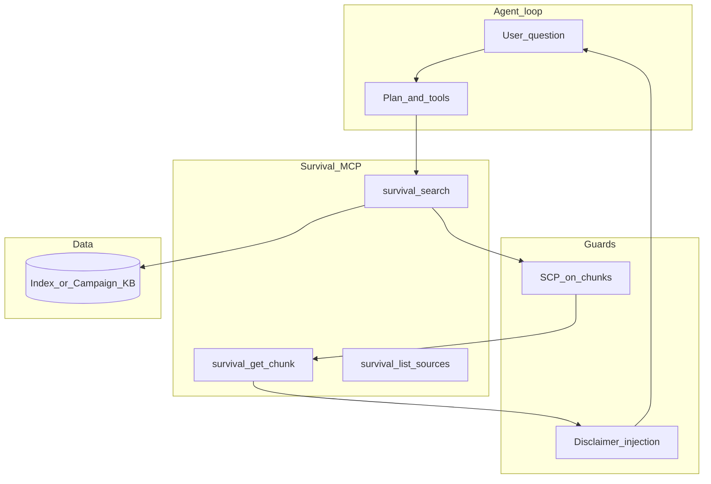

# Survival knowledge MCP — architecture brainstorm

## Product scope (what and for whom)

**Goal:** Give agents **retrieval-grounded** survival information for **urban and rural** contexts without replacing professional training or emergency services.

**Success criteria (testable):**

1. Agent can **search** and **retrieve cited chunks** from an approved corpus (metadata: source, license posture, environment tags).
2. **Urban vs rural** is modeled as **facets** (tags, filters, or routing prompts)—not two separate incompatible corpora unless you intentionally fork content.
3. Every answer path that touches retrieval includes a **fixed disclaimer** (see [SURVIVAL_MEDICAL_RAG_DISCLAIMER.md](D:\local-proto\docs\SURVIVAL_MEDICAL_RAG_DISCLAIMER.md)) and does not present model synthesis as medical authority.
4. **High-stakes domains** (toxicology, internal medicine, improvised care): retrieval allowed; **directive “do this now”** outputs should default to **escalate / cite-only** unless you add explicit product approval.

**Non-goals (YAGNI unless you decide otherwise):** shipping copyrighted full text in git; a single monolithic `survival_expert_answer` tool that hides retrieval.

---

## Tech-lead placement (where it lives)

| Layer                  | Recommendation                                                                                                                                                                                                                                                                                           |
| ---------------------- | -------------------------------------------------------------------------------------------------------------------------------------------------------------------------------------------------------------------------------------------------------------------------------------------------------- |
| **MCP server process** | New module under [local-proto/scripts/](D:\local-proto\scripts\) (same family as `scp_mcp.py`, `daggr_mcp.py`) **or** thin wrapper if you already expose Campaign KB over HTTP. [MCP_SEAM_DESIGN.md](D:\local-proto\docs\MCP_SEAM_DESIGN.md) already lists **Campaign KB MCP** as “wrap REST, Low risk.” |
| **Corpus storage**     | **Private path** via env (e.g. `SURVIVAL_KB_ROOT`); never commit PDFs. Ingested sections/chunks in DB or files **outside** public repos.                                                                                                                                                                 |
| **Search backend**     | **Option A:** Wrap existing [Campaign KB](D:\local-proto\docs\TOOLS_TO_INTEGRATE.md) ingest + search. **Option B:** SQLite + `sqlite-vec` / Chroma locally for a dedicated survival index. **Option C:** Filesystem + ripgrep for MVP (worse recall, simplest).                                          |
| **Docs**               | Extend [HUMAN_WELLBEING_CORPUS.md](D:\local-proto\docs\HUMAN_WELLBEING_CORPUS.md) with “MCP tool surface” once tools are stable.                                                                                                                                                                         |

**Conflict to resolve explicitly:** You have two `local-proto` trees (standalone `D:\local-proto` vs `portfolio-harness/local-proto`). Implement in **one** canonical tree and mirror or symlink to avoid drift.

---

## Agent-native architecture (tools, not monoliths)

Follow **parity** and **granularity**: the MCP exposes **primitives** that compose; the agent does judgment in the loop.

| Primitive tool (example)              | Purpose                                                                              |
| ------------------------------------- | ------------------------------------------------------------------------------------ |
| `survival_search`                     | Query + filters: `environment: urban                                                 |
| `survival_get_chunk`                  | Fetch full text for a chunk id (bounded size; SCP-sanitized or pre-gated at ingest). |
| `survival_list_sources`               | Non-secret manifest: titles, hashes, tags—no full copyrighted text in responses.     |
| `survival_record_feedback` (optional) | Human flags bad retrieval; never trains on copyrighted text without license.         |

**Anti-pattern:** One tool `answer_survival_question` that bundles retrieval + synthesis—harder to audit and violates “features as outcomes in the agent loop” when you actually need **inspectable** retrieval steps.

**Capability map sketch:**

---

## Safety and governance (non-negotiable)

1. **Ingestion pipeline** stays as in [HUMAN_WELLBEING_CORPUS.md](D:\local-proto\docs\HUMAN_WELLBEING_CORPUS.md): extract text → **SCP** on chunks → provenance → index.
2. **Runtime:** Optionally run `scp_validate_output` on tool JSON before return ([TOOL_SAFEGUARDS.md](D:\local-proto\docs\TOOL_SAFEGUARDS.md) verification-before-persist pattern).
3. **Risk tier:** Default **Low** for read-only search if corpus is local and non-PII; **Med** if tools can exfiltrate large excerpts to untrusted sinks—document in MCP manifest.
4. **Audit:** If you use [audit_wrapper](D:\local-proto\scripts\audit_wrapper.py), log tool name + args hash, not raw chunk text.

---

## Urban vs rural (single corpus, dual facets)

- **Tagging at ingest:** `environment: urban | rural | general`, plus optional `climate`, `region`, `topic`.
- **Query routing:** `survival_search(..., environment=rural)` filters metadata; same chunk can appear under both if tagged `general`.
- **Prompting:** System prompt reminds the agent to **prefer matching environment** and to **ask clarifying** questions when context is ambiguous (density, resources, season).

---

## Open decisions (resolve before implementation)

1. **Backend:** Campaign KB vs dedicated local index (latency, ops, licensing).
2. **Licensing:** Only **your** purchases + public-domain / licensed summaries in the index; redistributing full book text through MCP is a legal product decision.
3. **Offline:** Does the MCP need to work **air-gapped**? If yes, bundle index + embeddings locally; no cloud embedding API.

---

## Suggested next step after brainstorm

- Capture this in `docs/brainstorms/2026-03-20-survival-knowledge-mcp-brainstorm.md` (when not in plan-only mode).
- Run a focused `/workflows:plan` for **MCP v0**: `survival_search` + `survival_get_chunk` + env-configured corpus path + disclaimer string.

