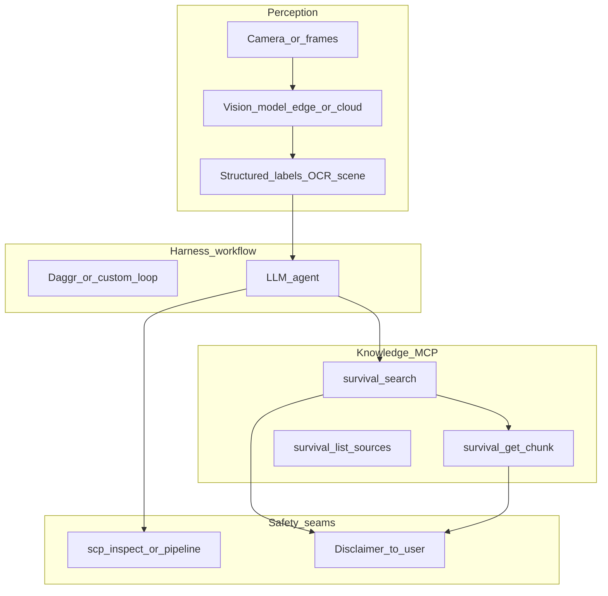

# Survival Knowledge MCP: review, critic report, and vision+harness framework

## Scope of this document

This is a **review and framework** (no code changes). It evaluates the existing implementation in `[D:\local-proto\scripts\survival_mcp.py](D:\local-proto\scripts\survival_mcp.py)` and `[D:\local-proto\docs\SURVIVAL_MCP_TOOLS.md](D:\local-proto\docs\SURVIVAL_MCP_TOOLS.md)`, then proposes how to combine **machine vision**, **harness/agent workflows**, and this MCP for survival-related assistance.

---

## 1. Critic report (portfolio-harness rubric)

**Artifact domain:** `code` (MCP server + contracts)

**Rubric (0–5 each):**


| Dimension            | Score | Evidence                                                                                                                                                                                                                                      |
| -------------------- | ----- | --------------------------------------------------------------------------------------------------------------------------------------------------------------------------------------------------------------------------------------------- |
| **intent_alignment** | 4     | Matches stated goals: retrieval-grounded excerpts, urban/rural facet, fixed disclaimer on every `_wrap` payload (`[survival_mcp.py](D:\local-proto\scripts\survival_mcp.py)` L50–65, L32–36).                                                 |
| **safety**           | 4     | Disclaimer always attached; optional `SURVIVAL_VALIDATE_OUTPUT` runs `scp_inspect` on JSON (L46–64). Risk tier Low in docs. Gap: high-stakes advice (e.g. plant ID) is **policy in prompts**, not enforced in code—appropriate if documented. |
| **correctness**      | 4     | Tool contracts in `[SURVIVAL_MCP_TOOLS.md](D:\local-proto\docs\SURVIVAL_MCP_TOOLS.md)` align with implementation; env validation for `environment` (L87–89).                                                                                  |
| **completeness**     | 3     | Strong for **text RAG**; does not cover **vision**, **real-time sensors**, or **offline edge**—out of current MCP scope but relevant to your imagined system.                                                                                 |
| **minimality**       | 5     | Primitives only (`survival_search`, `survival_get_chunk`, `survival_list_sources`, `survival_record_feedback`)—no monolithic “answer” tool.                                                                                                   |


**Weighted total:** 4+4+4+3+5 = **20** (threshold 18). **Pass:** yes, given safety ≥ 4 and correctness ≥ 4.

**Issues (with evidence):**

1. **Empty KB UX:** If `survival_kb.sqlite` is missing or empty, tools return structurally valid JSON but agents may hallucinate “no results” handling—consider documenting expected agent behavior (not necessarily a new tool).
2. **Vision gap:** `[survival_mcp.py](D:\local-proto\scripts\survival_mcp.py)` has no image input; any plant/animal/scene ID from camera must flow **through a separate vision step** before `survival_search`—risk if users conflate vision labels with authoritative ID.

**Fixes (non-blocking):**

- Add harness **system prompt** snippet: “After `survival_search`, never substitute retrieval for emergency services; for plant/mushroom ID from images, say uncertain unless human-verified.”
- Run `**audit_wrapper`** per `[MCP_SERVERS.md](D:\local-proto\docs\MCP_SERVERS.md)` for tool name + args hash logging.

**Final critic JSON:**

```json
{
  "pass": true,
  "threshold": 18,
  "total_score": 20,
  "dimensions": {
    "intent_alignment": 4,
    "safety": 4,
    "correctness": 4,
    "completeness": 3,
    "minimality": 5
  },
  "domain": "code",
  "issues": [
    {
      "type": "completeness",
      "detail": "MCP is text-retrieval only; vision and sensor fusion are out of scope.",
      "evidence": "survival_mcp.py: tools accept strings only, no image_uri or bbox."
    },
    {
      "type": "safety",
      "detail": "High-stakes domains rely on prompt/policy; no code-level escalate for directive medical steps.",
      "evidence": "SURVIVAL_MCP_TOOLS.md disclaimer; survival_mcp.py _wrap adds disclaimer only."
    }
  ],
  "fixes": [
    {
      "action": "prompt_and_workflow",
      "detail": "Document vision-to-query pipeline and escalation in harness; optional future tool survival_escalation_hint(topic)."
    }
  ]
}
```

---

## 2. Agent-native audit (condensed)


| Principle                  | Assessment            | Notes                                                                                                                                                                                                                                                      |
| -------------------------- | --------------------- | ---------------------------------------------------------------------------------------------------------------------------------------------------------------------------------------------------------------------------------------------------------- |
| **Action parity**          | Partial               | There is no separate UI for the KB; parity means **agent tools match human ability to search the same index** if the human uses DB/files—ensure ingest path is documented in `[HUMAN_WELLBEING_CORPUS.md](D:\local-proto\docs\HUMAN_WELLBEING_CORPUS.md)`. |
| **Tools as primitives**    | Strong                | Search / get_chunk / list_sources / feedback are atomic; judgment stays in the agent loop.                                                                                                                                                                 |
| **Context injection**      | External              | MCP does not inject dynamic “what’s in the KB”; **harness system prompt** should list tool names + disclaimer + environment facet usage.                                                                                                                   |
| **Shared workspace**       | Yes                   | `SURVIVAL_KB_ROOT` is a shared file artifact; agent and operator use the same SQLite store when configured.                                                                                                                                                |
| **CRUD completeness**      | Intentionally partial | No agent **create/update/delete** of chunks via MCP (correct for copyright/safety); ingest is **offline script** (`[survival_kb_ingest.py](D:\local-proto\scripts\survival_kb_ingest.py)`).                                                                |
| **UI integration**         | N/A                   | Stdio MCP; any UI is client-side.                                                                                                                                                                                                                          |
| **Capability discovery**   | Docs                  | `[MCP_SERVERS.md](D:\local-proto\docs\MCP_SERVERS.md)` + `[SURVIVAL_MCP_TOOLS.md](D:\local-proto\docs\SURVIVAL_MCP_TOOLS.md)` serve discovery.                                                                                                             |
| **Prompt-native features** | Strong                | “Survival assistant” behavior should be **prompt-defined** (when to search, when to escalate, how to combine vision labels with FTS queries).                                                                                                              |


**Overall:** The MCP is **appropriately agent-native for retrieval**; gaps appear when you add **vision**—those belong in orchestration, not in cramming into one tool.

---

## 3. Product scope (what you’re building toward)

**Problem:** Operators need **situation-aware** help (urban vs rural, season, resources) grounded in a **private corpus**, without treating the model as a medic or forager-infallible oracle.

**Users:** You (primary), optionally trusted operators in a controlled harness.

**Requirements (numbered):**

1. **Sense:** Ingest camera frames or stills (edge or cloud vision) and produce **structured labels** (objects, scene class, OCR text, optional geo if allowed).
2. **Reason:** Agent composes **natural-language queries** + `environment` / `topic` filters for `survival_search`, then `survival_get_chunk` for citations.
3. **Guard:** Run **SCP** on synthesized answers or long handoffs (`scp_mcp`); keep **disclaimer** visible to the user.
4. **Act:** Outputs are **informational** (checklists, citations, “call 911”)—not closed-loop control of physical equipment unless explicitly scoped later.
5. **Audit:** Use `[audit_wrapper](D:\local-proto\scripts\audit_wrapper.py)` on MCP stdio where policy requires.

**Acceptance criteria (checklist):**

- Given a scene description or vision labels, the agent retrieves **at least one** relevant chunk or states **no match** without fabricating sources.
- User sees **disclaimer** on any retrieval-backed answer.
- For **toxicology / plant ID / CPR**, workflow **escalates** to human verification or cite-only mode (per your org-intent / `[SURVIVAL_MEDICAL_RAG_DISCLAIMER.md](D:\local-proto\docs\SURVIVAL_MEDICAL_RAG_DISCLAIMER.md)`).
- No copyrighted full text in git; KB path private.

---

## 4. Framework: machine vision + harness + Survival MCP




**Data flow (plain language):**

1. **Vision** turns pixels into **text/labels** (e.g. “leaf compound”, “mushroom cap”, “smoke”, “knife”).
2. **Agent** maps labels + user intent into **FTS queries** (`survival_search`) and optional `environment=rural|urban`.
3. **Retrieval** returns **snippets**; **get_chunk** pulls bounded text for synthesis.
4. **SCP** validates **agent-generated** narrative before persistence or handoff; **disclaimer** remains mandatory.

**Separation of concerns (important):**

- **Do not** push raw images through `survival_mcp` today—keep vision as a **separate tool or service** (could be future MCP: `vision_describe` with strict scope).
- **Plant/mushroom ID from photo** is **high-risk**; framework should require **“uncertain / verify with field guide”** and prefer **citation** from corpus over novel claims.

**Harness touchpoints:**

- **Daggr / workflow** (`[daggr_mcp.py](D:\local-proto\scripts\daggr_mcp.py)` pattern): a “survival assist” workflow could be **steps**: `capture_context` → `vision_extract` → `survival_search` → `draft_response` → `scp_validate`.
- **Portfolio-harness** decision-log / state: one line that **wellbeing corpus + vision** are **human-gated** for high-stakes outputs.

---

## 5. Risks and non-goals

- **Copyright:** Retrieved chunks are for **personal** use; do not re-export full books via automation.
- **False confidence:** Vision + RAG can feel authoritative; **escalation** and **cite-only** defaults for medical/toxicology paths.
- **Offline:** Current stack is **local FTS**-friendly; vision models may need **GPU/edge**—document which parts are offline vs cloud.

---

## 6. Suggested next steps (optional implementation backlog)

1. Add a **short harness doc** (e.g. `.cursor/state/` or `docs/brainstorms/`) describing the vision→query→retrieval→SCP pipeline (no code required for “framework” completion).
2. If you add vision: define **one** primitive tool contract (image in → structured JSON out) separate from Survival MCP.
3. Extend **MCP_CAPABILITY_MAP** in portfolio-harness with a row linking survival-kb + scp for “assist” stacks.

---

## Summary

The Survival Knowledge MCP **passes** a strict critic-style review for its **intended scope** (primitive text retrieval + disclaimer + optional output validation). It is **well aligned** with agent-native **granularity** and **composability**. Your envisioned **machine vision + harness** system should sit **above** this MCP: vision produces **query inputs**; the MCP remains **text-in, cited text-out**; safety and escalation are **workflow + prompt** concerns, optionally reinforced by **SCP** on final narratives.