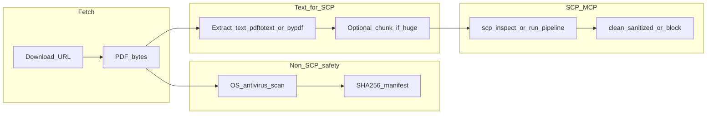

# Survival library: download, SCP text gate, private archive, cross-repo todos

## Scope and constraints

- **26 PDFs** from Shopify purchase emails (`americansurvivalist.us` download links). Personal use; **do not commit PDFs or full text** to public git repos.
- **SCP** (`[D:\scp\README.md](D:\scp\README.md)`, `[D:\scp\src\scp\scp_utils.py](D:\scp\src\scp\scp_utils.py)`) operates on **strings**: it classifies injection / reversal / clean and can run `scp_run_pipeline` before LLM sinks. It does **not** scan binary PDFs for malware—that needs a separate step.
- **Provenance** policy is already documented in `[D:\local-proto\docs\TOOL_SAFEGUARDS.md](D:\local-proto\docs\TOOL_SAFEGUARDS.md)` (§Document provenance and URL trust): record URL + content hash before treating fetched content as trusted for downstream automation.

## Execution plan (after you approve; not run in plan mode)

### 1. Private directory layout

- Choose a **non-repo** or **gitignored private root**, e.g. `D:\Research\personal\american-survivalist-purchase-2025-03\` (or under `[D:\local-proto\.cursor\private\](D:\local-proto\docs\TOOL_SAFEGUARDS.md)` if you prefer harness-local private storage).
- Subfolders: `raw/` (original PDFs), `extracted/` (per-file `.txt`), `manifests/` (JSON lines or one `manifest.json`), `scp_reports/` (per-file inspect JSON or pipeline output).

### 2. Download all files

- Script or `Invoke-WebRequest` with a **stable filename** per row (sanitize from email titles).
- **Verify completeness**: 26 files, non-zero size, PDF magic header `%PDF`.
- **Re-download policy**: links may expire; capture `manifest` immediately.

### 3. Safety checks (beyond SCP)

- **Antivirus**: Windows Defender scan on `raw/` (or full path).
- **Optional**: record **SHA256** per file for integrity and provenance; call `**document_provenance_record`** (provenance MCP) per `[TOOL_SAFEGUARDS.md](D:\local-proto\docs\TOOL_SAFEGUARDS.md)` with `source: user_purchase_email` or `americansurvivalist_download`.

### 4. Text extraction → SCP

- Extract text with **pdftotext** (Poppler) or **pypdf** / **pymupdf** into `extracted/<slug>.txt`.
- For each extracted file (or per ~32k-char chunk if MCP limits apply): run `**scp_inspect`** or `**scp_run_pipeline**` with `sink='llm_context'` (or `handoff` if merging into session state).
- **Interpretation**: survival/medical PDFs may trigger **reversal** tier from benign instructional phrasing; treat reports as **signals for human review**, not automatic deletion. Use `**scp_quarantine`** only for clear injection-tier content or if structural anomalies warrant isolation per your policy.
- **If blocked/quarantined**: keep binary in `raw/`, flag in manifest, do not feed that extract to RAG until reviewed.

### 5. Archive

- **Zip** `raw/` + `manifest.json` + `scp_reports/` (optional) to dated archive, e.g. `american-survivalist-purchase-2025-03-20.zip`, stored on backup disk or encrypted volume.
- Ensure `**.gitignore`** in any repo that might touch this path includes `**/american-survivalist*/**` or the chosen private glob.

### 6. local-proto and cross-repo alignment (documentation todos)

Add **small, linkable artifacts** (no copyrighted PDFs in git):

| Location                                                                                                                   | Purpose                                                                                                                                                                                                                                 |
| -------------------------------------------------------------------------------------------------------------------------- | --------------------------------------------------------------------------------------------------------------------------------------------------------------------------------------------------------------------------------------- |
| `[D:\local-proto\docs\TOOL_SAFEGUARDS.md](D:\local-proto\docs\TOOL_SAFEGUARDS.md)` or new `docs/HUMAN_WELLBEING_CORPUS.md` | Short subsection: **PDF ingestion pipeline** = hash → extract text → SCP → provenance → optional Campaign KB / RAG; pointer to `[D:\local-proto\docs\TOOLS_TO_INTEGRATE.md](D:\local-proto\docs\TOOLS_TO_INTEGRATE.md)` Campaign KB row |
| `[D:\portfolio-harness\.cursor\state\decision-log.md](D:\portfolio-harness\.cursor\state\decision-log.md)` (if used)       | One line: personal wellbeing corpus stays private; SCP applies to **extracted text**                                                                                                                                                    |
| `[D:\openharness](D:\openharness)`                                                                                         | Mirror the same subsection or a single-line pointer to local-proto doc to keep harness parity                                                                                                                                           |
| `[D:\scp\README.md](D:\scp\README.md)` (optional)                                                                          | FAQ: "PDFs require text extraction before SCP"                                                                                                                                                                                          |

**Product-level disclaimers** (for any future agent that answers from this corpus): survival/medical content can be wrong or context-dependent; **human judgment and professional care** override model output; align with org-intent / HITL where applicable (`[PentAGI HITL](D:\portfolio-harness\pentagi\docs\HITL_AND_ETHICS_PROJECT.md)` reference already in TOOL_SAFEGUARDS).

### 7. Master todo list (outcome-oriented)

1. **Ingest**: All 26 PDFs downloaded and manifest with SHA256 complete.
2. **Host safety**: AV scan clean (or documented exceptions).
3. **SCP**: Every extracted text passed through SCP; reports stored; tier anomalies reviewed by human.
4. **Provenance**: URLs + hashes logged (provenance MCP or JSONL per harness convention).
5. **Privacy**: No PDFs in git; path gitignored; zip backup exists.
6. **local-proto**: Doc update with PDF→SCP playbook + Campaign KB optional path.
7. **portfolio-harness / openharness**: Pointers updated so "wellbeing corpus" is not a single-repo concern.
8. **Optional later**: Private Obsidian/Foam index (titles + tags only, no full text in vault if you want minimal exposure).
9. **Optional later**: Wire **Campaign KB** (`[Arc_Forge\campaign_kb](D:\local-proto\docs\TOOLS_TO_INTEGRATE.md)`) only after SCP-clean text and explicit scope approval.

## Risk note

- **Copyright**: purchased files are for your use; do not redistribute via repos or shared drives without license.
- **High-stakes domains**: poison identification, medicine, CPR—**never** treat LLM retrieval as authoritative; keep printed references and training.

