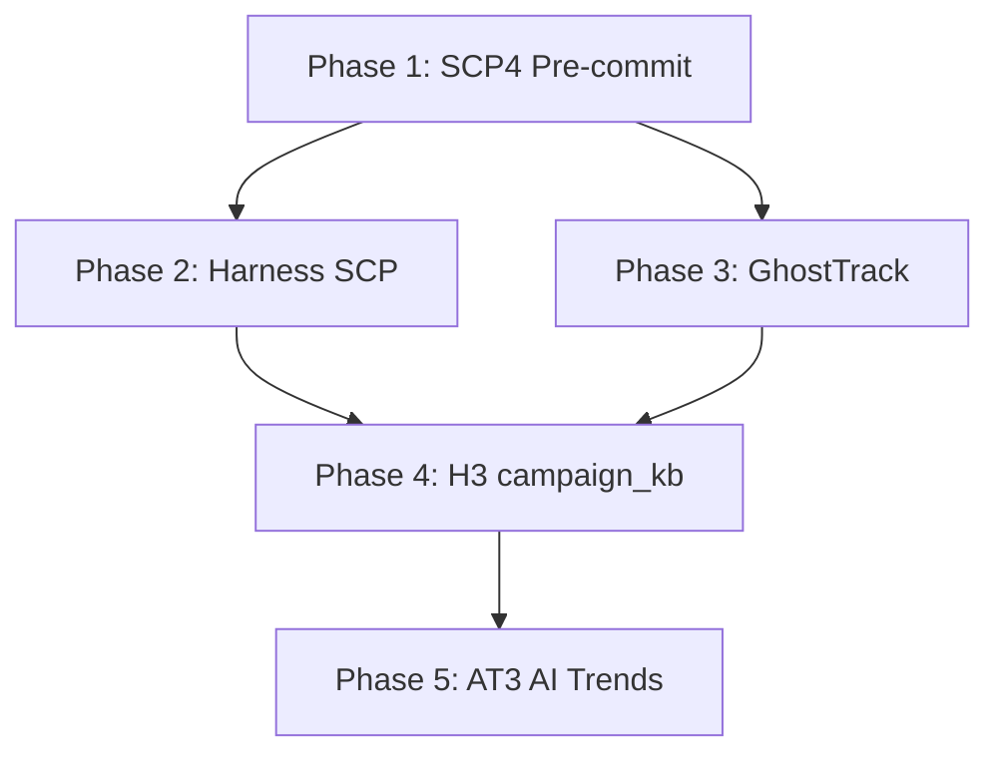

# Testing Quality & Smoke Implementation Plan

Implement the five tasks from [TESTING_QUALITY_SMOKE_CONCRETE_PLANS.md](docs/TESTING_QUALITY_SMOKE_CONCRETE_PLANS.md) in dependency order.

---

## Phase 1: SCP4 — Pre-commit Environment Fix (~15 min, Low risk)

**Goal:** Install pre-commit, enable hooks, document manual run.

### Steps

1. **Install pre-commit**
  - Add to dev dependencies: `pip install pre-commit` or add to `pyproject.toml`/`requirements-dev.txt` if present
  - Verify: `pre-commit --version`
2. **Install hooks**
  - From repo root: `pre-commit install`
  - Hooks in [.pre-commit-config.yaml](.pre-commit-config.yaml) run on commit for staged paths (state/, rules/, skills/, org-intent-spec/)
3. **Run full verification**
  - `pre-commit run --all-files` — validates all four hooks (sanitize-input, validate-output, mask-secrets, checksum-integrity)
  - Fix any script path issues: hooks use `python .cursor/scripts/<script>.py` (run from repo root)
4. **Update COMMANDS_README**
  - [.cursor/docs/COMMANDS_README.md](.cursor/docs/COMMANDS_README.md) OWASP section already has "Run pre-commit install"
  - Add row: `pre-commit run --all-files` | Manual run all hooks (CI or before commit)
5. **Mark SCP4 done** in [.cursor/state/pending_tasks.md](.cursor/state/pending_tasks.md)

---

## Phase 2: Harness SCP Pipeline Smoke Test (~1–2 hrs, Low risk)

**Goal:** Add pytest for harness Daggr workflows (scp, blue_hat_privacy).

### Steps

1. **Create test module**
  - Path: [daggr_workflows/test_scp_pipeline.py](daggr_workflows/test_scp_pipeline.py)
2. **Test 1: SCP graph loads**

```python
   def test_scp_pipeline_defines_graph():
       from daggr_workflows.scp_pipeline import graph
       assert graph is not None
       assert graph.name == "SCP Content Safety Pipeline"
   

```

1. **Test 2: SCP pipeline runs (mocked)**
  - Mock `scp_utils.run_pipeline` (from `local-proto/scripts/scp_utils`) via `unittest.mock.patch`
  - Call `scp_full_pipeline("Hello")`; assert result has `"pipeline"` key
  - Ensures CI runs without SCP MCP
2. **Test 3: blue_hat_privacy graph**
  - `test_blue_hat_privacy_defines_graph()` — import graph, assert name
3. **Wire to run_daggr_tests.ps1 (optional)**
  - Add harness pytest step before WatchTower in [.cursor/scripts/run_daggr_tests.ps1](.cursor/scripts/run_daggr_tests.ps1)

---

## Phase 3: GhostTrack Smoke Test (~1–2 hrs, Low risk)

**Goal:** Add minimal pytest for GhostTrack CLI and API.

### Steps

1. **Create tests directory**
  - Path: [GhostTrack/tests/](GhostTrack/tests/)
  - Add `conftest.py` with `sys.path.insert` for `GhostTrack` parent if needed
2. **Test 1: GhostTR imports**
  - Import `GhostTR` (or run as module); assert `hasattr(GhostTR, 'IP_Track')`
  - Note: [GhostTrack/GhostTR.py](GhostTrack/GhostTR.py) uses `input()` — test import only, not interactive flow
3. **Test 2: API server (FastAPI)**
  - [GhostTrack/api_server.py](GhostTrack/api_server.py) uses FastAPI
  - Use `from fastapi.testclient import TestClient`
  - `client = TestClient(app)`; `r = client.get("/")` or `/docs`; assert status in (200, 307, 404)
4. **Test 3: IP lookup mocked (optional)**
  - Mock `requests.get` in `ip_lookup`; call endpoint; assert JSON structure
  - Skip if coupling is high
5. **Add pytest.ini or conftest**
  - Ensure `GhostTrack` is discoverable; add `pytest.ini` with `pythonpath = .` if needed

---

## Phase 4: H3 — campaign_kb Playwright Fixtures (~2–4 hrs, Medium risk)

**Goal:** Allow campaign_kb Daggr tests to run without a real SQLite DB.

### Steps

1. **Create conftest.py**
  - Path: [D:\Arc_Forge\campaign_kb\tests\conftest.py](D:\Arc_Forge\campaign_kb\tests\conftest.py)
  - Fixture `in_memory_db`: set `os.environ["DATABASE_URL"] = "sqlite:///:memory:"` before importing `app.database`
  - Or: monkeypatch `settings.database_url` in [app/config.py](D:\Arc_Forge\campaign_kb\app\config.py) via pydantic-settings override
2. **Schema setup**
  - [app/database.py](D:\Arc_Forge\campaign_kb\app\database.py) uses `get_engine()` from `settings.database_url`
  - For `:memory:`, call `Base.metadata.create_all(engine)` in fixture to create tables
  - Ensure [app/models](D:\Arc_Forge\campaign_kb\app\models.py) are imported so tables exist
3. **Update test_daggr_workflows.py**
  - [D:\Arc_Forge\campaign_kb\tests\test_daggr_workflows.py](D:\Arc_Forge\campaign_kb\tests\test_daggr_workflows.py)
  - Use `in_memory_db` fixture so `test_search_workflow_defines_graph` loads with empty DB
  - Add `test_search_workflow_returns_empty_when_no_data`: run search, assert "No sections matched" or similar
4. **Document**
  - Update [.cursor/docs/daggr_test_matrix.md](.cursor/docs/daggr_test_matrix.md): campaign_kb tests run without real DB when fixtures used

---

## Phase 5: AT3 — AI Trends MCP E2E (~3–5 hrs, Medium risk)

**Goal:** Add E2E tests for AI Trends MCP tools.

### Steps

1. **Create test module**
  - Path: `local-proto/tests/test_ai_trends_mcp_e2e.py` (create `local-proto/tests/` if missing)
2. **Test 1: MCP tools respond (subprocess or MCP client)**
  - Option A: Use `test_mcp_and_audit.py` pattern — spawn MCP, call `list_ingested` via stdio
  - Option B: Add ai-trends to TOOL_MAP in [local-proto/scripts/test_mcp_and_audit.py](local-proto/scripts/test_mcp_and_audit.py) and run as part of full MCP test
  - Assert `list_ingested` returns list (possibly empty)
3. **Test 2: fetch_youtube_channel (optional)**
  - Call with known channel ID; assert non-error structure
  - Skip if no network or API limits
4. **Test 3: Playwright (if Gradio UI exists)**
  - AI Trends MCP has no Gradio in current design — skip Playwright unless a UI is added
  - Document in plan: "Playwright deferred until Gradio UI exists"
5. **Document**
  - Add "E2E Testing" section to [local-proto/docs/AI_TRENDS_MCP.md](local-proto/docs/AI_TRENDS_MCP.md)

---

## Execution Order




---

## Verification Checklist

- `pre-commit run --all-files` exits 0
- `pytest daggr_workflows/test_scp_pipeline.py -v` passes
- `cd GhostTrack; pytest tests/ -v` passes
- `cd D:\Arc_Forge\campaign_kb; pytest tests/test_daggr_workflows.py -v` passes without `data/kb.sqlite3`
- `run_daggr_tests.ps1 -SkipPlaywright` still passes
- AI Trends E2E test passes or skips gracefully

