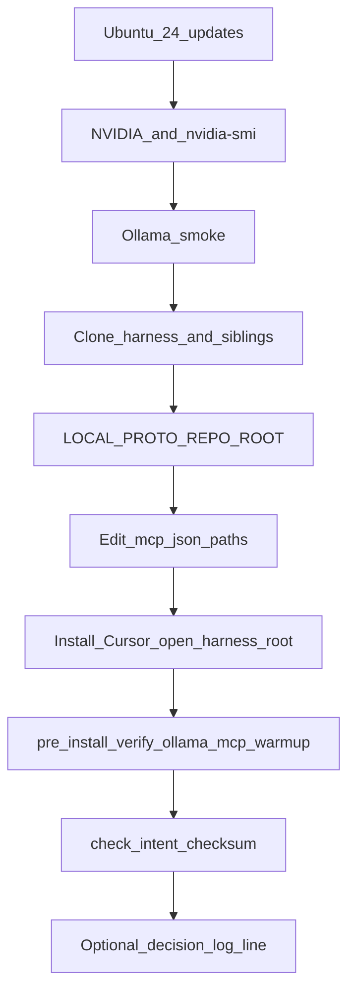

# Ubuntu 24.04 + Cursor + local-proto alignment

## Goals (three threads)


| Thread                             | Outcome                                                                                                                  |
| ---------------------------------- | ------------------------------------------------------------------------------------------------------------------------ |
| **Cursor on metal**                | Cursor App installed, signed in, opens a workspace rooted at your harness clone.                                         |
| **Hardware + software path**       | NVIDIA stack works (`nvidia-smi`), Ollama uses GPU, MCP `mcp.json` uses Linux absolute paths, pre-install + warmup pass. |
| **Intent / local-proto alignment** | Same org-intent JSON policy as Windows; checksum stored under XDG; optional decision-log line for the new host.          |


Your repo already encodes the Linux path: [D:/local-proto/docs/LINUX_INSTALL.md](D:/local-proto/docs/LINUX_INSTALL.md), [D:/local-proto/docs/FIRST_INSTALL_RUNBOOK.md](D:/local-proto/docs/FIRST_INSTALL_RUNBOOK.md), [D:/local-proto/docs/INTENT_CHECKSUM.md](D:/local-proto/docs/INTENT_CHECKSUM.md). [D:/portfolio-harness/.cursor/state/decision-log.md](D:/portfolio-harness/.cursor/state/decision-log.md) records Ubuntu LTS + XDG intent checksum (2026-03-23).

---

## 1. After flash: base OS and GPU

1. Complete first boot, updates, and user account.
2. **NVIDIA (eGPU/desktop):** Follow [LINUX_INSTALL.md §2](D:/local-proto/docs/LINUX_INSTALL.md) — `ubuntu-drivers` (or `autoinstall`), reboot, confirm **Thunderbolt/eGPU** in BIOS if applicable, then `nvidia-smi`.
3. **Ollama:** Official Linux install from upstream, then `ollama run` a small model to prove inference.

This is what “render software to hardware” means in your stack: **driver → GPU visible → Ollama runs on GPU**, not a separate rendering pipeline unless you later add GUI apps (Cursor itself is the main desktop consumer).

---

## 2. Repos and directory layout (single harness root)

Default topology (already documented): `**portfolio-harness` checkout with `local-proto/` inside** ([FIRST_INSTALL_RUNBOOK §1](D:/local-proto/docs/FIRST_INSTALL_RUNBOOK.md), [LINUX_INSTALL §4](D:/local-proto/docs/LINUX_INSTALL.md)).

On the Linux box:

- Pick a stable path, e.g. `~/Code/portfolio-harness` (or `~/software/portfolio-harness` if you use `SOFTWARE_ROOT` — see LINUX_INSTALL).
- **Clone or sync** the harness (and siblings you rely on: `Arc_Forge`, `obsidian_cursor_integration`, etc.) so paths in pre-install checks exist.
- Set persistently:

```bash
export LOCAL_PROTO_REPO_ROOT="$HOME/Code/portfolio-harness"   # adjust
```

Add to `~/.profile` or systemd user environment if you want agents and cron to agree.

---

## 3. Cursor: install and workspace

1. Install **Cursor for Linux** from the vendor (`.deb` or AppImage — follow current Cursor docs).
2. **Open folder:** `File → Open Folder` → your **harness root** (the directory that contains `.cursor/mcp.json` and `local-proto/`). That matches how Windows uses the harness.

**Remote development (optional):** If the box is headless or you prefer editing from another machine, use **VS Code Remote SSH** or Cursor’s remote workflow (if supported in your Cursor build) so the **remote** side still has the clone + GPU; same `LOCAL_PROTO_REPO_ROOT` and `mcp.json` rules apply on the machine where MCP servers run.

---

## 4. MCP and path migration (critical)

Cursor reads **[harness]/.cursor/mcp.json** — Windows `D:/...` entries must become **Linux absolute paths** ([LINUX_INSTALL §6](D:/local-proto/docs/LINUX_INSTALL.md)):

- `--repository`, filesystem MCP roots, sqlite path, `local-proto/scripts/...` Python paths.
- Pre-cache `npx` packages with the same Linux paths as in the runbook (reduces cold-start timeouts).

Treat this as a **one-time edit** per machine; the runbook explicitly calls out `sed`/editor examples. Do not commit secrets; only paths.

---

## 5. Verification chain (human = agent commands)

From harness root, run the **same** MVP commands documented for Linux ([LINUX_INSTALL §7](D:/local-proto/docs/LINUX_INSTALL.md)):

- `python3 local-proto/scripts/pre_install_check.py` (flags as needed, e.g. `--skip-ollama` while iterating)
- `python3 local-proto/scripts/verify_ollama_llm.py`
- `python3 local-proto/scripts/mcp_warmup.py` after Cursor has loaded MCP config

Optional: `pre_install_check.sh` if you prefer a shell entrypoint.

This is how you “prepare to connect” software to hardware in a testable way: **exit codes and logs**, not only “it feels fine.”

---

## 6. Intent and goals alignment (local-proto)

**Org-intent file:** Still [org-intent-spec/examples/org-intent.example.json](D:/portfolio-harness/org-intent-spec/examples/org-intent.example.json) (or your chosen path via env — see [INTENT_CHECKSUM.md](D:/local-proto/docs/INTENT_CHECKSUM.md)).

**Checksum storage on Linux:** Use **XDG** — e.g. `$XDG_STATE_HOME/local-proto/audit/` or `~/.local/state/local-proto/` (per [decision-log 2026-03-23](D:/portfolio-harness/.cursor/state/decision-log.md) and INTENT_CHECKSUM).

**Workflow:**

1. After clone, run `python3 local-proto/scripts/check_intent_checksum.py` — first run stores baseline; later runs detect drift.
2. When you **intentionally** change org-intent after review: `check_intent_checksum.py --update` (or equivalent).
3. **Align goals in prose:** Append a one-line **decision** to [decision-log.md](D:/portfolio-harness/.cursor/state/decision-log.md) when you lock the new machine topology (e.g. “Ubuntu 24.04 + Alienware eGPU primary host”) so future agents read the same intent as your automation.

**Safeguards:** [TOOL_SAFEGUARDS.md](D:/local-proto/docs/TOOL_SAFEGUARDS.md) + [ENTITY_CRUD_MATRIX.md](D:/portfolio-harness/local-proto/docs/ENTITY_CRUD_MATRIX.md) remain the reference for what MCP may do vs human-only paths; no change required for “alignment” unless you revise org-intent JSON itself.

---

## 7. What to defer (already decided)

From the same decision-log entry: **full** port of stealth/Daggr/NIM-only PowerShell flows, new sync engines, and full eGPU troubleshooting **beyond** driver + `nvidia-smi` are **out of MVP**. Focus on pre-install, Ollama verify, MCP warmup, intent checksum first.

---

## Suggested order of operations




---

## Optional follow-up (not blocking)

- If you use **two copies** of local-proto (`D:\local-proto` vs nested), keep **portfolio-harness/local-proto** canonical and sync one direction ([REQUIREMENTS.md](D:/portfolio-harness/local-proto/REQUIREMENTS.md)).
- Systemd user timers for orchestrator/intent jobs: [SCHEDULED_TASKS.md](D:/local-proto/docs/SCHEDULED_TASKS.md).

