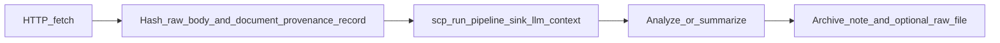

# URL fetch → provenance → SCP → analyze → archive

## Grounding in your repo

- **SCP external content**: [D:/scp/docs/INTEGRATION.md](D:/scp/docs/INTEGRATION.md) (section "External Content") requires `scp_inspect` / `scp_run_pipeline(content, sink='llm_context')` before feeding fetched content to an LLM or state, and mentions recording provenance (URL, hash, source) for untrusted sources.
- **Document provenance policy**: [D:/portfolio-harness/local-proto/docs/TOOL_SAFEGUARDS.md](D:/portfolio-harness/local-proto/docs/TOOL_SAFEGUARDS.md) — call `document_provenance_record(url, hash, source)` (provenance MCP) before trusting URL content; applies to user-supplied links.
- **Sink semantics**: `scp_run_pipeline` maps sinks in the same INTEGRATION doc — use `llm_context` when the next step is model analysis; use `handoff` / `state` if persisting to those sinks.
- **Optional pre-persist validation**: Same doc recommends `scp_validate_output` before writing to durable stores (optional extra gate after analysis).

## Recommended order of operations (your checklist, refined)

1. **HTTP fetch** — Obtain **final URL** (after redirects) and **body** (prefer markdown/plain text extraction). Use Scrapling or web fetch MCP; escalate to browser/stealthy fetch if the page is JS-heavy or blocked.
2. **Hash + `document_provenance_record`** — Compute **SHA-256 of the raw fetched body** (the bytes you will treat as "what we downloaded"). Record `url`, `hash`, `source` (e.g. `user_provided` or a short site label). This matches [docs/provenance_log.jsonl](D:/portfolio-harness/docs/provenance_log.jsonl)-style JSONL entries already in use.
3. `**scp_run_pipeline`** — Run on the **fetched text** with `sink='llm_context'` (or `scp_inspect` first if you want tier visibility before the full pipeline). If `blocked` is true for injection tier, **stop** — do not send to the LLM; optionally `scp_quarantine` for retention.
4. **Analyze** — Use the **pipeline `result` / sanitized contained content** from step 3 (not the raw body) for summarization or structured notes. If you use `summarize_content` with a file path, point it at a file holding the **post-SCP** text when your policy expects that.
5. **Archive** — Persist:
  - **Note**: title, canonical URL, fetch date (UTC), content hash, short summary / tags (Foam/Obsidian MCP or vault path you already use, e.g. under `docs/brainstorms/`).
  - **Optional raw snapshot**: save markdown/HTML of the fetch next to provenance for reproducibility.

## Ordering note (SCP doc vs. audit trail)

[INTEGRATION.md](D:/scp/docs/INTEGRATION.md) lists SCP before the provenance bullet in one paragraph; your order (**provenance on raw body immediately after fetch, then SCP**) is stronger for **auditability** (hash matches exact download before any transform). Keep analysis on **SCP output**, not raw, unless policy explicitly allows.

## Out of scope unless you ask

- Automating this as a single script or Cursor skill (would be a follow-up implementation).
- Bitcoin-chain content (that path uses `bitcoin_provenance_record` + stricter CHAOS rules per BITCOIN_AGENT_CAPABILITIES — not needed for a normal blog URL).

