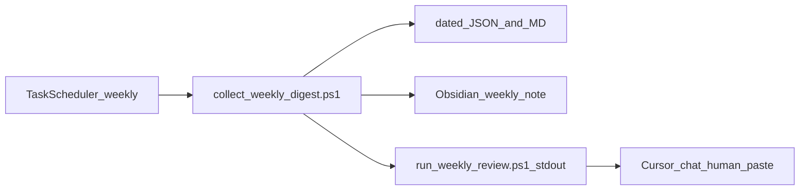

# Weekly automated multi-repo review and AI summary

## Context you already have

- [GOVERNANCE_RITUAL.md](D:/portfolio-harness/.cursor/docs/GOVERNANCE_RITUAL.md) documents that **Task Scheduler can log and print prompts, but Cursor does not run the agent from cron**—the human still opens a chat for meta-review. The same split applies here: **automate data collection + prompt generation; use Cursor (or an API you opt into later) for interpretation.**
- [meta-review skill](D:/portfolio-harness/.cursor/skills/meta-review/SKILL.md) + [run_meta_review.ps1](D:/portfolio-harness/.cursor/scripts/run_meta_review.ps1) already cover **agent telemetry and governance drift** for portfolio-harness. The weekly digest should **compose with** that (link or chained prompt), not duplicate it.
- [goals.json](D:/portfolio-harness/.cursor/state/goals.json) is a concrete **alignment source** for the harness; other repos can optionally add the same path pattern for drift checks.
- You chose: **story points / work from markdown in repos**, and **output both** under portfolio-harness **and** an Obsidian path.

## Architecture

1. **Registry** — single source of truth for “which repos” and where to read markdown work signals.
2. **Collector** — deterministic, no LLM: git stats + file reads → structured JSON + a human-readable Markdown skeleton.
3. **Narrative layer** — LLM in Cursor (default): prompt instructs the model to add status narrative, reflections, prioritized next steps, and **explicit questions for you**, using only the bundle + optional meta-review output.

## 1. Repo registry (new file)

Add something like `[.cursor/registry/weekly_repos.yaml](D:/portfolio-harness/.cursor/registry/weekly_repos.yaml)` (or `.json` if you prefer no YAML dependency):

- `**repos`**: list of entries with:
  - `path` — absolute path to git root (your machine; keep this file **gitignored** or use a committed `weekly_repos.example.yaml` + local override).
  - `name` — short label for the digest.
  - `task_globs` — optional list of globs to read (defaults: `.cursor/state/pending_tasks.md`, `plans/**/*.md`, top-level `README.md` snippet).
  - `goals_path` — optional path to `goals.json` if present.
- `**obsidian`**: `weekly_folder` (vault-relative or absolute) and naming pattern e.g. `Reviews/Weekly/YYYY-Www.md` or `YYYY-MM-DD-weekly-review.md`.
- `**harness_output**`: e.g. `.cursor/state/weekly_digest/` under portfolio-harness.

**Convention for “story points” in markdown** (document in the new ritual doc): pick one lightweight pattern and use it consistently where you care about numbers, for example:

- Optional frontmatter on plan files: `story_points: 3` / `status: done`, or
- A small `WEEKLY_SCOREBOARD.md` per repo with a table: `| week | done_sp | carry_sp | notes |`.

The collector **parses what exists** (frontmatter keys, simple tables, or `SP:` lines) and **reports “unparsed / missing”** so the AI can ask you to standardize rather than inventing metrics.

## 2. Collector script (new)

New script e.g. `[.cursor/scripts/collect_weekly_digest.ps1](D:/portfolio-harness/.cursor/scripts/collect_weekly_digest.ps1)`:

Per registered repo (skip missing paths gracefully):

- `git rev-parse` guard; `git status -sb`; `git log --since=7.days.ago --oneline` (cap line count).
- Optional: `git diff --stat` for dirty trees (bounded output).
- Read matched markdown files with **size caps** (per file and total) to avoid huge payloads.
- If `goals.json` exists, copy a short excerpt (active goals / `active_focus`).

Write outputs:

- `**weekly_digest_YYYY-MM-DD.json`** — machine-readable summary for the AI or future tooling.
- `**weekly_digest_YYYY-MM-DD.md**` — skeleton sections: per-repo Git summary, extracted tasks/plan titles, scoreboard/story-point block if found, “data gaps” list.

## 3. Orchestrator + Obsidian copy (new)

New `[.cursor/scripts/run_weekly_review.ps1](D:/portfolio-harness/.cursor/scripts/run_weekly_review.ps1)`:

- Load registry, run collector, **copy or merge** the Markdown into the configured Obsidian folder (create folder if missing). Prefer **copy** over symlink on Windows unless you explicitly want a single file.
- Append a one-line pointer to [decision_index.md](D:/portfolio-harness/.cursor/state/decision_index.md) or to that day’s [governance_runs](D:/portfolio-harness/.cursor/state/governance_runs/) log (optional flag), consistent with [GOVERNANCE_RITUAL.md](D:/portfolio-harness/.cursor/docs/GOVERNANCE_RITUAL.md).
- **Print a pasteable Cursor prompt** that:
  - References the JSON/MD paths,
  - Asks for: executive summary, per-repo status, **story points interpretation** (only from extracted data), blockers, **next steps (3–5)**, **reflections**, **risks**, and **questions for the human**,
  - Suggests chaining: “If this is Monday governance, also run meta-review per run_meta_review.ps1 and merge insights.”

## 4. Documentation

New `[.cursor/docs/WEEKLY_MULTI_REPO_REVIEW.md](D:/portfolio-harness/.cursor/docs/WEEKLY_MULTI_REPO_REVIEW.md)`:

- Purpose, registry setup, markdown conventions for SP, Task Scheduler one-liner (same pattern as [GOVERNANCE_RITUAL.md § Scheduled task](D:/portfolio-harness/.cursor/docs/GOVERNANCE_RITUAL.md)).
- Link from [AUTOMATION_INDEX.md](D:/portfolio-harness/docs/AUTOMATION_INDEX.md) and optionally a single bullet in GOVERNANCE_RITUAL’s table.

## 5. Git hygiene

- Commit `**weekly_repos.example.yaml`** + scripts + docs.
- Add `**weekly_repos.yaml**` (or local override path) to `**.gitignore**` if it contains absolute paths you do not want pushed—or document using env var `WEEKLY_REGISTRY_PATH` pointing outside the repo.

## Out of scope (unless you expand later)

- **Fully unattended LLM** (API key in CI): possible but separate security/cost review.
- **Jira/GitHub Projects**: you chose markdown; re-open when you want API-backed SP.
- **Deep code analysis** every week: expensive/noisy; keep digest factual; let the chat focus narrative.

## Success criteria

- One scheduled (or manual) command produces **dated artifacts** in the harness **and** a note in Obsidian.
- A **single paste** into Cursor yields a structured weekly brief with **explicit questions** and no fabricated story points when data is missing.

