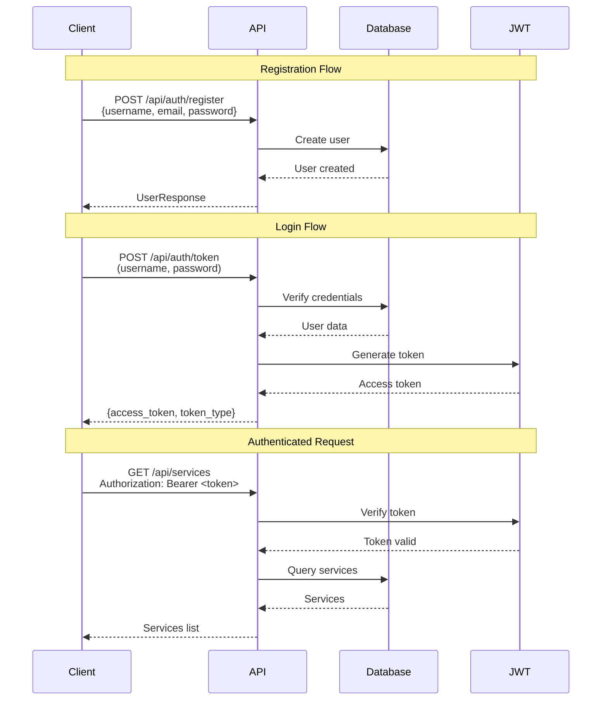

# API Documentation

## Base URL

All API endpoints are prefixed with `/api`.

## Authentication

Most endpoints require authentication using Bearer tokens. Include the token in the Authorization header:

```
Authorization: Bearer <your-token>
```

## Endpoints

### Authentication

#### POST /api/auth/token

Obtain an access token for authentication.

**Request:**
```
Content-Type: application/x-www-form-urlencoded

username=your_username&password=your_password
```

**Response:**
```json
{
  "access_token": "eyJhbGciOiJIUzI1NiIsInR5cCI6IkpXVCJ9...",
  "token_type": "bearer"
}
```

#### POST /api/auth/register

Register a new user account.

**Request:**
```json
{
  "username": "newuser",
  "email": "user@example.com",
  "password": "securepassword"
}
```

**Response:**
```json
{
  "id": 1,
  "username": "newuser",
  "email": "user@example.com",
  "is_active": true,
  "is_admin": false
}
```

#### GET /api/auth/me

Get current user information.

**Headers:**
```
Authorization: Bearer <token>
```

**Response:**
```json
{
  "id": 1,
  "username": "user",
  "email": "user@example.com",
  "is_active": true,
  "is_admin": false
}
```

### Service Management

#### GET /api/services

List all registered services.

**Headers:**
```
Authorization: Bearer <token>
```

**Response:**
```json
[
  {
    "id": 1,
    "name": "seafile",
    "service_type": "file_storage",
    "base_url": "http://seafile:8000",
    "api_url": "http://seafile:8000/api2",
    "health_check_url": "http://seafile:8000/api2/ping/",
    "is_active": true,
    "requires_auth": true,
    "health_status": "healthy"
  }
]
```

#### POST /api/services

Register a new service (admin only).

**Headers:**
```
Authorization: Bearer <token>
Content-Type: application/json
```

**Request:**
```json
{
  "name": "seafile",
  "service_type": "file_storage",
  "base_url": "http://seafile:8000",
  "api_url": "http://seafile:8000/api2",
  "health_check_url": "http://seafile:8000/api2/ping/",
  "requires_auth": true,
  "auth_token": "your-api-token"
}
```

**Response:**
```json
{
  "id": 1,
  "name": "seafile",
  "service_type": "file_storage",
  "base_url": "http://seafile:8000",
  "is_active": true,
  "health_status": "unknown"
}
```

#### GET /api/services/{service_id}

Get a specific service by ID.

**Headers:**
```
Authorization: Bearer <token>
```

**Response:**
```json
{
  "id": 1,
  "name": "seafile",
  "service_type": "file_storage",
  "base_url": "http://seafile:8000",
  "is_active": true,
  "health_status": "healthy"
}
```

#### PUT /api/services/{service_id}

Update a service (admin only).

**Headers:**
```
Authorization: Bearer <token>
Content-Type: application/json
```

**Request:** Same as POST /api/services

#### DELETE /api/services/{service_id}

Delete a service (admin only).

**Headers:**
```
Authorization: Bearer <token>
```

**Response:** 204 No Content

### Health Monitoring

#### GET /api/health

Basic health check endpoint.

**Response:**
```json
{
  "status": "healthy",
  "timestamp": "2024-01-01T00:00:00"
}
```

#### GET /api/health/services

Check health of all registered services.

**Headers:**
```
Authorization: Bearer <token>
```

**Response:**
```json
{
  "timestamp": "2024-01-01T00:00:00",
  "services": {
    "seafile": {
      "status": "healthy",
      "status_code": 200,
      "response_time_ms": 45.2
    },
    "jellyfin": {
      "status": "healthy",
      "status_code": 200,
      "response_time_ms": 123.5
    }
  }
}
```

#### GET /api/health/services/{service_id}

Check health of a specific service.

**Headers:**
```
Authorization: Bearer <token>
```

**Response:**
```json
{
  "service": "seafile",
  "status": "healthy",
  "status_code": 200,
  "response_time_ms": 45.2,
  "timestamp": "2024-01-01T00:00:00"
}
```

### Gateway Endpoints

#### GET /api/gateway/file-storage/libraries

Get file storage libraries.

**Headers:**
```
Authorization: Bearer <token>
```

**Response:**
```json
{
  "libraries": [
    {
      "id": "abc123",
      "name": "My Library",
      "owner": "user@example.com"
    }
  ]
}
```

#### GET /api/gateway/media-server/libraries

Get media server libraries.

**Headers:**
```
Authorization: Bearer <token>
```

**Response:**
```json
{
  "libraries": [
    {
      "Name": "Movies",
      "CollectionType": "movies"
    }
  ]
}
```

#### GET /api/gateway/media-server/recent

Get recently added media items.

**Headers:**
```
Authorization: Bearer <token>
```

**Query Parameters:**
- `limit` (optional): Number of items to return (default: 10)

**Response:**
```json
{
  "items": [
    {
      "Name": "Movie Title",
      "Type": "Movie"
    }
  ]
}
```

#### GET /api/gateway/productivity/pages

Get wiki pages.

**Headers:**
```
Authorization: Bearer <token>
```

**Response:**
```json
{
  "pages": [
    {
      "id": "page-1",
      "title": "Page Title"
    }
  ]
}
```

#### GET /api/gateway/dev-tools/repositories

Get Git repositories.

**Headers:**
```
Authorization: Bearer <token>
```

**Query Parameters:**
- `page` (optional): Page number (default: 1)
- `limit` (optional): Items per page (default: 20)

**Response:**
```json
{
  "repositories": [
    {
      "id": 1,
      "name": "my-repo",
      "full_name": "user/my-repo"
    }
  ]
}
```

#### GET /api/gateway/monitoring/metrics

Get monitoring metrics from Prometheus.

**Headers:**
```
Authorization: Bearer <token>
```

**Query Parameters:**
- `query` (optional): PromQL query string

**Response (with query):**
```json
{
  "result": {
    "status": "success",
    "data": {
      "resultType": "vector",
      "result": [...]
    }
  }
}
```

**Response (without query - list metrics):**
```json
{
  "metrics": [
    "up",
    "cpu_usage",
    "memory_usage"
  ]
}
```

#### GET /api/gateway/monitoring/dashboards

Get Grafana dashboards.

**Headers:**
```
Authorization: Bearer <token>
```

**Response:**
```json
{
  "dashboards": [
    {
      "uid": "dashboard-1",
      "title": "System Overview"
    }
  ]
}
```

#### GET /api/gateway/security/stats

Get Vaultwarden statistics (admin only).

**Headers:**
```
Authorization: Bearer <token>
```

**Response:**
```json
{
  "stats": {
    "users": 10,
    "items": 150
  }
}
```

### Generic Proxy

#### ANY /api/gateway/proxy/{service_name}/{path}

Proxy requests to any registered service.

**Headers:**
```
Authorization: Bearer <token>
```

**Example:**
```
GET /api/gateway/proxy/seafile/api2/repos/
```

This will proxy the request to the service's base URL with the provided path.

## Error Responses

All endpoints may return the following error responses:

### 400 Bad Request
```json
{
  "detail": "Error message"
}
```

### 401 Unauthorized
```json
{
  "detail": "Could not validate credentials"
}
```

### 403 Forbidden
```json
{
  "detail": "Insufficient permissions"
}
```

### 404 Not Found
```json
{
  "detail": "Resource not found"
}
```

### 502 Bad Gateway
```json
{
  "detail": "Service unavailable"
}
```

## Authentication Flow

### Complete Authentication Flow



### Token Usage

1. **Obtain Token**: Use `/api/auth/token` to get an access token
2. **Store Token**: Save the token securely (don't store in localStorage for production)
3. **Include in Requests**: Add `Authorization: Bearer <token>` header to all protected requests
4. **Token Expiration**: Tokens expire after 30 minutes (configurable). Request a new token when expired.

## Error Handling Reference

### Error Response Format

All error responses follow this format:

```json
{
  "detail": "Error message describing what went wrong"
}
```

### HTTP Status Codes

| Status Code | Meaning | Common Causes |
|------------|---------|---------------|
| 200 | Success | Request completed successfully |
| 201 | Created | Resource created successfully |
| 204 | No Content | Resource deleted successfully |
| 400 | Bad Request | Invalid request data, missing required fields |
| 401 | Unauthorized | Missing or invalid authentication token |
| 403 | Forbidden | Insufficient permissions (e.g., admin-only endpoint) |
| 404 | Not Found | Resource or service not found |
| 500 | Internal Server Error | Server-side error |
| 502 | Bad Gateway | External service unavailable or timeout |

### Common Error Scenarios

#### Authentication Errors

**401 Unauthorized - Invalid Token**
```json
{
  "detail": "Could not validate credentials"
}
```
**Solution**: Request a new token using `/api/auth/token`

**401 Unauthorized - Missing Token**
```json
{
  "detail": "Not authenticated"
}
```
**Solution**: Include `Authorization: Bearer <token>` header

**403 Forbidden - Inactive User**
```json
{
  "detail": "User account is inactive"
}
```
**Solution**: Contact administrator to activate account

#### Service Errors

**404 Not Found - Service Not Registered**
```json
{
  "detail": "File storage service not found"
}
```
**Solution**: Register the service using `/api/services` (admin only)

**502 Bad Gateway - Service Unavailable**
```json
{
  "detail": "Service unavailable: Connection timeout"
}
```
**Solution**: Check if the service is running and accessible

#### Validation Errors

**400 Bad Request - Invalid Data**
```json
{
  "detail": "Username already registered"
}
```
**Solution**: Check request data and fix validation errors

## SDK Examples

### Python SDK Example

```python
import requests
from typing import Optional, Dict, Any

class PlatformClient:
    """Python client for Platform API."""
    
    def __init__(self, base_url: str = "http://localhost:8000/api"):
        self.base_url = base_url.rstrip('/')
        self.token: Optional[str] = None
    
    def login(self, username: str, password: str) -> Dict[str, Any]:
        """Authenticate and get access token."""
        response = requests.post(
            f"{self.base_url}/auth/token",
            data={"username": username, "password": password}
        )
        response.raise_for_status()
        data = response.json()
        self.token = data["access_token"]
        return data
    
    def _headers(self) -> Dict[str, str]:
        """Get request headers with authentication."""
        if not self.token:
            raise ValueError("Not authenticated. Call login() first.")
        return {"Authorization": f"Bearer {self.token}"}
    
    def get_services(self) -> list:
        """Get list of all services."""
        response = requests.get(
            f"{self.base_url}/services",
            headers=self._headers()
        )
        response.raise_for_status()
        return response.json()
    
    def get_service(self, service_id: int) -> Dict[str, Any]:
        """Get service by ID."""
        response = requests.get(
            f"{self.base_url}/services/{service_id}",
            headers=self._headers()
        )
        response.raise_for_status()
        return response.json()
    
    def create_service(self, service_data: Dict[str, Any]) -> Dict[str, Any]:
        """Create a new service (admin only)."""
        response = requests.post(
            f"{self.base_url}/services",
            json=service_data,
            headers=self._headers()
        )
        response.raise_for_status()
        return response.json()
    
    def check_health(self) -> Dict[str, Any]:
        """Check API health."""
        response = requests.get(f"{self.base_url}/health")
        response.raise_for_status()
        return response.json()
    
    def check_all_services_health(self) -> Dict[str, Any]:
        """Check health of all services."""
        response = requests.get(
            f"{self.base_url}/health/services",
            headers=self._headers()
        )
        response.raise_for_status()
        return response.json()
    
    def get_file_storage_libraries(self) -> Dict[str, Any]:
        """Get file storage libraries."""
        response = requests.get(
            f"{self.base_url}/gateway/file-storage/libraries",
            headers=self._headers()
        )
        response.raise_for_status()
        return response.json()

# Usage example
client = PlatformClient("http://localhost:8000/api")
client.login("admin", "password")
services = client.get_services()
print(services)
```

### JavaScript/TypeScript SDK Example

```typescript
class PlatformClient {
  private baseUrl: string;
  private token: string | null = null;

  constructor(baseUrl: string = "http://localhost:8000/api") {
    this.baseUrl = baseUrl.replace(/\/$/, "");
  }

  async login(username: string, password: string): Promise<any> {
    const formData = new URLSearchParams();
    formData.append("username", username);
    formData.append("password", password);

    const response = await fetch(`${this.baseUrl}/auth/token`, {
      method: "POST",
      headers: {
        "Content-Type": "application/x-www-form-urlencoded",
      },
      body: formData,
    });

    if (!response.ok) {
      throw new Error(`Login failed: ${response.statusText}`);
    }

    const data = await response.json();
    this.token = data.access_token;
    return data;
  }

  private getHeaders(): HeadersInit {
    if (!this.token) {
      throw new Error("Not authenticated. Call login() first.");
    }
    return {
      "Authorization": `Bearer ${this.token}`,
      "Content-Type": "application/json",
    };
  }

  async getServices(): Promise<any[]> {
    const response = await fetch(`${this.baseUrl}/services`, {
      headers: this.getHeaders(),
    });

    if (!response.ok) {
      throw new Error(`Failed to get services: ${response.statusText}`);
    }

    return response.json();
  }

  async getService(serviceId: number): Promise<any> {
    const response = await fetch(`${this.baseUrl}/services/${serviceId}`, {
      headers: this.getHeaders(),
    });

    if (!response.ok) {
      throw new Error(`Failed to get service: ${response.statusText}`);
    }

    return response.json();
  }

  async createService(serviceData: any): Promise<any> {
    const response = await fetch(`${this.baseUrl}/services`, {
      method: "POST",
      headers: this.getHeaders(),
      body: JSON.stringify(serviceData),
    });

    if (!response.ok) {
      throw new Error(`Failed to create service: ${response.statusText}`);
    }

    return response.json();
  }

  async checkHealth(): Promise<any> {
    const response = await fetch(`${this.baseUrl}/health`);
    if (!response.ok) {
      throw new Error(`Health check failed: ${response.statusText}`);
    }
    return response.json();
  }

  async checkAllServicesHealth(): Promise<any> {
    const response = await fetch(`${this.base_url}/health/services`, {
      headers: this.getHeaders(),
    });

    if (!response.ok) {
      throw new Error(`Health check failed: ${response.statusText}`);
    }

    return response.json();
  }

  async getFileStorageLibraries(): Promise<any> {
    const response = await fetch(
      `${this.baseUrl}/gateway/file-storage/libraries`,
      {
        headers: this.getHeaders(),
      }
    );

    if (!response.ok) {
      throw new Error(`Failed to get libraries: ${response.statusText}`);
    }

    return response.json();
  }
}

// Usage example
const client = new PlatformClient("http://localhost:8000/api");
await client.login("admin", "password");
const services = await client.getServices();
console.log(services);
```

### cURL Examples

#### Authentication

```bash
# Login and get token
TOKEN=$(curl -X POST http://localhost:8000/api/auth/token \
  -d "username=admin&password=password" \
  | jq -r '.access_token')

# Register new user
curl -X POST http://localhost:8000/api/auth/register \
  -H "Content-Type: application/json" \
  -d '{
    "username": "newuser",
    "email": "user@example.com",
    "password": "securepassword"
  }'

# Get current user
curl -X GET http://localhost:8000/api/auth/me \
  -H "Authorization: Bearer $TOKEN"
```

#### Service Management

```bash
# List all services
curl -X GET http://localhost:8000/api/services \
  -H "Authorization: Bearer $TOKEN"

# Get specific service
curl -X GET http://localhost:8000/api/services/1 \
  -H "Authorization: Bearer $TOKEN"

# Create service (admin only)
curl -X POST http://localhost:8000/api/services \
  -H "Authorization: Bearer $TOKEN" \
  -H "Content-Type: application/json" \
  -d '{
    "name": "seafile",
    "service_type": "file_storage",
    "base_url": "http://seafile:8000",
    "api_url": "http://seafile:8000/api2",
    "health_check_url": "http://seafile:8000/api2/ping/",
    "requires_auth": true,
    "auth_token": "your-token"
  }'

# Update service (admin only)
curl -X PUT http://localhost:8000/api/services/1 \
  -H "Authorization: Bearer $TOKEN" \
  -H "Content-Type: application/json" \
  -d '{
    "name": "seafile",
    "service_type": "file_storage",
    "base_url": "http://seafile:8000",
    "requires_auth": true
  }'

# Delete service (admin only)
curl -X DELETE http://localhost:8000/api/services/1 \
  -H "Authorization: Bearer $TOKEN"
```

#### Health Monitoring

```bash
# Basic health check
curl -X GET http://localhost:8000/api/health

# Check all services
curl -X GET http://localhost:8000/api/health/services \
  -H "Authorization: Bearer $TOKEN"

# Check specific service
curl -X GET http://localhost:8000/api/health/services/1 \
  -H "Authorization: Bearer $TOKEN"
```

#### Gateway Endpoints

```bash
# Get file storage libraries
curl -X GET http://localhost:8000/api/gateway/file-storage/libraries \
  -H "Authorization: Bearer $TOKEN"

# Get media server libraries
curl -X GET http://localhost:8000/api/gateway/media-server/libraries \
  -H "Authorization: Bearer $TOKEN"

# Get recent media items
curl -X GET "http://localhost:8000/api/gateway/media-server/recent?limit=10" \
  -H "Authorization: Bearer $TOKEN"

# Get repositories
curl -X GET "http://localhost:8000/api/gateway/dev-tools/repositories?page=1&limit=20" \
  -H "Authorization: Bearer $TOKEN"

# Query Prometheus metrics
curl -X GET "http://localhost:8000/api/gateway/monitoring/metrics?query=up" \
  -H "Authorization: Bearer $TOKEN"

# Get Grafana dashboards
curl -X GET http://localhost:8000/api/gateway/monitoring/dashboards \
  -H "Authorization: Bearer $TOKEN"

# Get security stats (admin only)
curl -X GET http://localhost:8000/api/gateway/security/stats \
  -H "Authorization: Bearer $TOKEN"

# Generic proxy
curl -X GET http://localhost:8000/api/gateway/proxy/seafile/api2/repos/ \
  -H "Authorization: Bearer $TOKEN"
```

## Rate Limiting

Currently, there is no rate limiting implemented. Consider implementing rate limiting for production use.

**Recommended Rate Limits:**
- Authentication endpoints: 5 requests per minute per IP
- API endpoints: 100 requests per minute per user
- Health check endpoints: 10 requests per minute per user

## Pagination

Some endpoints support pagination using `page` and `limit` query parameters:

- **page**: Page number (default: 1, minimum: 1)
- **limit**: Items per page (default: 20, minimum: 1, maximum: 100)

**Example:**
```
GET /api/gateway/dev-tools/repositories?page=2&limit=50
```

**Response Format:**
```json
{
  "repositories": [...],
  "page": 2,
  "limit": 50,
  "total": 150
}
```

## OpenAPI Specification

A complete OpenAPI 3.0 specification is available at [OPENAPI.yaml](OPENAPI.yaml).

You can use this specification to:
- Generate client SDKs using tools like OpenAPI Generator
- Import into API testing tools like Postman or Insomnia
- Generate interactive API documentation

**View Interactive Documentation:**
- Swagger UI: `http://localhost:8000/docs`
- ReDoc: `http://localhost:8000/redoc`

## See Also

- [Architecture Documentation](ARCHITECTURE.md) - System architecture overview
- [Data Flow Documentation](DATA_FLOW.md) - Request flow patterns
- [Service Integration Guide](SERVICE_INTEGRATION.md) - Service integration patterns
- [Deployment Guide](DEPLOYMENT.md) - Deployment instructions
