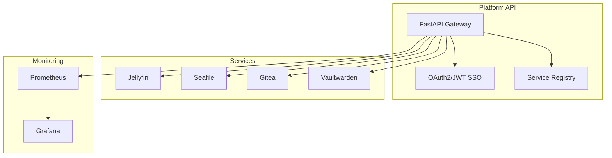

# Self-Hosted Platform — Unified Home Lab Integration

One place to run and manage security, job automation, education, and monitoring services—with a single dashboard, SSO, and an API gateway so everything is discoverable and authenticated in one go.

[](https://www.python.org/downloads/) [](LICENSE)

**Tech stack:** FastAPI, PostgreSQL, Docker Compose, Nginx, Prometheus, Grafana.

## Problem → Solution → Impact

- **Problem:** Self-hosted services (Jellyfin, Seafile, Gitea, Vaultwarden, etc.) each have their own auth, dashboards, and health checks—no single pane of glass.
- **Solution:** FastAPI-based Platform API with OAuth2/JWT SSO, service registry, API gateway, and unified dashboard. All services integrate through one authenticated entry point.
- **Impact:** Single sign-on across services; centralized monitoring; one API to discover and manage everything.

## Features

- **Unified Authentication**: Single sign-on (SSO) across all services using OAuth2/JWT
- **Service Discovery**: Automatic detection and registration of services
- **Health Monitoring**: Centralized health checks for all services
- **API Gateway**: Single entry point for all service APIs
- **Dashboard**: Unified web interface showing all services
- **Docker Integration**: Easy deployment via Docker Compose

## Architecture Overview



### Service Integration
- All services integrate through Platform API
- Unified authentication via OAuth2/JWT
- Centralized monitoring via Prometheus/Grafana
- Service discovery and health monitoring
- API Gateway pattern for service access

### Data Flow
1. Platform API provides unified entry point
2. Services register via service registry
3. Authentication handled centrally
4. Monitoring collects metrics from all services
5. Security service monitors all traffic

### Component Architecture

The platform consists of:

- **Platform API**: FastAPI-based integration layer
- **Service Clients**: Python API clients for each service
- **Frontend Dashboard**: Web UI for accessing all services
- **Reverse Proxy**: Nginx for routing requests
- **Database**: PostgreSQL for user management and service registry
- **Monitoring Stack**: Prometheus, Grafana, Alertmanager for observability
- **Security Layer**: IDS, threat detection, firewall automation

## Complete Service Inventory

### Core Platform Services
- **Platform API** (Port 8000) - Main integration layer, authentication, service registry
- **PostgreSQL** (Port 5432) - Primary database for platform and services

### Security & Monitoring Services
- **Security Service** (Port 8001) - IDS, threat detection, firewall automation, SIEM
- **Home Cyber Risk** (Port 8002) - Multi-source breach monitoring, risk scoring, DNS protection
- **Monitoring Stack** (Ports 3001, 9090, 9093) - Prometheus, Grafana, Alertmanager

### Application Services
- **Job Automation Service** (Port 8004) - Multi-source job search, AI cover letters, application tracking
- **Education Service** (Port 8003) - Content management, project tracking, Pi integration
- **Pi Client** - Raspberry Pi endpoint for educational platform

### Infrastructure Services
- **Seafile** (Port 8001) - File storage and sync
- **Jellyfin** (Port 8096) - Media server
- **Gitea** (Port 3000) - Git service
- **BookStack** - Wiki/documentation (if configured)
- **Vaultwarden** - Self-hosted password manager

### Infrastructure Automation
- **Ansible** - Server provisioning, deployment automation
- **Terraform** - Cloud infrastructure (future)
- **Scripts** - Automation utilities (network, monitoring, security, Pi)

### Supporting Services
- **Portfolio Website** - Business showcase
- **Business Documentation** - Templates, workflows, legal docs

## Service Documentation

Each service has its own comprehensive README:
- [Home Cyber Risk](home-cyber-risk/README.md) - Breach monitoring and DNS protection
- [Security Service](security-service/README.md) - Security monitoring and threat detection
- [Education Service](education-service/README.md) - Educational content management
- [Job Automation Service](job-automation-service/README.md) - Job search and application automation
- [Monitoring Stack](monitoring/README.md) - Prometheus, Grafana, and Alertmanager
- [Pi Client](pi-client/README.md) - Raspberry Pi integration
- [Ansible Automation](ansible/README.md) - Infrastructure automation
- [Terraform](terraform/README.md) - Infrastructure as code (future)

## Quick Start

### Prerequisites

- Docker and Docker Compose
- At least 4GB of available RAM
- 20GB+ of free disk space

### Installation

1. Clone or download this repository:
```bash
cd software
```

2. Copy the environment file:
```bash
cp .env.example .env
```

3. Edit `.env` and configure your settings (especially secrets):
```bash
# Edit with your preferred editor
nano .env
```

4. Start all services:
```bash
docker-compose up -d
```

5. Initialize the database:
```bash
# Access the platform container
docker exec -it platform-api bash

# Initialize database (in debug mode)
curl -X POST http://localhost:8000/api/auth/init-db
```

6. Create your first admin user:
```bash
# Register a user
curl -X POST http://localhost:8000/api/auth/register \
  -H "Content-Type: application/json" \
  -d '{
    "username": "admin",
    "email": "admin@example.com",
    "password": "your-secure-password"
  }'

# Make user admin (connect to database)
docker exec -it platform-postgres psql -U platform -d platform
# Then run: UPDATE users SET is_admin = true WHERE username = 'admin';
```

7. Access the dashboard:
   - Open your browser to `http://localhost/dashboard`
   - Login with your credentials

## Configuration

### Environment Variables

Key environment variables in `.env`:

- **`SECRET_KEY`** (REQUIRED): Secret key for application. Must be at least 32 characters long. The application will fail to start if not set. Generate with: `python -c "import secrets; print(secrets.token_urlsafe(32))"`
- **`JWT_SECRET_KEY`** (REQUIRED): Secret key for JWT tokens. Must be at least 32 characters long. The application will fail to start if not set. Generate with: `python -c "import secrets; print(secrets.token_urlsafe(32))"`
- `DATABASE_URL`: PostgreSQL connection string
- Service-specific URLs and tokens

**⚠️ WARNING**: The application will not start without `SECRET_KEY` and `JWT_SECRET_KEY` set. These are mandatory environment variables with no default values for security reasons.

### Service Configuration

Each service can be configured through environment variables or the service registry API. See individual service documentation for details.

## API Documentation

### Authentication

All API endpoints (except `/api/auth/token` and `/api/auth/register`) require authentication via Bearer token.

#### Login
```bash
POST /api/auth/token
Content-Type: application/x-www-form-urlencoded

username=your_username&password=your_password
```

Response:
```json
{
  "access_token": "eyJ...",
  "token_type": "bearer"
}
```

#### Register
```bash
POST /api/auth/register
Content-Type: application/json

{
  "username": "newuser",
  "email": "user@example.com",
  "password": "securepassword"
}
```

### Service Management

#### List Services
```bash
GET /api/services
Authorization: Bearer <token>
```

#### Register Service
```bash
POST /api/services
Authorization: Bearer <token>
Content-Type: application/json

{
  "name": "seafile",
  "service_type": "file_storage",
  "base_url": "http://seafile:8000",
  "api_url": "http://seafile:8000/api2",
  "health_check_url": "http://seafile:8000/api2/ping/",
  "requires_auth": true,
  "auth_token": "your-token-here"
}
```

### Health Monitoring

#### Check All Services
```bash
GET /api/health/services
Authorization: Bearer <token>
```

#### Check Specific Service
```bash
GET /api/health/services/{service_id}
Authorization: Bearer <token>
```

### Gateway Endpoints

#### File Storage
```bash
GET /api/gateway/file-storage/libraries
Authorization: Bearer <token>
```

#### Media Server
```bash
GET /api/gateway/media-server/libraries
GET /api/gateway/media-server/recent?limit=10
Authorization: Bearer <token>
```

#### Development Tools
```bash
GET /api/gateway/dev-tools/repositories?page=1&limit=20
Authorization: Bearer <token>
```

#### Monitoring
```bash
GET /api/gateway/monitoring/metrics?query=up
GET /api/gateway/monitoring/dashboards
Authorization: Bearer <token>
```

## Development

### Project Structure

```
software/
├── docker-compose.yml          # Main orchestration
├── Dockerfile                  # Platform container
├── requirements.txt            # Python dependencies
├── .env.example                # Environment template
│
├── platform/                   # Main integration platform
│   ├── main.py                 # FastAPI application
│   ├── config.py               # Configuration
│   ├── auth/                   # Authentication
│   ├── api/                    # API routes
│   └── models/                 # Data models
│
├── services/                   # Service integrations
│   ├── file_storage/
│   ├── media_server/
│   ├── productivity/
│   ├── dev_tools/
│   ├── monitoring/
│   └── security/
│
├── frontend/                   # Web UI
│   ├── static/
│   └── templates/
│
├── nginx/                      # Reverse proxy config
└── prometheus/                 # Prometheus config
```

### Running Locally

1. Install dependencies:
```bash
pip install -r requirements.txt
```

2. Set up environment:
```bash
cp .env.example .env
# Edit .env with your settings
```

3. Start database:
```bash
docker-compose up -d postgres
```

4. Run migrations (if using Alembic):
```bash
alembic upgrade head
```

5. Run the platform:
```bash
uvicorn platform.main:app --reload
```

### Adding New Services

1. Create a service client in `services/your_service/`
2. Add configuration in `services/your_service/config.py`
3. Add gateway routes in `platform/api/gateway.py`
4. Update docker-compose.yml with the new service
5. Update nginx.conf with routing rules

## Testing

### Running Tests

```bash
# Install test dependencies
pip install -r requirements.txt

# Run all tests
pytest

# Run specific test categories
pytest tests/unit          # Unit tests
pytest tests/integration   # Integration tests
pytest tests/e2e          # End-to-end tests

# Run with coverage
pytest --cov=app --cov=services --cov-report=html

# Run specific test file
pytest tests/unit/test_auth_jwt.py

# Run with markers
pytest -m "unit"           # Only unit tests
pytest -m "not slow"      # Exclude slow tests
```

### Test Coverage

The project aims for:
- Overall coverage: 80%+
- Critical paths: 95%+
- Service clients: 75%+
- API endpoints: 90%+

View coverage report:
```bash
pytest --cov=app --cov=services --cov-report=html
open htmlcov/index.html
```

### Test Structure

```
tests/
├── unit/              # Unit tests (fast, isolated)
├── integration/      # Integration tests (with database)
├── e2e/              # End-to-end tests (complete workflows)
├── fixtures/         # Test data and mocks
└── conftest.py       # Shared fixtures
```

For more details, see [Development Guide](docs/DEVELOPMENT.md).

## Troubleshooting

### Services Not Starting

- Check Docker logs: `docker-compose logs <service-name>`
- Verify environment variables in `.env`
- Ensure ports are not already in use
- Check disk space: `docker system df`

### Database Connection Issues

- Verify PostgreSQL is running: `docker-compose ps postgres`
- Check connection string in `.env`
- Ensure database is initialized

### Authentication Problems

- Verify JWT_SECRET_KEY is set
- Check token expiration time
- Ensure user account is active

## Security Considerations

1. **Required Secrets**: `SECRET_KEY` and `JWT_SECRET_KEY` must be set as environment variables (no defaults). Generate strong secrets (32+ characters) before deployment.
2. **Use HTTPS**: Configure SSL/TLS certificates for production
3. **Firewall**: Restrict access to necessary ports only
4. **Regular Updates**: Keep all containers and dependencies updated
5. **Backup**: Regularly backup PostgreSQL database and service data

For detailed security information, see [Security Guide](docs/SECURITY.md).

## License

This project integrates multiple open-source services. Each service has its own license. Please refer to individual service documentation for license information.

## Contributing

Contributions are welcome! Please feel free to submit a Pull Request.

## Documentation

### Project Documentation

- [Architecture Documentation](docs/ARCHITECTURE.md) - System architecture and design
- [Deployment Guide](docs/DEPLOYMENT.md) - Production deployment instructions
- [Development Guide](docs/DEVELOPMENT.md) - Development setup and contributing
- [Security Guide](docs/SECURITY.md) - Security best practices and configuration
- [API Documentation](API.md) - API endpoint reference

### AI Agent Documentation

- **[AI Documentation Index](docs/AI_DOCUMENTATION_INDEX.md)** - Master navigation hub for all AI documentation
- [AI Principles](docs/AI_PRINCIPLES.md) - Core principles, safety mechanisms, and governance framework
- [AI Patterns](docs/AI_PATTERNS.md) - Code implementation patterns with real examples
- [AI Task Templates](docs/AI_TASK_TEMPLATES.md) - Standardized task decomposition templates
- [AI Validation Checklist](docs/AI_VALIDATION_CHECKLIST.md) - Pre-execution validation checklists
- [AI Codebase Map](docs/AI_CODEBASE_MAP.md) - Navigation guide and file location reference
- [AI Prompt Library](docs/AI_PROMPT_LIBRARY.md) - Reusable prompt templates for AI interactions

These AI documentation files work together as a cohesive system to guide AI agents and maintain alignment with project principles. Start with the [AI Documentation Index](docs/AI_DOCUMENTATION_INDEX.md) for navigation.

## Support

For issues and questions:
- Check service-specific documentation
- Review Docker logs for errors
- Open an issue on the repository

## Acknowledgments

This project integrates services from the [awesome-selfhosted](https://github.com/awesome-selfhosted/awesome-selfhosted) list.


