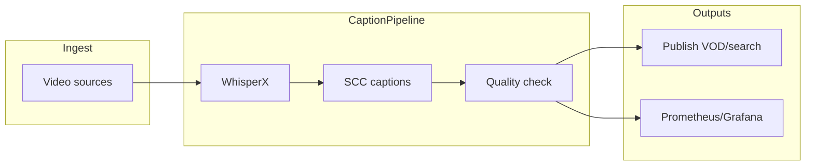
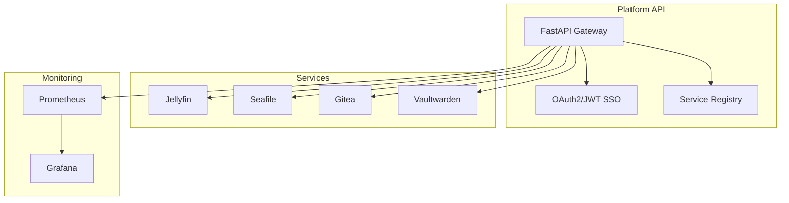

# media-ops-platform — CaptionPipeline + Platform API

Production media caption automation and a self-hosted FastAPI integration plane for homelab services.

[](https://www.python.org/downloads/) [](LICENSE) [](https://github.com/ManintheCrowds/media-ops-platform/actions/workflows/tests.yml)

## CaptionPipeline — Problem → Solution → Impact

- **Problem:** Large video libraries were hard to search and lacked consistent captions; manual captioning did not scale across multiple production feeds.
- **Solution:** End-to-end pipeline: ingest → WhisperX transcription → broadcast SCC-format captions → publication to VOD/search with monitoring and alerting.
- **Impact (portfolio snapshot):** 256+ caption files, 330+ content hours, ~93.5% success rate, &lt;1% errors, 100% uptime across **9 production feeds** (see [docs/portfolio/README.md](docs/portfolio/README.md) for metrics and diagram sources).

### CaptionPipeline architecture



Export PNGs from [docs/portfolio/architecture-high-level.mmd](docs/portfolio/architecture-high-level.mmd) for portfolio pages.

---

## Platform API

One place to run and manage security, job automation, education, and monitoring services—with a single dashboard, SSO, and an API gateway so everything is discoverable and authenticated in one go.

## Platform API — Problem → Solution → Impact

- **Problem:** Self-hosted services (Jellyfin, Seafile, Gitea, Vaultwarden, etc.) each have their own auth, dashboards, and health checks—no single pane of glass.
- **Solution:** FastAPI-based Platform API with OAuth2/JWT SSO, service registry, API gateway, and unified dashboard.
- **Impact:** Single sign-on across services; centralized monitoring; one API to discover and manage everything.



## Tech stack

| Area | Technologies |
|------|----------------|
| CaptionPipeline | WhisperX, Celery, Redis, PostgreSQL, Flask/FastAPI workers, Prometheus, Grafana |
| Platform API | FastAPI, SQLAlchemy, Alembic, OAuth2/JWT, Docker Compose, Nginx |

## What runs from this clone

**Runnable in-repo:** Platform API and homelab services via `docker compose up` (see Quick start). **CaptionPipeline** architecture, metrics, and case study live under [docs/portfolio/](docs/portfolio/README.md); pipeline workers are not the primary `app/` entrypoint in this repository tree.

## Quick start

**Prerequisites:** Docker and Docker Compose, 4GB+ RAM, 20GB+ disk.

```bash
git clone https://github.com/ManintheCrowds/media-ops-platform.git
cd media-ops-platform
cp .env.example .env
# Edit .env — set SECRET_KEY and JWT_SECRET_KEY (min 32 chars each)
docker compose up -d
```

Initialize the platform database and create an admin user — see [docs/DEVELOPMENT.md](docs/DEVELOPMENT.md) for full steps. Dashboard (when compose profile includes it): `http://localhost/dashboard`.

> **Note:** Full multi-service compose is homelab-oriented; minimal CI runs unit/integration tests without the entire stack.

## Documentation

- [docs/API.md](docs/API.md) — Platform OpenAPI entry and CaptionPipeline surfaces
- [docs/DEVELOPMENT.md](docs/DEVELOPMENT.md) — Local development and testing
- [docs/portfolio/README.md](docs/portfolio/README.md) — Portfolio metrics and diagram export
- [ROADMAP.md](ROADMAP.md) — Planned work

Service-level READMEs: [education-service](education-service/README.md), [job-automation-service](job-automation-service/README.md), [monitoring](monitoring/README.md), [security-service](security-service/README.md).

## Testing

```bash
python -m pip install -r requirements.txt
python -m pytest tests/ -v
```

CI runs lint, unit, and integration workflows on push/PR — see [.github/workflows/tests.yml](.github/workflows/tests.yml).

## License

MIT — see [LICENSE](LICENSE).
