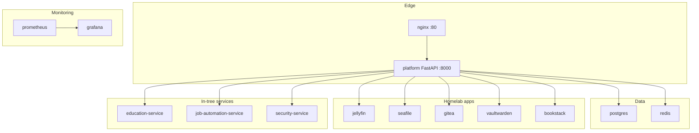

# media-ops-platform — homelab Platform API

Self-hosted FastAPI integration plane: JWT auth, service registry, API gateway, and a dashboard in front of compose-backed homelab apps.

This clone does **not** run CaptionPipeline workers (WhisperX / SCC). That work is a dated portfolio case study under [docs/portfolio/](docs/portfolio/README.md).

[](https://www.python.org/downloads/) [](LICENSE) [](https://github.com/ManintheCrowds/media-ops-platform/actions/workflows/tests.yml)

## Platform API — Problem → Solution → Impact

- **Problem:** Homelab apps each ship their own login, health, and UI. Operators want one authenticated place to discover and proxy them.
- **Solution:** FastAPI Platform API with OAuth2-password / JWT for the dashboard and API, a service registry, a gateway to registered backends, Nginx on port 80, Postgres, Redis, Prometheus, and Grafana.
- **Impact:** One clone-and-compose plane for the apps listed below. This is **not** federated SSO into Jellyfin, Seafile, Gitea, or Vaultwarden — those keep their own accounts unless you configure them separately.

### What `docker compose` starts (default file)


```mermaid
flowchart TB
  subgraph edge [Edge]
    NGX[nginx :80]
    API[platform FastAPI :8000]
  end
  subgraph data [Data]
    PG[postgres]
    R[redis]
  end
  subgraph apps [Homelab apps]
    JF[jellyfin]
    SF[seafile]
    GT[gitea]
    VW[vaultwarden]
    BS[bookstack]
  end
  subgraph extras [In-tree services]
    EDU[education-service]
    JOB[job-automation-service]
    SEC[security-service]
  end
  subgraph mon [Monitoring]
    PROM[prometheus]
    GRAF[grafana]
  end
  NGX --> API
  API --> PG
  API --> R
  API --> JF
  API --> SF
  API --> GT
  API --> VW
  API --> BS
  API --> EDU
  API --> JOB
  API --> SEC
  PROM --> GRAF
```

Auth for `/dashboard` and `/api/*` is the platform JWT. Gateway calls may forward a per-service token from the registry; they do not log you into those apps as a single IdP.

## Quick start

**Prerequisites:** Docker and Docker Compose, 4GB+ RAM, 20GB+ disk. Default compose is homelab-sized (many services). CI runs tests without this stack.

```bash
git clone https://github.com/ManintheCrowds/media-ops-platform.git
cd media-ops-platform
cp .env.example .env
# Edit .env — set SECRET_KEY and JWT_SECRET_KEY (min 32 chars each)
docker compose up -d
```

- Platform API: `http://localhost:8000` (OpenAPI at `/docs`, health at `GET /api/health`)
- Dashboard (nginx): `http://localhost/dashboard`

Initialize the database and create an admin user: [docs/DEPLOYMENT.md](docs/DEPLOYMENT.md) (`POST /api/auth/init-db`, register, then `is_admin`). Venv-only development: [docs/DEVELOPMENT.md](docs/DEVELOPMENT.md).

## Tech stack (this clone)

| Area | Technologies |
|------|----------------|
| Platform API | FastAPI, SQLAlchemy, Alembic, OAuth2-password / JWT, Python 3.11 |
| Runtime | Docker Compose, Nginx, PostgreSQL 15, Redis |
| Homelab images | Jellyfin, Seafile, Gitea, Vaultwarden, BookStack |
| Observability | Prometheus, Grafana |

## Also in this tree

Pointers only — not a second product pitch.

| Path | What it is |
|------|------------|
| [education-service](education-service/README.md) | Education CMS (also a compose service) |
| [job-automation-service](job-automation-service/README.md) | Job scrape/match (also a compose service) |
| [security-service](security-service/README.md) | Security service (also a compose service) |
| [monitoring](monitoring/README.md) | Prometheus/Grafana operator notes |
| [home-cyber-risk](home-cyber-risk/README.md) | Separate HIBP/DNS awareness stack (own compose) |
| [pi-client](pi-client/README.md) | Raspberry Pi client for the education path |
| [portfolio](portfolio/README.md) | Static portfolio site |

`ansible/` is operator automation. `terraform/` is a stub, not an implementation.

## CaptionPipeline — portfolio case study (not this runtime)

**Snapshot (Dec 2025), not live from this compose:** 256+ caption files, 330+ content hours, ~93.5% success, 9 production feeds. Source of truth: [docs/portfolio/metrics.json](docs/portfolio/metrics.json). Live Grafana capture is still deferred ([PF-REPO-2](docs/portfolio/README.md)).

Pipeline workers (WhisperX → SCC → publish) are **not** in `app/` or root compose. Architecture sources: [docs/portfolio/architecture-high-level.mmd](docs/portfolio/architecture-high-level.mmd).

## Documentation

- [docs/API.md](docs/API.md) — Platform OpenAPI entry
- [docs/DEVELOPMENT.md](docs/DEVELOPMENT.md) — Local venv and tests
- [docs/DEPLOYMENT.md](docs/DEPLOYMENT.md) — Compose deploy, DB init, admin user
- [docs/portfolio/README.md](docs/portfolio/README.md) — CaptionPipeline case-study kit
- [ROADMAP.md](ROADMAP.md) — Planned work

## Testing

```bash
python -m pip install -r requirements.txt
python -m pytest tests/ -v
```

CI: lint, unit, integration (path-filtered) — [.github/workflows/tests.yml](.github/workflows/tests.yml).

## License

MIT — see [LICENSE](LICENSE).
