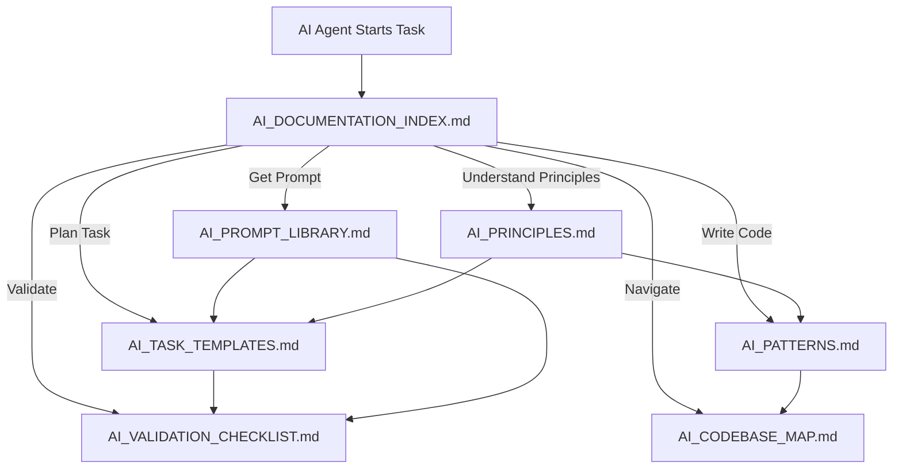

# AI Documentation Index

**Purpose**: Central navigation hub for all AI-related documentation in this codebase.

**How to Use**: Start here to find the right document for your task. Each document is standalone but cross-referenced for easy navigation.

---

## Quick Start Guide

### I'm new to this codebase
→ Start with [AI_CODEBASE_MAP.md](AI_CODEBASE_MAP.md) to understand the structure, then read [AI_PRINCIPLES.md](AI_PRINCIPLES.md) for core principles.

### I need to write code
→ Use [AI_PATTERNS.md](AI_PATTERNS.md) for code patterns, [AI_CODEBASE_MAP.md](AI_CODEBASE_MAP.md) to find where code goes, and [AI_VALIDATION_CHECKLIST.md](AI_VALIDATION_CHECKLIST.md) before committing.

### I need to plan a task
→ Start with [AI_TASK_TEMPLATES.md](AI_TASK_TEMPLATES.md) to decompose your task, then use [AI_VALIDATION_CHECKLIST.md](AI_VALIDATION_CHECKLIST.md) for safety checks.

### I need to validate safety
→ Go directly to [AI_VALIDATION_CHECKLIST.md](AI_VALIDATION_CHECKLIST.md) for comprehensive pre-execution validation.

### I need a prompt template
→ Check [AI_PROMPT_LIBRARY.md](AI_PROMPT_LIBRARY.md) for reusable prompt templates.

---

## Document Overview

| Document | Purpose | When to Use | Primary Audience | Read Time |
|----------|---------|-------------|------------------|-----------|
| **[AI_PRINCIPLES.md](AI_PRINCIPLES.md)** | Core principles and governance framework | Understanding foundational principles, decision-making | All AI agents, human reviewers | 15-20 min |
| **[AI_PATTERNS.md](AI_PATTERNS.md)** | Code implementation patterns with examples | Writing new code, refactoring, following conventions | AI agents writing code | 10-15 min |
| **[AI_TASK_TEMPLATES.md](AI_TASK_TEMPLATES.md)** | Standardized task decomposition templates | Planning tasks, breaking down work, identifying dependencies | AI agents planning work | 5-10 min |
| **[AI_VALIDATION_CHECKLIST.md](AI_VALIDATION_CHECKLIST.md)** | Pre-execution validation checklists | Before executing any change, safety verification | All AI agents, reviewers | 5-10 min |
| **[AI_CODEBASE_MAP.md](AI_CODEBASE_MAP.md)** | Navigation guide and file location reference | Finding where code lives, understanding structure | All AI agents, new contributors | 10-15 min |
| **[AI_PROMPT_LIBRARY.md](AI_PROMPT_LIBRARY.md)** | Reusable prompt templates for AI interactions | Standardizing AI interactions, consistent prompts | AI agents, prompt engineers | 10-15 min |

---

## Document Relationships

**Dependency Flow**:
1. **Principles** → Foundation for all decisions
2. **Templates** → Task planning and decomposition
3. **Patterns** → Code implementation guidance
4. **Checklist** → Safety validation (used with templates and patterns)
5. **Map** → Navigation and code location
6. **Prompts** → Standardized interactions (used with all)

---

## Task-Based Navigation

### I want to add a new feature

**Read these documents in this order**:
1. [AI_TASK_TEMPLATES.md](AI_TASK_TEMPLATES.md#template-7-feature-addition) - Use Feature Addition template
2. [AI_CODEBASE_MAP.md](AI_CODEBASE_MAP.md) - Find where to place code
3. [AI_PATTERNS.md](AI_PATTERNS.md) - Follow code patterns
4. [AI_VALIDATION_CHECKLIST.md](AI_VALIDATION_CHECKLIST.md) - Validate before execution
5. [AI_PRINCIPLES.md](AI_PRINCIPLES.md) - Ensure alignment with principles

### I want to fix a bug

**Read these documents in this order**:
1. [AI_TASK_TEMPLATES.md](AI_TASK_TEMPLATES.md#template-4-bug-fix) - Use Bug Fix template
2. [AI_CODEBASE_MAP.md](AI_CODEBASE_MAP.md) - Locate relevant code
3. [AI_PATTERNS.md](AI_PATTERNS.md) - Understand existing patterns
4. [AI_VALIDATION_CHECKLIST.md](AI_VALIDATION_CHECKLIST.md#section-2-code-change-validation) - Validate fix
5. [AI_PROMPT_LIBRARY.md](AI_PROMPT_LIBRARY.md#prompt-4-bug-fix-prompt) - Use bug fix prompt

### I want to refactor code

**Read these documents in this order**:
1. [AI_PRINCIPLES.md](AI_PRINCIPLES.md#5-rebuilding-from-first-principles-playbook) - Understand refactoring principles
2. [AI_TASK_TEMPLATES.md](AI_TASK_TEMPLATES.md#template-6-refactoring) - Use Refactoring template
3. [AI_PATTERNS.md](AI_PATTERNS.md) - Target patterns to achieve
4. [AI_VALIDATION_CHECKLIST.md](AI_VALIDATION_CHECKLIST.md#section-2-code-change-validation) - Validate refactoring
5. [AI_PROMPT_LIBRARY.md](AI_PROMPT_LIBRARY.md#prompt-5-refactoring-prompt) - Use refactoring prompt

### I want to update documentation

**Read these documents in this order**:
1. [AI_TASK_TEMPLATES.md](AI_TASK_TEMPLATES.md#template-5-documentation-update) - Use Documentation Update template
2. [AI_PRINCIPLES.md](AI_PRINCIPLES.md#3-documentation--memory-as-a-safety-system) - Understand preservation requirements
3. [AI_VALIDATION_CHECKLIST.md](AI_VALIDATION_CHECKLIST.md#section-7-documentation-validation) - Validate documentation
4. [AI_PROMPT_LIBRARY.md](AI_PROMPT_LIBRARY.md#prompt-6-documentation-update-prompt) - Use documentation prompt

### I want to deploy changes

**Read these documents in this order**:
1. [AI_PRINCIPLES.md](AI_PRINCIPLES.md#1-ai-philosophy-safety-reversibility-and-human-governance) - Understand risk-tiered operations
2. [AI_VALIDATION_CHECKLIST.md](AI_VALIDATION_CHECKLIST.md#section-8-deployment-validation) - Complete deployment validation
3. [AI_PROMPT_LIBRARY.md](AI_PROMPT_LIBRARY.md#prompt-13-deployment-prompt) - Use deployment prompt
4. [AI_TASK_TEMPLATES.md](AI_TASK_TEMPLATES.md) - Review relevant task template

---

## Document Details

### AI_PRINCIPLES.md

**Full Description**: Comprehensive playbook establishing core principles, safety mechanisms, and operational guidelines for AI agents. Includes decision trees, common scenarios, and integration points.

**Key Sections**:
- AI Philosophy (Safety, Reversibility, Human Governance)
- Project Management & Multi-Agent Coordination
- Documentation & Memory as a Safety System
- Prompting Principles for Scale
- Rebuilding from First Principles (Playbook)
- Quick Reference Playbook
- Common Scenarios Playbook
- Integration Points

**Quick Reference**: Use for understanding "why" and "what should I do when..." decisions.

**Related Documents**: All other documents reference principles from this document.

**File Path**: `docs/AI_PRINCIPLES.md`

---

### AI_PATTERNS.md

**Full Description**: Detailed code implementation patterns with real examples from the codebase. Covers service clients, API endpoints, database models, tests, error handling, configuration, and documentation patterns.

**Key Sections**:
- Service Client Pattern
- API Endpoint Pattern
- Database Model Pattern
- Test Pattern
- Error Handling Pattern
- Configuration Pattern
- Documentation Pattern
- Common Patterns Summary Table
- Anti-Patterns

**Quick Reference**: Use when writing code to follow established patterns.

**Related Documents**: References [AI_CODEBASE_MAP.md](AI_CODEBASE_MAP.md) for file locations, [AI_TASK_TEMPLATES.md](AI_TASK_TEMPLATES.md) for task context.

**File Path**: `docs/AI_PATTERNS.md`

---

### AI_TASK_TEMPLATES.md

**Full Description**: Standardized templates for decomposing common tasks into subtasks with dependency graphs, parallelization opportunities, rollback plans, and pre-execution validation steps.

**Key Sections**:
- Template 1: Add New Service Integration
- Template 2: Add New API Endpoint
- Template 3: Database Migration
- Template 4: Bug Fix
- Template 5: Documentation Update
- Template 6: Refactoring
- Template 7: Feature Addition
- Task Type Reference
- Using Templates

**Quick Reference**: Use when planning any task to ensure proper decomposition and safety.

**Related Documents**: Integrates with [AI_VALIDATION_CHECKLIST.md](AI_VALIDATION_CHECKLIST.md) for validation, [AI_PROMPT_LIBRARY.md](AI_PROMPT_LIBRARY.md) for prompts.

**File Path**: `docs/AI_TASK_TEMPLATES.md`

---

### AI_VALIDATION_CHECKLIST.md

**Full Description**: Comprehensive pre-execution validation checklists for various types of tasks (code changes, service integration, API endpoints, database changes, tests, documentation, deployment) and risk levels.

**Key Sections**:
- Pre-Task Validation (Universal)
- Code Change Validation
- Service Integration Validation
- API Endpoint Validation
- Database Change Validation
- Test Validation
- Documentation Validation
- Deployment Validation
- Risk-Level Specific Checklists
- Emergency Stop Conditions

**Quick Reference**: Use before executing any change to ensure safety and completeness.

**Related Documents**: Used with [AI_TASK_TEMPLATES.md](AI_TASK_TEMPLATES.md) and [AI_PROMPT_LIBRARY.md](AI_PROMPT_LIBRARY.md).

**File Path**: `docs/AI_VALIDATION_CHECKLIST.md`

---

### AI_CODEBASE_MAP.md

**Full Description**: Quick reference guide for AI agents to understand the codebase structure, key directories, files, common tasks, and where to locate or add specific code.

**Key Sections**:
- Directory Structure Overview
- Core Application (`app/`)
- Service Clients (`services/`)
- API Gateway (`app/api/gateway.py`)
- Tests (`tests/`)
- Documentation (`docs/`)
- Scripts (`scripts/`)
- Configuration Files
- Integration Points
- Common Modification Patterns
- Decision Points
- Key Conventions
- Quick Reference Table
- Anti-Patterns

**Quick Reference**: Use to find where code lives and where to add new code.

**Related Documents**: Complements [AI_PATTERNS.md](AI_PATTERNS.md) with location information.

**File Path**: `docs/AI_CODEBASE_MAP.md`

---

### AI_PROMPT_LIBRARY.md

**Full Description**: Reusable prompt templates for common AI agent operations like task decomposition, code review, service integration, bug fixing, refactoring, and emergency rollback, promoting consistent and safe interactions.

**Key Sections**:
- Task Decomposition Prompt
- Code Review Prompt
- Service Integration Prompt
- Bug Fix Prompt
- Refactoring Prompt
- Documentation Update Prompt
- Database Migration Prompt
- Pre-Execution Validation Prompt
- Code Generation Prompt
- Testing Prompt
- Error Handling Prompt
- Configuration Prompt
- Deployment Prompt
- Emergency Rollback Prompt
- Prompt Usage Guidelines
- Prompt Customization Examples

**Quick Reference**: Use for standardized AI interactions and consistent prompt structure.

**Related Documents**: Integrates with [AI_TASK_TEMPLATES.md](AI_TASK_TEMPLATES.md) and [AI_VALIDATION_CHECKLIST.md](AI_VALIDATION_CHECKLIST.md).

**File Path**: `docs/AI_PROMPT_LIBRARY.md`

---

## Integration Map

### How Documents Work Together

**Example: Complete Workflow Using Multiple Documents**

**Scenario**: Adding a new service integration (e.g., Nextcloud)

1. **Start**: [AI_DOCUMENTATION_INDEX.md](AI_DOCUMENTATION_INDEX.md) → Navigate to task templates
2. **Plan**: [AI_TASK_TEMPLATES.md](AI_TASK_TEMPLATES.md#template-1-add-new-service-integration) → Decompose task into 8 subtasks
3. **Navigate**: [AI_CODEBASE_MAP.md](AI_CODEBASE_MAP.md#section-3-service-clients-services) → Find where service clients live
4. **Code**: [AI_PATTERNS.md](AI_PATTERNS.md#section-1-service-client-pattern) → Follow service client pattern
5. **Validate**: [AI_VALIDATION_CHECKLIST.md](AI_VALIDATION_CHECKLIST.md#section-3-service-integration-validation) → Complete validation checklist
6. **Principles**: [AI_PRINCIPLES.md](AI_PRINCIPLES.md#1-ai-philosophy-safety-reversibility-and-human-governance) → Ensure risk level assigned, backups created
7. **Prompt**: [AI_PROMPT_LIBRARY.md](AI_PROMPT_LIBRARY.md#prompt-3-service-integration-prompt) → Use standardized prompt if needed

**Cross-Reference Patterns**:
- Each document includes "Related Documents" section
- Inline references like "See [AI_PATTERNS.md](AI_PATTERNS.md#section) for..."
- Consistent terminology across all documents
- Complementary, not duplicative content

---

## Maintenance

### How to Keep Documents Updated

1. **Review Cycle**: Quarterly review of all AI documentation
2. **Update Triggers**:
   - New patterns emerge → Update [AI_PATTERNS.md](AI_PATTERNS.md)
   - New task types → Update [AI_TASK_TEMPLATES.md](AI_TASK_TEMPLATES.md)
   - New validation requirements → Update [AI_VALIDATION_CHECKLIST.md](AI_VALIDATION_CHECKLIST.md)
   - Codebase structure changes → Update [AI_CODEBASE_MAP.md](AI_CODEBASE_MAP.md)
   - New prompt needs → Update [AI_PROMPT_LIBRARY.md](AI_PROMPT_LIBRARY.md)
   - Principle changes → Update [AI_PRINCIPLES.md](AI_PRINCIPLES.md) and cross-references

3. **Contribution Guidelines**:
   - Follow preservation process from [AI_PRINCIPLES.md](AI_PRINCIPLES.md#3-documentation--memory-as-a-safety-system)
   - Update cross-references when modifying content
   - Maintain consistency in terminology and structure
   - Test all examples and links before committing

4. **Version Control**:
   - All changes tracked in git
   - Significant changes require preservation records
   - Archive old versions following preservation process

---

## See Also

- [AI Principles](AI_PRINCIPLES.md) - Core principles and governance framework
- [AI Patterns](AI_PATTERNS.md) - Code implementation patterns
- [AI Task Templates](AI_TASK_TEMPLATES.md) - Task decomposition templates
- [AI Validation Checklist](AI_VALIDATION_CHECKLIST.md) - Pre-execution validation
- [AI Codebase Map](AI_CODEBASE_MAP.md) - Navigation guide
- [AI Prompt Library](AI_PROMPT_LIBRARY.md) - Reusable prompt templates

---

**Last Updated**: 2026-02-20  
**Maintained By**: Project Team  
**Review Cycle**: Quarterly

**Multi-workspace:** For agents operating across portfolio-harness, Arc_Forge, moltbook-watchtower, and other roots, see [D:\portfolio-harness\.cursor\docs\AGENT_ENTRY_INDEX.md](D:\portfolio-harness\.cursor\docs\AGENT_ENTRY_INDEX.md) for handoff, context engineering, and cross-repo navigation.
