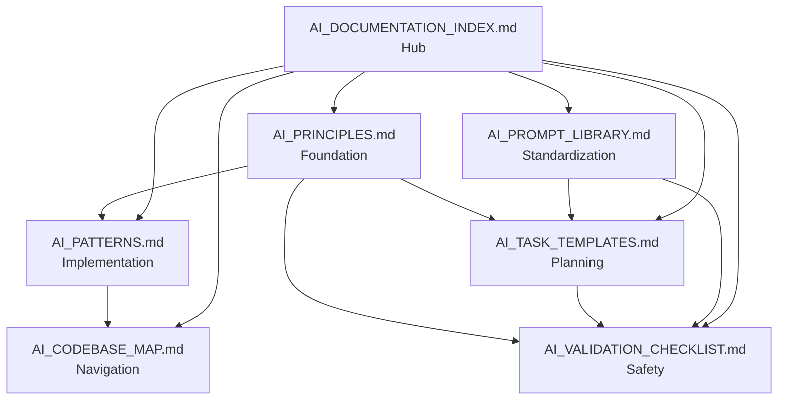

# AI Principles and Governance Framework

This document establishes the core principles, safety mechanisms, and operational guidelines for AI agents operating within this codebase. These principles ensure human control, system safety, and sustainable multi-agent coordination.

## Table of Contents

1. [AI Philosophy: Safety, Reversibility, and Human Governance](#1-ai-philosophy-safety-reversibility-and-human-governance)
2. [Project Management & Multi-Agent Coordination](#2-project-management--multi-agent-coordination-first-principles)
3. [Documentation & Memory as a Safety System](#3-documentation--memory-as-a-safety-system)
4. [Prompting Principles for Scale](#4-prompting-principles-for-scale)
5. [Rebuilding from First Principles (Playbook)](#5-rebuilding-from-first-principles-playbook)

---

## 1. AI Philosophy: Safety, Reversibility, and Human Governance

### Human-Gated Autonomy

**Principle**: AI proposes improvements, but every execution path includes explicit human approval and rollback hooks, keeping the operator in control.

**Quick Decision**: 
- ❓ Need to make a change? → Get human approval first
- ❓ Change affects production? → Require explicit sign-off
- ❓ No rollback plan? → Don't proceed

**See Also**: [AI_VALIDATION_CHECKLIST.md](AI_VALIDATION_CHECKLIST.md) Section 1 for approval requirements, [AI_TASK_TEMPLATES.md](AI_TASK_TEMPLATES.md) for rollback plans

**Common Mistakes**:
- ❌ Proceeding without approval for MEDIUM+ risk changes
- ❌ Assuming approval is implicit
- ❌ Skipping rollback plan creation

**Implementation Requirements**:
- All code changes must be proposed via pull requests or explicit approval workflows
- No silent or automatic deployments to production
- Every change must include a clear rollback mechanism
- Human review required before any destructive operations

**Examples**:
- Database migrations require explicit approval
- Configuration changes must be reviewed
- Service deployments need human sign-off
- File deletions require confirmation

### Risk-Tiered Operations

**Principle**: Changes are categorized (Low/Medium/High/Critical) with graduated approval, backup, and rollback requirements, ensuring proportional safeguards for each change size or blast radius.

**Quick Decision**: 
- ❓ What's the risk? → Use risk assessment flowchart (Section 6)
- ❓ LOW risk? → Git commit, single reviewer, tests pass
- ❓ MEDIUM risk? → + Git tag, backup, two reviewers
- ❓ HIGH risk? → + Full backup, lead approval, staging test
- ❓ CRITICAL risk? → + Multiple backups, team consensus, on-call ready

**See Also**: [AI_VALIDATION_CHECKLIST.md](AI_VALIDATION_CHECKLIST.md) Section 9 for risk-level specific checklists, [AI_TASK_TEMPLATES.md](AI_TASK_TEMPLATES.md) for risk assessment in templates

**Common Mistakes**:
- ❌ Underestimating risk level
- ❌ Skipping backups for MEDIUM+ risk
- ❌ Proceeding without required approvals

**Risk Categories**:

| Risk Level | Examples | Approval Required | Backup Required | Rollback Plan |
|------------|----------|-------------------|-----------------|---------------|
| **Low** | Documentation updates, non-breaking refactors | Single reviewer | Git commit | Git revert |
| **Medium** | New features, API additions | Two reviewers | Git tag + database backup | Git revert + restore backup |
| **High** | Breaking changes, schema migrations | Lead approval | Full system backup | Automated rollback script |
| **Critical** | Production config, security changes | Team consensus | Multiple backups + staging test | Multi-step rollback with validation |

**Implementation**:
- Tag all changes with risk level in commit messages: `[RISK: HIGH]`
- Automated checks enforce backup requirements based on risk level
- Rollback procedures documented and tested before deployment

### Reversible by Default

**Principle**: Backups, git tags, and automated rollbacks are treated as mandatory primitives so experimentation never traps the system in an irrecoverable state.

**Quick Decision**: 
- ❓ Making a change? → Create git tag first
- ❓ Database change? → Backup database first
- ❓ Config change? → Backup config first
- ❓ No rollback plan? → Don't proceed

**See Also**: [AI_TASK_TEMPLATES.md](AI_TASK_TEMPLATES.md) for rollback plans in templates, [AI_PROMPT_LIBRARY.md](AI_PROMPT_LIBRARY.md#prompt-14-emergency-rollback-prompt) for rollback prompts

**Common Mistakes**:
- ❌ Forgetting to create git tag before changes
- ❌ Skipping backups for "small" changes
- ❌ Not testing rollback procedures

**Mandatory Practices**:
1. **Git Tags**: Create tags before any significant change
   ```bash
   git tag -a pre-change-$(date +%Y%m%d-%H%M%S) -m "Before [change description]"
   ```

2. **Database Backups**: Before schema changes or data migrations
   ```bash
   ./scripts/automation/backup.sh --type=database --tag=pre-migration
   ```

3. **Configuration Snapshots**: Save current configs before changes
   ```bash
   ./scripts/automation/backup.sh --type=config --tag=pre-update
   ```

4. **Rollback Scripts**: Every deployment includes a tested rollback procedure
   ```bash
   ./scripts/automation/rollback.sh --version=<tag>
   ```

**Checklist Before Any Change**:
- [ ] Git tag created
- [ ] Backups completed and verified
- [ ] Rollback procedure documented
- [ ] Rollback procedure tested in staging
- [ ] Human approval obtained

### Known Failure Modes

**Inverted U-shaped performance:** AI performs adequately on textbook cases but worst at clinical extremes, rare domains, or adversarial inputs. Validate agent behavior at edge cases; do not assume mid-range performance generalizes.

**Identify but advise wrong:** AI may correctly identify risk in reasoning but still advise harmful action (e.g., respiratory distress → "schedule 24–48 hour appointment" instead of ED). Human gates required for high-stakes decisions; verify advised action, not just reasoning.

**See Also**: [portfolio-harness AI_TASK_EVALS](D:\portfolio-harness\.cursor\docs\AI_TASK_EVALS.md) Identify-but-advise-wrong evals; [calibration_test_suite](D:\portfolio-harness\.cursor\scripts\calibration_test_suite.md) §5–6; [learnings doc](D:\portfolio-harness\docs\learnings\2026-03-18-video-nemoclaw-chatgpt-health.md).

---

## 2. Project Management & Multi-Agent Coordination (First Principles)

### Deterministic Coordination

**Principle**: Use atomic locks and explicit status tracking so agents never fight over the same resource; clarity beats cleverness in concurrency.

**Coordination Mechanisms**:

1. **Task Locking**: Use file-based or database locks for exclusive operations
   ```python
   # Example: Atomic task lock
   with TaskLock(task_id="migration-001", timeout=300):
       # Perform exclusive operation
       pass
   ```

2. **Status Tracking**: Explicit state machines for all long-running operations
   ```python
   # Task states: PENDING -> IN_PROGRESS -> COMPLETED | FAILED
   task.update_status("IN_PROGRESS", agent_id="agent-001")
   ```

3. **Resource Reservation**: Agents must reserve resources before use
   ```python
   # Reserve database connection
   db_pool.reserve(agent_id="agent-001", timeout=60)
   ```

**Anti-Patterns to Avoid**:
- ❌ Multiple agents modifying the same file simultaneously
- ❌ Agents assuming resources are available without checking
- ❌ Implicit coordination through timing or delays

### Scope Before Scale

**Principle**: Validate the current system with small agent counts, then iterate; scaling without validation just multiplies unknowns.

**Validation Process**:

1. **Single Agent Validation**: Test with one agent first
   - Verify all operations complete successfully
   - Measure performance and resource usage
   - Document edge cases and failures

2. **Small Multi-Agent Test**: Scale to 2-3 agents
   - Test coordination mechanisms
   - Verify no resource conflicts
   - Measure coordination overhead

3. **Gradual Scaling**: Increase agent count incrementally
   - Monitor for degradation
   - Validate coordination at each level
   - Document scaling limits

**Scaling Checklist**:
- [ ] Single agent validation complete
- [ ] Multi-agent coordination tested
- [ ] Resource limits identified
- [ ] Monitoring in place
- [ ] Rollback plan for scaling issues

### Expand Capability by Type, Not Volume

**Principle**: Add support for new task categories (configuration, documentation, metrics) and smarter parsing before adding more agents—breadth of understanding before parallelism.

**Capability Expansion Strategy**:

1. **Task Type Coverage**: Ensure agents can handle all task categories
   - Configuration management
   - Documentation generation
   - Testing and validation
   - Deployment operations
   - Monitoring and alerting

2. **Intelligence Over Parallelism**: Improve agent understanding before adding more agents
   - Better context parsing
   - Smarter task decomposition
   - Improved error handling
   - Enhanced decision-making

3. **Type-Based Scaling**: Add agents for new task types, not more of the same
   - One agent per task type initially
   - Scale within type only after validation

---

## 3. Documentation & Memory as a Safety System

### Preserve Before Moving

**Principle**: Extract unique technical, operational, and historical context before archiving; the archive is a relocation, not a deletion.

**Preservation Process**:

1. **Context Extraction**: Before moving or archiving any documentation
   ```markdown
   ## Preservation Record
   - **Source**: `docs/old-feature.md`
   - **Destination**: `docs/archive/features/old-feature-20240101.md`
   - **Unique Information**:
     - Historical context about feature decisions
     - Technical constraints that influenced design
     - Operational lessons learned
   - **Cross-References**: 
     - Related to: `docs/ARCHITECTURE.md#section-x`
     - Referenced by: `app/services/legacy.py`
   - **Preservation Date**: 2024-01-01
   - **Preserved By**: AI Agent (agent-id)
   ```

2. **Archive Index**: Maintain searchable index of archived content
   ```markdown
   # Archive Index
   - [Old Feature Documentation](archive/features/old-feature-20240101.md) - Moved 2024-01-01
   - [Legacy API Spec](archive/api/legacy-api-v1.md) - Moved 2024-01-15
   ```

3. **Cross-Reference Updates**: Update all references to point to new location

**Preservation Checklist**:
- [ ] Unique information extracted and documented
- [ ] Cross-references identified
- [ ] Archive index updated
- [ ] Source references updated to point to archive
- [ ] Preservation record created

### Triple-Check Integrity

**Principle**: Automated reference scans, AI-assisted risk checks, and manual review create layered defenses against losing knowledge.

**Three-Layer Verification**:

1. **Automated Reference Scan**: Script checks for broken links and references
   ```bash
   ./scripts/verify-docs.sh --check-references
   ```

2. **AI-Assisted Risk Check**: AI agent reviews for:
   - Missing context
   - Unreferenced unique information
   - Broken cross-references
   - Incomplete preservation records

3. **Manual Review**: Human reviewer validates:
   - Preservation completeness
   - Archive organization
   - Reference accuracy

**Verification Checklist**:
- [ ] Automated reference scan passed
- [ ] AI risk check completed
- [ ] Manual review approved
- [ ] All broken references fixed
- [ ] Preservation record complete

### Traceability Over Time

**Principle**: Preservation records and archive indexes ensure every relocation leaves an auditable trail linking source, destination, and rationale.

**Traceability Requirements**:

1. **Preservation Records**: Every archive operation creates a record
   - Source location
   - Destination location
   - Reason for archiving
   - Date and agent
   - Related changes

2. **Change History**: Track all documentation changes
   ```markdown
   ## Change History
   - 2024-01-01: Archived to `docs/archive/` - Reason: Feature deprecated
   - 2024-01-15: Updated cross-references
   ```

3. **Audit Trail**: Maintain searchable audit log
   ```bash
   # Search preservation history
   grep -r "Preservation Record" docs/archive/
   ```

---

## 4. Prompting Principles for Scale

### Decompose, Then Orchestrate

**Principle**: Start with work breakdown (WBS), dependency mapping, and parallelization strategy prompts so tasks can run independently with minimal coupling.

**Decomposition Process**:

1. **Work Breakdown Structure (WBS)**: Break tasks into atomic units
   ```markdown
   ## Task: Add New Service Integration
   
   ### Subtasks:
   1. Create service client (`services/new_service/client.py`)
   2. Add configuration (`services/new_service/config.py`)
   3. Add gateway routes (`app/api/gateway.py`)
   4. Update docker-compose (`docker-compose.yml`)
   5. Update nginx config (`nginx/nginx.conf`)
   6. Write tests (`tests/integration/test_new_service.py`)
   7. Update documentation (`docs/SERVICE_INTEGRATION.md`)
   
   ### Dependencies:
   - Task 1 → Task 2 → Task 3
   - Task 3 → Task 4, Task 5
   - Task 1-5 → Task 6
   - Task 1-6 → Task 7
   
   ### Parallelization:
   - Tasks 4 and 5 can run in parallel after Task 3
   - Task 6 can start after Tasks 1-5 complete
   ```

2. **Dependency Mapping**: Explicit dependency graph
   ```python
   dependencies = {
       "task-1": [],
       "task-2": ["task-1"],
       "task-3": ["task-2"],
       "task-4": ["task-3"],
       "task-5": ["task-3"],
       "task-6": ["task-4", "task-5"],
       "task-7": ["task-6"]
   }
   ```

3. **Parallelization Strategy**: Identify independent work streams
   - Tasks with no dependencies can run immediately
   - Tasks with same dependencies can run in parallel
   - Critical path identified for scheduling

### Validate Early

**Principle**: Prompts emphasize fail-fast checks (availability of APIs/metrics) to avoid late surprises and reduce rework.

**Early Validation Checks**:

1. **Pre-Task Validation**: Before starting any task
   ```python
   # Validate prerequisites
   - [ ] Required APIs are available
   - [ ] Database connection works
   - [ ] Required services are running
   - [ ] Dependencies are installed
   - [ ] Configuration is valid
   ```

2. **Fail-Fast Patterns**: Check early, fail clearly
   ```python
   def validate_service_integration():
       # Check service is reachable
       if not check_service_health():
           raise ValidationError("Service not available")
       
       # Check API endpoint exists
       if not check_api_endpoint():
           raise ValidationError("API endpoint not found")
       
       # Check authentication works
       if not test_authentication():
           raise ValidationError("Authentication failed")
   ```

3. **Validation Prompts**: Include in all task prompts
   ```
   Before starting this task:
   1. Verify [specific requirement]
   2. Check [specific condition]
   3. Validate [specific constraint]
   
   If any validation fails, stop and report the issue.
   ```

### Design for Reversibility and Compatibility

**Principle**: Prompts bake in rollback plans, idempotency, feature flags, and backward-compatibility strategies as default design constraints.

**Design Requirements**:

1. **Rollback Plans**: Every change includes rollback
   ```markdown
   ## Rollback Plan
   - **Git Rollback**: `git revert <commit-hash>`
   - **Database Rollback**: `./scripts/automation/rollback.sh --db --version=<tag>`
   - **Config Rollback**: Restore from backup `backups/config-<timestamp>.tar.gz`
   - **Service Rollback**: `docker-compose down && docker-compose up -d <previous-version>`
   ```

2. **Idempotency**: Operations can be safely repeated
   ```python
   def apply_configuration(config):
       # Check if already applied
       if is_configuration_applied(config):
           return  # Idempotent: no-op if already done
       
       # Apply configuration
       apply_config(config)
       mark_configuration_applied(config)
   ```

3. **Feature Flags**: Enable gradual rollout
   ```python
   if feature_flag_enabled("new_service_integration"):
       use_new_service()
   else:
       use_legacy_service()
   ```

4. **Backward Compatibility**: Maintain compatibility during transitions
   ```python
   # Support both old and new API formats
   def process_request(data):
       if is_legacy_format(data):
           return process_legacy_format(data)
       else:
           return process_new_format(data)
   ```

---

## 5. Rebuilding from First Principles (Playbook)

### Define the Invariants

**Principle**: Require human approval, reversible changes, and risk-tiered gates for every AI-driven action (no "silent" autonomy).

**Core Invariants**:

1. **Human Approval Required**: No autonomous execution
   - All changes require explicit approval
   - Approval workflow documented
   - Approval history tracked

2. **Reversibility Mandatory**: Every change must be reversible
   - Rollback mechanism exists
   - Rollback tested
   - Backup created

3. **Risk-Tiered Gates**: Safeguards proportional to risk
   - Low risk: Minimal gates
   - High risk: Multiple gates and approvals
   - Critical: Full team consensus

### Model Work as Typed Tasks

**Principle**: Represent tasks with explicit categories, inputs, outputs, and dependencies so coordination and parsing remain deterministic as you scale.

**Task Model**:

```python
@dataclass
class Task:
    id: str
    type: TaskType  # CONFIG, DOCS, CODE, DEPLOY, TEST
    category: str   # "service-integration", "bug-fix", "feature"
    inputs: Dict[str, Any]
    outputs: Dict[str, Any]
    dependencies: List[str]
    risk_level: RiskLevel
    status: TaskStatus
    agent_id: Optional[str]
    created_at: datetime
    updated_at: datetime
```

**Task Types**:
- **CONFIG**: Configuration changes
- **DOCS**: Documentation updates
- **CODE**: Code changes
- **DEPLOY**: Deployment operations
- **TEST**: Testing operations
- **MONITOR**: Monitoring setup

### Treat Documentation as Memory Infrastructure

**Principle**: Before moving or rewriting anything, inventory unique information, capture it in preservation records, and keep cross-references current.

**Documentation Workflow**:

1. **Inventory**: Identify unique information
2. **Preserve**: Create preservation record
3. **Archive**: Move to archive with index
4. **Update**: Fix all cross-references
5. **Verify**: Triple-check integrity

### Use Prompts as Control Surfaces

**Principle**: Standardize prompts for decomposition, validation, safety checks, and archival so AI interactions stay predictable and auditable.

**Standard Prompt Templates**:

1. **Task Decomposition Prompt**:
   ```
   Decompose this task into subtasks:
   - Identify all subtasks
   - Map dependencies
   - Identify parallelization opportunities
   - Estimate risk levels
   ```

2. **Validation Prompt**:
   ```
   Before executing, validate:
   - [Prerequisites]
   - [Dependencies]
   - [Constraints]
   If validation fails, stop and report.
   ```

3. **Safety Check Prompt**:
   ```
   Safety checks:
   - Risk level: [LOW/MEDIUM/HIGH/CRITICAL]
   - Backup required: [YES/NO]
   - Rollback plan: [DESCRIBE]
   - Approval required: [YES/NO]
   ```

### Iterate in Small, Observable Steps

**Principle**: Ship minimal, testable increments; run checks before/after; and ensure rollback is trivial at each step to keep experimentation safe.

**Iteration Process**:

1. **Small Increments**: Break work into minimal units
2. **Test Each Step**: Validate before proceeding
3. **Observable Changes**: Clear feedback at each step
4. **Easy Rollback**: Can revert any single step
5. **Document Learnings**: Capture insights from each iteration

**Iteration Checklist**:
- [ ] Increment is minimal and testable
- [ ] Pre-step validation passed
- [ ] Change is observable
- [ ] Rollback tested
- [ ] Learnings documented

### Comprehension Before Ship

**Principle**: Do not accept AI-generated code without understanding it. Quick generation feels productive, but without comprehension you miss architectural and performance pitfalls; time saved initially is lost in debugging, refactoring, and incident response.

**Practices**:
- Use AI for boilerplate, exploration, and repetitive tasks you already understand.
- For core logic and critical paths: review, understand, and be able to explain before shipping.
- When debugging unfamiliar code: diagnose from first principles rather than trial-and-error prompting.
- Periodically rebuild an AI-written feature by hand from docs and first principles to force understanding.

---

## 6. Quick Reference Playbook

### Decision Tree: "What Should I Do When..."

```
Start: Need to make a change
    ↓
What type of change?
    ├─ Code Change → Use AI_PATTERNS.md, follow code patterns
    ├─ New Feature → Use AI_TASK_TEMPLATES.md Template 7
    ├─ Bug Fix → Use AI_TASK_TEMPLATES.md Template 4
    ├─ Refactoring → Use AI_TASK_TEMPLATES.md Template 6
    ├─ Service Integration → Use AI_TASK_TEMPLATES.md Template 1
    ├─ Database Migration → Use AI_TASK_TEMPLATES.md Template 3 (HIGH RISK)
    └─ Documentation → Use AI_TASK_TEMPLATES.md Template 5
    ↓
What is the risk level?
    ├─ LOW → Git commit, single reviewer, tests pass
    ├─ MEDIUM → + Git tag, backup, two reviewers, rollback plan
    ├─ HIGH → + Full backup, lead approval, staging tested
    └─ CRITICAL → + Multiple backups, team consensus, on-call ready
    ↓
Complete validation checklist?
    ├─ Yes → Proceed with execution
    └─ No → Complete AI_VALIDATION_CHECKLIST.md first
    ↓
Execute change with rollback plan ready
```

### Risk Assessment Flowchart

```
Assess Change
    ↓
Is it a database migration or breaking change?
    ├─ Yes → HIGH or CRITICAL risk
    └─ No → Continue assessment
    ↓
Does it affect production configuration or security?
    ├─ Yes → CRITICAL risk
    └─ No → Continue assessment
    ↓
Does it add new features or modify APIs?
    ├─ Yes → MEDIUM risk
    └─ No → Continue assessment
    ↓
Is it documentation, tests, or non-breaking refactor?
    ├─ Yes → LOW risk
    └─ No → MEDIUM risk (default)
```

### Approval Workflow Diagram

```
Submit Change
    ↓
Risk Level Assessment
    ↓
LOW Risk?
    ├─ Yes → Single reviewer approval → Execute
    └─ No → Continue
    ↓
MEDIUM Risk?
    ├─ Yes → Two reviewers approval → Execute
    └─ No → Continue
    ↓
HIGH Risk?
    ├─ Yes → Lead approval + staging test → Execute
    └─ No → Continue
    ↓
CRITICAL Risk?
    └─ Yes → Team consensus + staging test + on-call ready → Execute
```

### Emergency Procedures

**When to Stop Immediately**:
1. Data loss risk detected
2. Service outage occurring
3. Security vulnerability created
4. Critical validation failure
5. Unexpected error during execution

**Emergency Stop Actions**:
1. **Stop Execution**: Immediately halt current operation
2. **Assess Situation**: Determine current state and impact
3. **Rollback**: Execute rollback plan if changes were made
4. **Document**: Document incident with what/why/actions taken
5. **Notify**: Notify appropriate team members
6. **Review**: Review incident to prevent recurrence

**Emergency Rollback**:
- Use git tag or commit hash for code rollback
- Restore database from backup if needed
- Revert configuration changes
- Restart services if needed
- Verify system stability after rollback

---

## 7. Common Scenarios Playbook

### Scenario 1: Adding New Feature

**Step-by-Step Playbook**:

1. **Plan** (30 min)
   - Use [AI_TASK_TEMPLATES.md](AI_TASK_TEMPLATES.md#template-7-feature-addition) Template 7
   - Decompose into subtasks
   - Identify dependencies
   - Assign risk level (typically MEDIUM)

2. **Design** (1-2 hours)
   - Design API/interface
   - Plan data model (if needed)
   - Create design document (if complex)

3. **Implement** (4-8 hours)
   - Create database models (if needed)
   - Implement core logic
   - Create API endpoints
   - Add error handling

4. **Test** (2-4 hours)
   - Write unit tests
   - Write integration tests
   - Write E2E tests (if applicable)

5. **Validate** (30 min)
   - Complete [AI_VALIDATION_CHECKLIST.md](AI_VALIDATION_CHECKLIST.md) Section 2
   - Code review
   - Get approvals

6. **Deploy** (30 min - 1 hour)
   - Create git tag
   - Deploy to staging
   - Verify functionality
   - Deploy to production (if approved)

**See Also**: [AI_TASK_TEMPLATES.md](AI_TASK_TEMPLATES.md#template-7-feature-addition), [AI_PATTERNS.md](AI_PATTERNS.md), [AI_VALIDATION_CHECKLIST.md](AI_VALIDATION_CHECKLIST.md)

---

### Scenario 2: Fixing Production Bug

**Step-by-Step Playbook**:

1. **Reproduce** (15-30 min)
   - Reproduce bug in test environment
   - Document steps to reproduce
   - Identify root cause

2. **Fix** (1-2 hours)
   - Write failing test (test-first approach)
   - Implement fix
   - Verify test passes
   - Add regression tests

3. **Validate** (30 min)
   - Complete [AI_VALIDATION_CHECKLIST.md](AI_VALIDATION_CHECKLIST.md) Section 2
   - Code review
   - Verify no regressions

4. **Deploy** (30 min)
   - Create git tag (if MEDIUM risk)
   - Deploy fix
   - Verify fix works
   - Monitor for issues

**See Also**: [AI_TASK_TEMPLATES.md](AI_TASK_TEMPLATES.md#template-4-bug-fix), [AI_PROMPT_LIBRARY.md](AI_PROMPT_LIBRARY.md#prompt-4-bug-fix-prompt)

---

### Scenario 3: Refactoring Legacy Code

**Step-by-Step Playbook**:

1. **Assess** (1 hour)
   - Identify refactoring targets
   - Understand dependencies
   - Plan incremental approach

2. **Prepare** (1 hour)
   - Ensure test coverage ≥80%
   - Create git tag: `git tag -a pre-refactor-{name}-{timestamp}`
   - Document current behavior

3. **Refactor** (2-6 hours)
   - Make small, testable changes
   - Run tests after each change
   - Commit working state frequently
   - Update tests as needed

4. **Verify** (1 hour)
   - Run full test suite
   - Manual testing if needed
   - Verify no regressions

**See Also**: [AI_TASK_TEMPLATES.md](AI_TASK_TEMPLATES.md#template-6-refactoring), [AI_PRINCIPLES.md](AI_PRINCIPLES.md#5-rebuilding-from-first-principles-playbook)

---

### Scenario 4: Database Migration

**Step-by-Step Playbook**:

1. **Prepare** (1 hour) - CRITICAL
   - Create database backup: `./scripts/automation/backup.sh --type=database --tag=pre-migration-{name}`
   - Verify backup integrity
   - Create git tag: `git tag -a pre-migration-{name}-{timestamp}`
   - Get lead approval

2. **Create Migration** (1-2 hours)
   - Review existing migrations
   - Generate migration: `alembic revision --autogenerate -m "{description}"`
   - Review and customize migration script
   - Update models

3. **Test in Staging** (1-2 hours) - CRITICAL
   - Apply migration: `alembic upgrade head`
   - Verify schema changes
   - Test application functionality
   - Test rollback: `alembic downgrade -1`
   - Re-apply migration: `alembic upgrade head`

4. **Apply to Production** (30 min - 1 hour) - CRITICAL
   - Final backup verification
   - Apply migration: `alembic upgrade head`
   - Verify application works
   - Monitor for issues
   - Be ready to rollback

**See Also**: [AI_TASK_TEMPLATES.md](AI_TASK_TEMPLATES.md#template-3-database-migration), [AI_VALIDATION_CHECKLIST.md](AI_VALIDATION_CHECKLIST.md#section-5-database-change-validation)

---

## 8. Integration Points

### How This Document Relates to Others

This document (AI_PRINCIPLES.md) serves as the **foundational playbook** that establishes core principles. Other documents build upon these principles:

- **[AI_PATTERNS.md](AI_PATTERNS.md)**: Implements principles in code patterns
- **[AI_TASK_TEMPLATES.md](AI_TASK_TEMPLATES.md)**: Applies principles to task decomposition
- **[AI_VALIDATION_CHECKLIST.md](AI_VALIDATION_CHECKLIST.md)**: Enforces principles through validation
- **[AI_CODEBASE_MAP.md](AI_CODEBASE_MAP.md)**: Provides navigation within principles
- **[AI_PROMPT_LIBRARY.md](AI_PROMPT_LIBRARY.md)**: Standardizes principles in prompts
- **[AI_DOCUMENTATION_INDEX.md](AI_DOCUMENTATION_INDEX.md)**: Central navigation hub

### When to Use Which Document

| Need | Document | Section |
|------|----------|---------|
| Understand "why" | AI_PRINCIPLES.md | All sections |
| Write code | AI_PATTERNS.md | Relevant pattern section |
| Plan task | AI_TASK_TEMPLATES.md | Relevant template |
| Validate safety | AI_VALIDATION_CHECKLIST.md | Relevant checklist |
| Find code location | AI_CODEBASE_MAP.md | Relevant section |
| Get prompt template | AI_PROMPT_LIBRARY.md | Relevant prompt |
| Navigate all docs | AI_DOCUMENTATION_INDEX.md | Quick Start Guide |

### Document Dependency Map



**Dependency Flow**:
1. **AI_PRINCIPLES.md** → Foundation for all decisions
2. **AI_PATTERNS.md** → Code implementation based on principles
3. **AI_TASK_TEMPLATES.md** → Task planning using principles
4. **AI_VALIDATION_CHECKLIST.md** → Safety validation enforcing principles
5. **AI_CODEBASE_MAP.md** → Navigation supporting patterns
6. **AI_PROMPT_LIBRARY.md** → Standardization across all documents
7. **AI_DOCUMENTATION_INDEX.md** → Central hub connecting all documents

---

## Implementation Checklist

When implementing AI agents or automation in this codebase:

- [ ] All changes require human approval
- [ ] Risk level assigned to every change
- [ ] Backups created before changes
- [ ] Rollback plans documented and tested
- [ ] Tasks modeled with explicit types and dependencies
- [ ] Documentation preserved before archiving
- [ ] Cross-references maintained
- [ ] Prompts standardized for consistency
- [ ] Validation happens early
- [ ] Changes are reversible by default
- [ ] Coordination uses explicit locks and status
- [ ] Scaling validated incrementally
- [ ] Capabilities expanded by type before volume

---

## References

### Related AI Documentation

- [AI Documentation Index](AI_DOCUMENTATION_INDEX.md) - Master navigation hub
- [AI Patterns](AI_PATTERNS.md) - Code implementation patterns
- [AI Task Templates](AI_TASK_TEMPLATES.md) - Task decomposition templates
- [AI Validation Checklist](AI_VALIDATION_CHECKLIST.md) - Pre-execution validation
- [AI Codebase Map](AI_CODEBASE_MAP.md) - Navigation guide
- [AI Prompt Library](AI_PROMPT_LIBRARY.md) - Reusable prompt templates

### Project Documentation

- [Development Guide](DEVELOPMENT.md) - Development setup and workflows
- [Deployment Guide](DEPLOYMENT.md) - Deployment procedures
- [Security Guide](SECURITY.md) - Security best practices
- [Architecture Documentation](ARCHITECTURE.md) - System architecture

---

**Last Updated**: 2024-01-01  
**Maintained By**: Project Team  
**Review Cycle**: Quarterly

