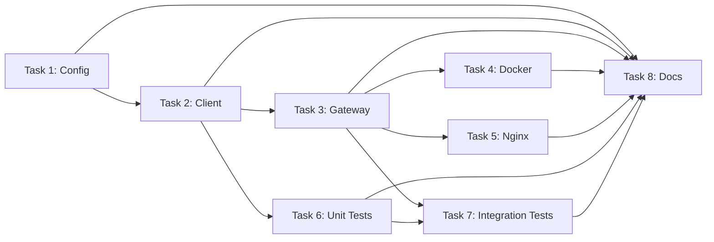
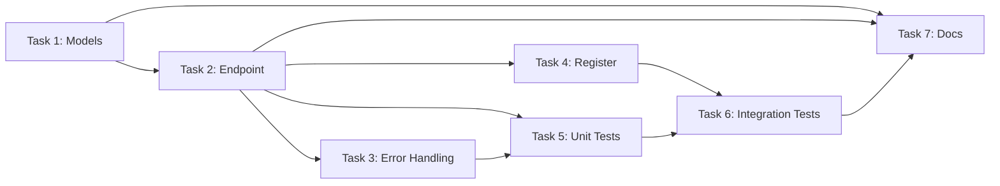
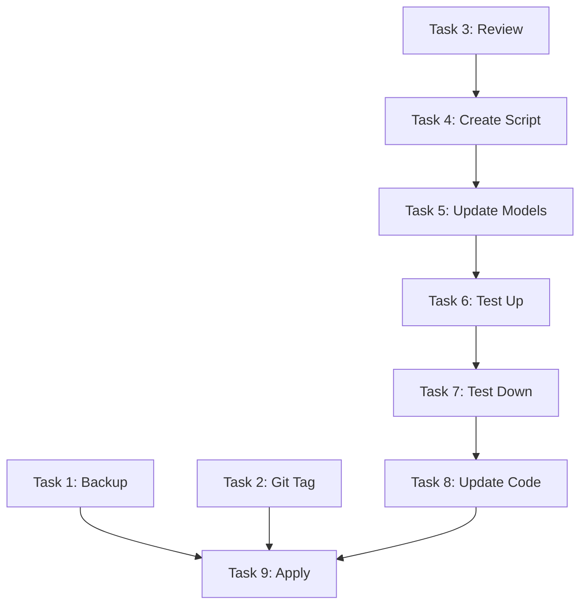
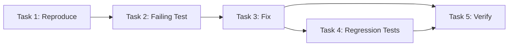
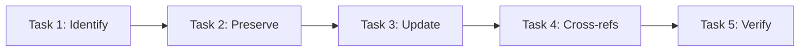
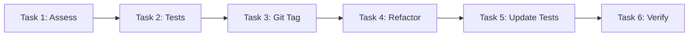
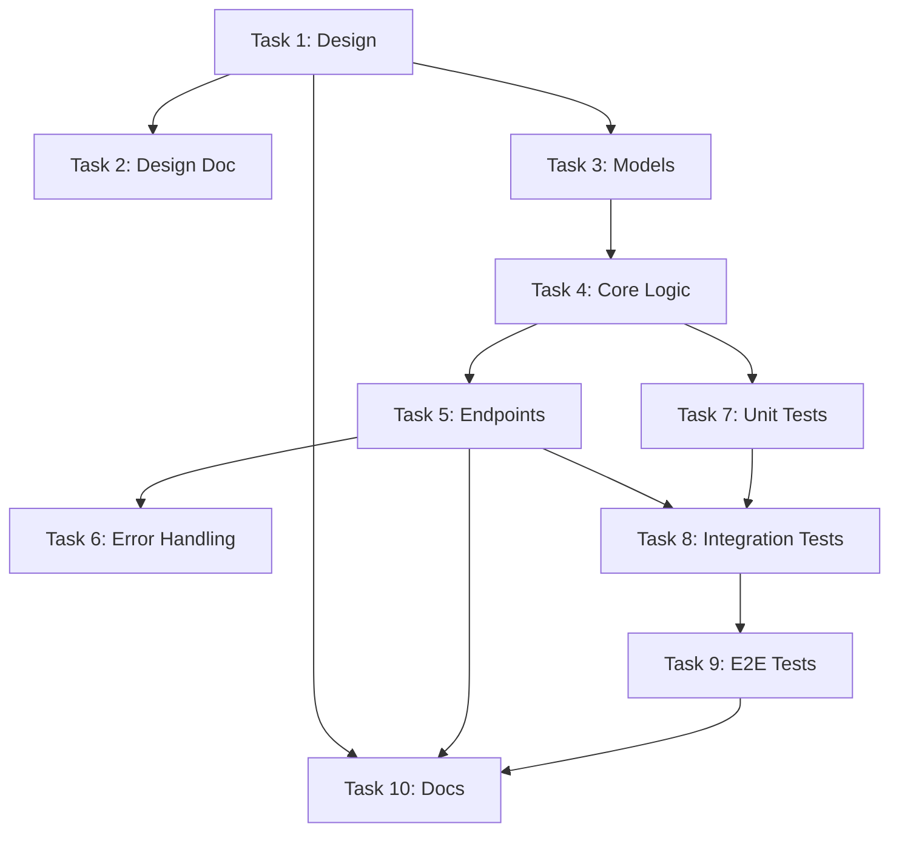

# AI Task Templates - Task Decomposition Templates

**Purpose**: Standardized templates for decomposing common tasks into subtasks with dependency graphs, parallelization opportunities, rollback plans, and pre-execution validation steps.

**How to Use Templates**: 
1. Find the template that matches your task
2. Customize subtasks for your specific needs
3. Follow dependency graph for execution order
4. Complete pre-execution validation checklist
5. Execute with rollback plan ready

**Related Documents**:
- [AI_VALIDATION_CHECKLIST.md](AI_VALIDATION_CHECKLIST.md) - Pre-execution validation
- [AI_PATTERNS.md](AI_PATTERNS.md) - Code patterns to follow
- [AI_CODEBASE_MAP.md](AI_CODEBASE_MAP.md) - File locations
- [AI_PROMPT_LIBRARY.md](AI_PROMPT_LIBRARY.md) - Prompt templates
- [AI_PRINCIPLES.md](AI_PRINCIPLES.md) - Core principles

---

## Template 1: Add New Service Integration

**Risk Level**: MEDIUM  
**Estimated Time**: 4-6 hours

### Subtasks

1. **Create Service Configuration** (`services/{service_name}/config.py`)
   - Create Pydantic `BaseSettings` class
   - Define environment variables with `env_prefix`
   - Add default values
   - **Dependencies**: None
   - **Risk**: LOW

2. **Create Service Client** (`services/{service_name}/client.py`)
   - Implement async context manager (`__aenter__`, `__aexit__`)
   - Add `ping()` method for health checks
   - Implement core API methods
   - Add error handling
   - **Dependencies**: Task 1
   - **Risk**: LOW

3. **Add Gateway Routes** (`app/api/gateway.py`)
   - Add endpoint for service resource
   - Use authentication dependency
   - Query service from database
   - Use service client
   - **Dependencies**: Task 2
   - **Risk**: MEDIUM

4. **Update Docker Compose** (`docker-compose.yml`)
   - Add service container definition
   - Configure environment variables
   - Set up networking
   - Add health checks
   - **Dependencies**: Task 3
   - **Risk**: MEDIUM

5. **Update Nginx Config** (`nginx/nginx.conf`)
   - Add upstream definition
   - Add location block for service
   - Configure proxy settings
   - **Dependencies**: Task 3
   - **Risk**: LOW

6. **Write Unit Tests** (`tests/unit/test_{service}_client.py`)
   - Test service client methods
   - Mock external API calls with `respx`
   - Test error handling
   - **Dependencies**: Task 2
   - **Risk**: LOW

7. **Write Integration Tests** (`tests/integration/test_{service}_gateway.py`)
   - Test gateway endpoints
   - Test with database fixtures
   - Test authentication
   - **Dependencies**: Tasks 3, 6
   - **Risk**: LOW

8. **Update Documentation** (`docs/SERVICE_INTEGRATION.md` or `README.md`)
   - Document service integration
   - Add configuration instructions
   - Update service list
   - **Dependencies**: Tasks 1-7
   - **Risk**: LOW

### Dependency Graph

### Parallelization Opportunities

- **Tasks 4 and 5** can run in parallel after Task 3 completes
- **Task 6** can start after Task 2 completes (independent of Tasks 3-5)
- **Task 8** can be prepared in parallel but finalized after all other tasks

### Rollback Plan

1. **Git Rollback**: `git revert <commit-hash>` or `git reset --hard <previous-tag>`
2. **Docker Compose**: Remove service from `docker-compose.yml`, run `docker-compose up -d`
3. **Nginx**: Revert `nginx/nginx.conf` changes, reload nginx
4. **Database**: No database changes, no rollback needed
5. **Code**: Remove service client and gateway routes

### Pre-Execution Validation

- [ ] Service API documentation reviewed
- [ ] Health endpoint identified
- [ ] Authentication method understood
- [ ] Environment variables documented
- [ ] Docker image available
- [ ] Network requirements understood
- [ ] Risk level assigned: MEDIUM
- [ ] Git tag created: `pre-service-integration-{service_name}-{timestamp}`
- [ ] Rollback plan documented

---

## Template 2: Add New API Endpoint

**Risk Level**: LOW-MEDIUM  
**Estimated Time**: 1-2 hours

### Subtasks

1. **Define Request/Response Models** (`app/api/{feature}.py` or `app/schemas/`)
   - Create Pydantic models for request
   - Create Pydantic models for response
   - Add validation rules
   - **Dependencies**: None
   - **Risk**: LOW

2. **Create Endpoint Function** (`app/api/{feature}.py`)
   - Define route decorator with path and method
   - Add authentication dependency if needed
   - Add database dependency if needed
   - Implement business logic
   - **Dependencies**: Task 1
   - **Risk**: LOW

3. **Add Error Handling**
   - Handle not found cases
   - Handle validation errors
   - Handle permission errors
   - **Dependencies**: Task 2
   - **Risk**: LOW

4. **Register Router** (`app/main.py`)
   - Import router
   - Include router in app
   - Add tags for documentation
   - **Dependencies**: Task 2
   - **Risk**: LOW

5. **Write Unit Tests** (`tests/unit/test_{feature}.py`)
   - Test endpoint with valid data
   - Test endpoint with invalid data
   - Test authentication requirements
   - Test error cases
   - **Dependencies**: Tasks 2-4
   - **Risk**: LOW

6. **Write Integration Tests** (`tests/integration/test_{feature}.py`)
   - Test with database
   - Test with authentication
   - Test end-to-end flow
   - **Dependencies**: Tasks 2-5
   - **Risk**: LOW

7. **Update API Documentation** (`API.md` or OpenAPI docs)
   - Document endpoint
   - Add examples
   - Update endpoint list
   - **Dependencies**: Tasks 1-6
   - **Risk**: LOW

### Dependency Graph

### Parallelization Opportunities

- **Task 5** can start after Task 2 completes (before Task 4)
- **Task 7** can be prepared in parallel

### Rollback Plan

1. **Git Rollback**: `git revert <commit-hash>`
2. **Code**: Remove endpoint function and router registration
3. **Tests**: Remove test files
4. **Documentation**: Revert documentation changes

### Pre-Execution Validation

- [ ] Endpoint purpose clearly defined
- [ ] Authentication requirements identified
- [ ] Request/response models designed
- [ ] Error cases identified
- [ ] Database changes needed (if any) assessed
- [ ] Risk level assigned: LOW-MEDIUM
- [ ] Git tag created (if MEDIUM risk)
- [ ] Rollback plan documented

---

## Template 3: Database Migration

**Risk Level**: HIGH  
**Estimated Time**: 2-4 hours (including testing)

### Subtasks

1. **Create Backup** (CRITICAL)
   - Backup database: `./scripts/automation/backup.sh --type=database --tag=pre-migration-{name}`
   - Verify backup integrity
   - **Dependencies**: None
   - **Risk**: CRITICAL (if skipped)

2. **Create Git Tag**
   - Tag current state: `git tag -a pre-migration-{name}-{timestamp} -m "Before migration: {description}"`
   - **Dependencies**: None
   - **Risk**: LOW

3. **Review Existing Migrations**
   - Check migration history
   - Identify dependencies
   - Plan migration order
   - **Dependencies**: None
   - **Risk**: LOW

4. **Create Migration Script** (`alembic/versions/{revision}_{description}.py`)
   - Generate migration: `alembic revision --autogenerate -m "{description}"`
   - Review generated migration
   - Customize if needed
   - **Dependencies**: Task 3
   - **Risk**: MEDIUM

5. **Update Models** (`app/models/__init__.py`)
   - Update SQLAlchemy models
   - Ensure models match migration
   - **Dependencies**: Task 4
   - **Risk**: MEDIUM

6. **Test Migration Up** (Staging/Test Environment)
   - Apply migration: `alembic upgrade head`
   - Verify schema changes
   - Test application functionality
   - **Dependencies**: Tasks 4-5
   - **Risk**: HIGH

7. **Test Migration Down** (Staging/Test Environment)
   - Rollback migration: `alembic downgrade -1`
   - Verify rollback works
   - Re-apply migration: `alembic upgrade head`
   - **Dependencies**: Task 6
   - **Risk**: HIGH

8. **Update Application Code** (if needed)
   - Update code that uses changed models
   - Update queries if schema changed
   - **Dependencies**: Tasks 5-7
   - **Risk**: MEDIUM

9. **Apply Migration** (Production)
   - Final backup verification
   - Apply migration: `alembic upgrade head`
   - Verify application works
   - Monitor for issues
   - **Dependencies**: Tasks 1-8
   - **Risk**: CRITICAL

### Dependency Graph

### Critical Path

Tasks 1, 2, 3, 4, 5, 6, 7, 8, 9 form the critical path. No parallelization recommended.

### Rollback Plan

1. **Immediate Rollback**: `alembic downgrade -1` (if migration just applied)
2. **Database Restore**: `./scripts/automation/restore.sh --backup=pre-migration-{name}`
3. **Code Rollback**: `git revert <commit-hash>` or `git reset --hard <tag>`
4. **Application Restart**: Restart application after rollback

### Pre-Execution Validation

- [ ] Backup created and verified: ✅
- [ ] Git tag created: ✅
- [ ] Migration script reviewed by lead developer
- [ ] Rollback tested in staging: ✅
- [ ] Impact assessment completed
- [ ] Application code updated (if needed)
- [ ] Risk level assigned: HIGH
- [ ] Lead approval obtained: ✅
- [ ] Staging tested: ✅
- [ ] On-call engineer notified (if production)

### Post-Migration Validation

- [ ] Migration applied successfully
- [ ] Application starts without errors
- [ ] Database schema matches models
- [ ] No data loss detected
- [ ] Application functionality verified
- [ ] Performance acceptable
- [ ] Monitoring shows no errors

---

## Template 4: Bug Fix

**Risk Level**: LOW-MEDIUM  
**Estimated Time**: 1-3 hours

### Subtasks

1. **Reproduce Bug**
   - Create test case that reproduces bug
   - Document steps to reproduce
   - Identify root cause
   - **Dependencies**: None
   - **Risk**: LOW

2. **Write Failing Test** (`tests/unit/test_{feature}.py` or `tests/integration/`)
   - Write test that demonstrates bug
   - Test should fail initially
   - **Dependencies**: Task 1
   - **Risk**: LOW

3. **Fix Bug**
   - Implement fix
   - Ensure test passes
   - **Dependencies**: Task 2
   - **Risk**: LOW-MEDIUM

4. **Add Regression Tests**
   - Add tests to prevent regression
   - Test edge cases
   - **Dependencies**: Task 3
   - **Risk**: LOW

5. **Verify Fix**
   - Run all tests
   - Test manually if needed
   - Verify no regressions
   - **Dependencies**: Tasks 3-4
   - **Risk**: LOW

### Dependency Graph

### Parallelization Opportunities

None - sequential execution required.

### Rollback Plan

1. **Git Rollback**: `git revert <commit-hash>`
2. **Code**: Revert fix changes

### Pre-Execution Validation

- [ ] Bug clearly identified and documented
- [ ] Root cause understood
- [ ] Test strategy defined
- [ ] Risk level assigned: LOW-MEDIUM
- [ ] Rollback plan documented

---

## Template 5: Documentation Update

**Risk Level**: LOW  
**Estimated Time**: 30 minutes - 2 hours

### Subtasks

1. **Identify Unique Information**
   - Extract unique content to preserve
   - Identify cross-references
   - **Dependencies**: None
   - **Risk**: LOW

2. **Create Preservation Record** (if archiving)
   - Document source and destination
   - Extract unique information
   - List cross-references
   - **Dependencies**: Task 1
   - **Risk**: LOW

3. **Update Documentation**
   - Write new content
   - Update existing content
   - Follow documentation patterns
   - **Dependencies**: Tasks 1-2 (if archiving)
   - **Risk**: LOW

4. **Update Cross-References**
   - Find all references to updated docs
   - Update links and references
   - **Dependencies**: Task 3
   - **Risk**: LOW

5. **Verify Integrity**
   - Check all links work
   - Verify cross-references
   - Spell check
   - **Dependencies**: Task 4
   - **Risk**: LOW

### Dependency Graph

### Parallelization Opportunities

None - sequential execution required.

### Rollback Plan

1. **Git Rollback**: `git revert <commit-hash>`
2. **Restore**: Restore from preservation record if archived

### Pre-Execution Validation

- [ ] Unique information identified
- [ ] Cross-references found
- [ ] Preservation record created (if archiving)
- [ ] Risk level assigned: LOW
- [ ] Rollback plan documented

---

## Template 6: Refactoring

**Risk Level**: MEDIUM-HIGH  
**Estimated Time**: 2-6 hours

### Subtasks

1. **Assess Current Code**
   - Identify refactoring targets
   - Understand dependencies
   - Plan refactoring approach
   - **Dependencies**: None
   - **Risk**: LOW

2. **Ensure Test Coverage**
   - Verify existing tests cover functionality
   - Add tests if coverage insufficient
   - **Dependencies**: Task 1
   - **Risk**: LOW

3. **Create Git Tag**
   - Tag before refactoring: `git tag -a pre-refactor-{name}-{timestamp}`
   - **Dependencies**: Task 2
   - **Risk**: LOW

4. **Refactor Incrementally**
   - Make small, testable changes
   - Run tests after each change
   - Commit working state frequently
   - **Dependencies**: Tasks 2-3
   - **Risk**: MEDIUM-HIGH

5. **Update Tests**
   - Update tests to match new structure
   - Ensure all tests pass
   - **Dependencies**: Task 4
   - **Risk**: LOW

6. **Verify Functionality**
   - Run full test suite
   - Manual testing if needed
   - Verify no regressions
   - **Dependencies**: Task 5
   - **Risk**: MEDIUM

### Dependency Graph

### Parallelization Opportunities

None - incremental refactoring requires sequential execution.

### Rollback Plan

1. **Git Rollback**: `git reset --hard <tag>` or `git revert <commit-hash>`
2. **Code**: Revert all refactoring changes
3. **Tests**: Revert test changes if needed

### Pre-Execution Validation

- [ ] Refactoring scope clearly defined
- [ ] Test coverage adequate (≥80%)
- [ ] Incremental approach planned
- [ ] Risk level assigned: MEDIUM-HIGH
- [ ] Git tag created: ✅
- [ ] Rollback plan documented

---

## Template 7: Feature Addition

**Risk Level**: MEDIUM  
**Estimated Time**: 4-12 hours

### Subtasks

#### Design Phase

1. **Design Feature**
   - Define requirements
   - Design API/interface
   - Plan data model
   - **Dependencies**: None
   - **Risk**: LOW

2. **Create Design Document** (if complex)
   - Document design decisions
   - Document API specifications
   - **Dependencies**: Task 1
   - **Risk**: LOW

#### Implementation Phase

3. **Create Database Models** (if needed)
   - Design schema
   - Create Alembic migration
   - Update models
   - **Dependencies**: Task 1
   - **Risk**: MEDIUM

4. **Implement Core Logic** (`app/services/` or `app/api/`)
   - Implement business logic
   - Create service functions
   - **Dependencies**: Task 3 (if database needed)
   - **Risk**: MEDIUM

5. **Create API Endpoints** (`app/api/`)
   - Define routes
   - Implement endpoints
   - Add authentication
   - **Dependencies**: Task 4
   - **Risk**: MEDIUM

6. **Add Error Handling**
   - Handle error cases
   - Add appropriate HTTP status codes
   - **Dependencies**: Task 5
   - **Risk**: LOW

#### Testing Phase

7. **Write Unit Tests**
   - Test core logic
   - Test service functions
   - **Dependencies**: Task 4
   - **Risk**: LOW

8. **Write Integration Tests**
   - Test API endpoints
   - Test with database
   - **Dependencies**: Tasks 5-7
   - **Risk**: LOW

9. **Write E2E Tests** (if applicable)
   - Test complete workflows
   - **Dependencies**: Tasks 5-8
   - **Risk**: LOW

#### Documentation Phase

10. **Update Documentation**
    - Update API documentation
    - Update user documentation
    - Add examples
    - **Dependencies**: Tasks 1-9
    - **Risk**: LOW

### Dependency Graph

### Parallelization Opportunities

- **Task 7** can start after Task 4
- **Task 10** can be prepared in parallel

### Rollback Plan

1. **Git Rollback**: `git revert <commit-hash>` or `git reset --hard <tag>`
2. **Database**: Rollback migration if created: `alembic downgrade -1`
3. **Code**: Remove feature code
4. **Tests**: Remove test files
5. **Documentation**: Revert documentation changes

### Pre-Execution Validation

- [ ] Feature requirements clearly defined
- [ ] Design approved (if complex)
- [ ] Database changes planned (if needed)
- [ ] API design documented
- [ ] Risk level assigned: MEDIUM
- [ ] Git tag created: ✅
- [ ] Rollback plan documented

---

## Task Type Reference

| Task Type | Risk Level | Examples | Typical Time |
|-----------|------------|----------|--------------|
| **CONFIG** | LOW | Configuration changes, env vars | 15-30 min |
| **CODE** | LOW-MEDIUM | New endpoints, bug fixes | 1-3 hours |
| **DOCS** | LOW | Documentation updates | 30 min - 2 hours |
| **TEST** | LOW | Writing tests | 1-2 hours |
| **DEPLOY** | MEDIUM-HIGH | Service deployment, migrations | 2-6 hours |
| **REVIEW** | LOW | Code review, documentation review | 30 min - 1 hour |

### Risk Level Guidelines

- **LOW**: No production impact, easy rollback (docs, tests, config)
- **MEDIUM**: Some production impact, rollback possible (new features, API changes)
- **HIGH**: Significant production impact, complex rollback (migrations, breaking changes)
- **CRITICAL**: Major production impact, requires team consensus (security, production config)

---

## Using Templates

### Step-by-Step Guide on Customizing Templates

1. **Select Template**: Choose the template closest to your task
2. **Customize Subtasks**: 
   - Add task-specific subtasks
   - Remove irrelevant subtasks
   - Adjust task descriptions
3. **Update Dependencies**: Modify dependency graph for your specific case
4. **Identify Parallelization**: Find opportunities to run tasks in parallel
5. **Create Rollback Plan**: Customize rollback steps for your changes
6. **Complete Validation**: Use [AI_VALIDATION_CHECKLIST.md](AI_VALIDATION_CHECKLIST.md)

### How to Adapt Templates to Specific Needs

- **Combine Templates**: Use multiple templates for complex tasks (e.g., Feature Addition + Service Integration)
- **Extend Templates**: Add additional subtasks for specific requirements
- **Simplify Templates**: Remove unnecessary steps for simple tasks

### Template Combination Strategies

- **Feature + Service**: Combine Feature Addition and Service Integration templates
- **Refactor + Test**: Combine Refactoring and Bug Fix templates for test-driven refactoring
- **Migration + Feature**: Combine Database Migration and Feature Addition for schema-changing features

---

## See Also

- [AI_VALIDATION_CHECKLIST.md](AI_VALIDATION_CHECKLIST.md) - Pre-execution validation
- [AI_PATTERNS.md](AI_PATTERNS.md) - Code patterns to follow
- [AI_CODEBASE_MAP.md](AI_CODEBASE_MAP.md) - File locations
- [AI_PROMPT_LIBRARY.md](AI_PROMPT_LIBRARY.md) - Prompt templates
- [AI_PRINCIPLES.md](AI_PRINCIPLES.md) - Core principles

---

**Last Updated**: 2024-01-01  
**Maintained By**: Project Team  
**Review Cycle**: Quarterly
