# Architecture Documentation

## Overview

The Self-Hosted Platform Integration is a unified gateway system that integrates multiple self-hosted services through a single FastAPI-based API. It provides unified authentication, service discovery, health monitoring, and a centralized dashboard.

## System Architecture

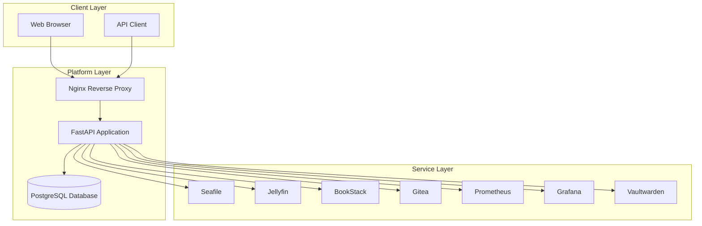

## Component Architecture

### 1. FastAPI Application (`app/`)

The main application layer providing:

- **Authentication Module** (`app/auth/`)
  - JWT token generation and validation
  - OAuth2 password flow
  - User management
  - Password hashing with bcrypt

- **API Routes** (`app/api/`)
  - `/api/auth` - Authentication endpoints
  - `/api/services` - Service registry management
  - `/api/health` - Health monitoring
  - `/api/gateway` - Service proxy endpoints

- **Models** (`app/models/`)
  - User model for authentication
  - Service model for service registry

- **Configuration** (`app/config.py`)
  - Environment-based configuration
  - Service URL configuration
  - Security settings

### 2. Service Clients (`services/`)

Modular service client implementations:

- **File Storage** (`services/file_storage/`)
  - SeafileClient for Seafile integration

- **Media Server** (`services/media_server/`)
  - JellyfinClient for Jellyfin integration

- **Productivity** (`services/productivity/`)
  - WikiClient for BookStack integration

- **Development Tools** (`services/dev_tools/`)
  - GiteaClient for Gitea integration

- **Monitoring** (`services/monitoring/`)
  - PrometheusClient for metrics
  - GrafanaClient for dashboards

- **Security** (`services/security/`)
  - VaultwardenClient for password manager

### 3. Database Schema

**Users Table:**
- `id` - Primary key
- `username` - Unique username
- `email` - Unique email
- `hashed_password` - Bcrypt hashed password
- `is_active` - Account status
- `is_admin` - Admin privileges
- `created_at` - Creation timestamp
- `updated_at` - Update timestamp

**Services Table:**
- `id` - Primary key
- `name` - Unique service name
- `service_type` - Service category
- `base_url` - Service base URL
- `api_url` - Service API URL
- `health_check_url` - Health check endpoint
- `is_active` - Service status
- `requires_auth` - Authentication requirement
- `auth_token` - Service authentication token
- `health_status` - Current health status
- `last_health_check` - Last check timestamp
- `created_at` - Creation timestamp
- `updated_at` - Update timestamp

## Data Flow

### Authentication Flow

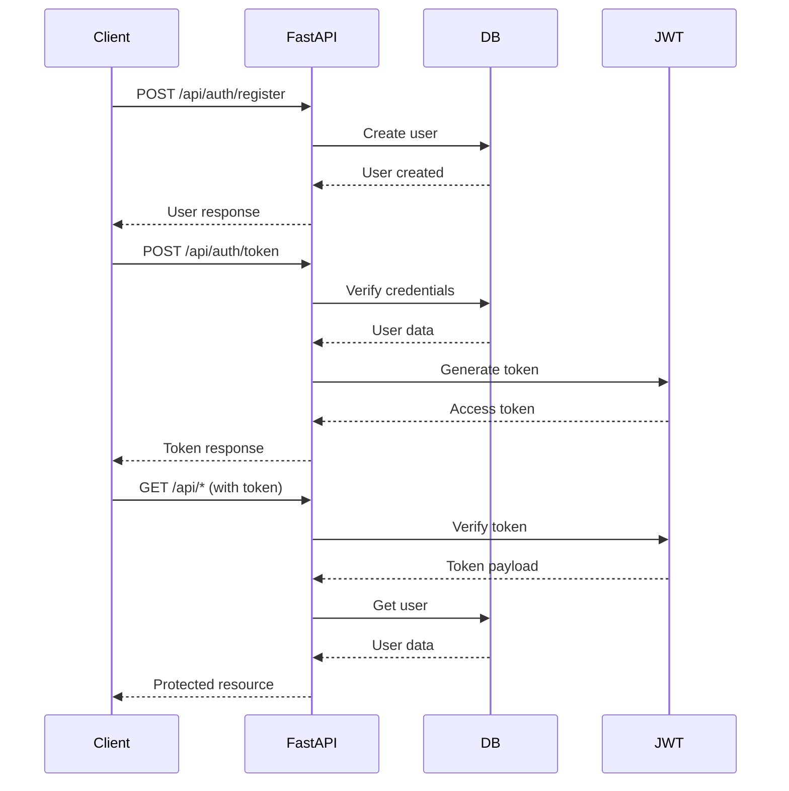

### Service Gateway Flow

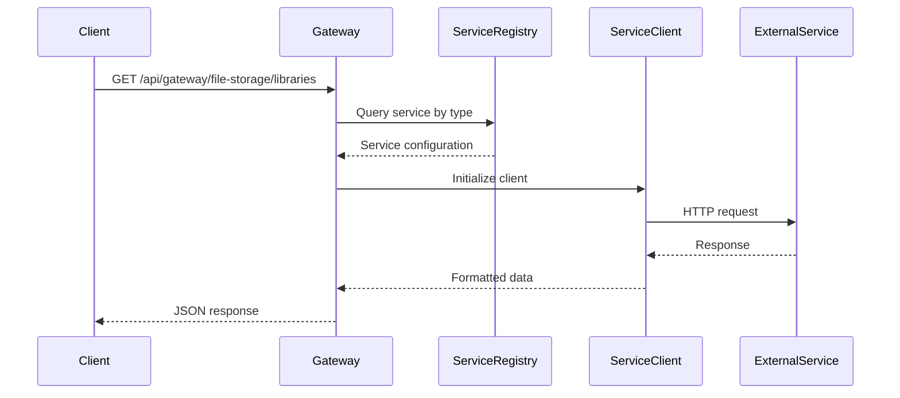

### Health Check Flow

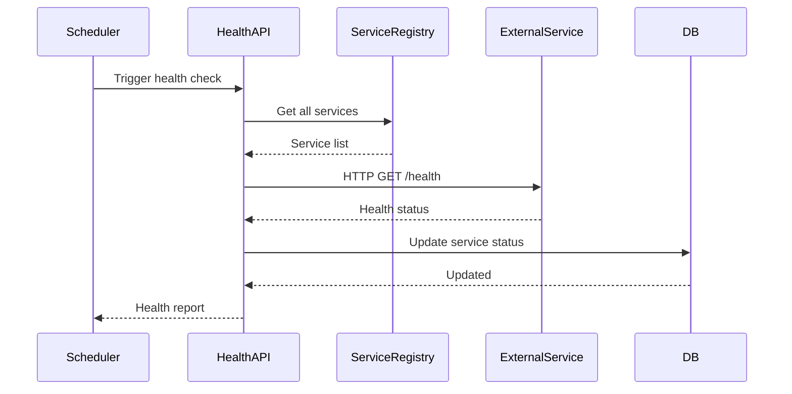

## Service Integration Pattern

All service clients follow a consistent pattern:

1. **Configuration** - Load from environment or config file
2. **Context Manager** - Async context manager for HTTP session
3. **Ping Method** - Health check capability
4. **API Methods** - Service-specific operations
5. **Error Handling** - Graceful failure handling

## Security Architecture

### Authentication
- JWT tokens with configurable expiration
- Bcrypt password hashing with salt
- OAuth2 password flow
- Token-based API authentication

### Authorization
- Role-based access control (admin/user)
- Protected endpoints require authentication
- Admin-only operations enforced

### Data Protection
- Service auth tokens stored in database
- HTTPS recommended for production
- CORS configuration for API access

## Deployment Architecture

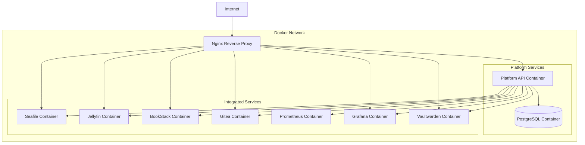

## Scalability Considerations

- **Horizontal Scaling**: Stateless API allows multiple instances
- **Database**: PostgreSQL supports connection pooling
- **Service Clients**: Async HTTP clients for concurrent requests
- **Caching**: Can be added for frequently accessed data
- **Load Balancing**: Nginx can distribute load across API instances

## Monitoring and Observability

- **Health Checks**: Built-in health monitoring for all services
- **Prometheus Integration**: Metrics collection capability
- **Grafana Integration**: Dashboard visualization
- **Logging**: Application logs for debugging
- **Error Tracking**: HTTP error responses with details

## Detailed Component Architecture

### FastAPI Application Structure

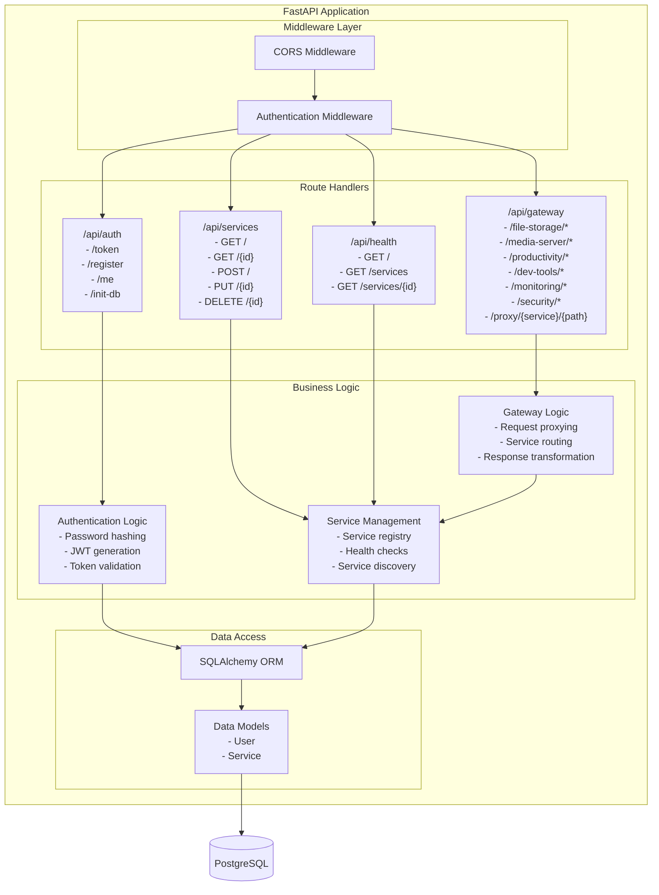

### Service Client Pattern

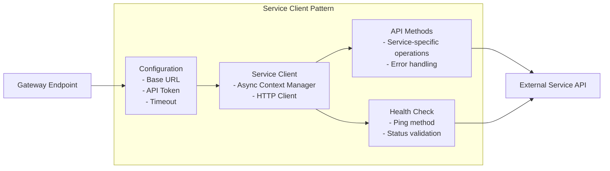

### Database Schema (ERD)

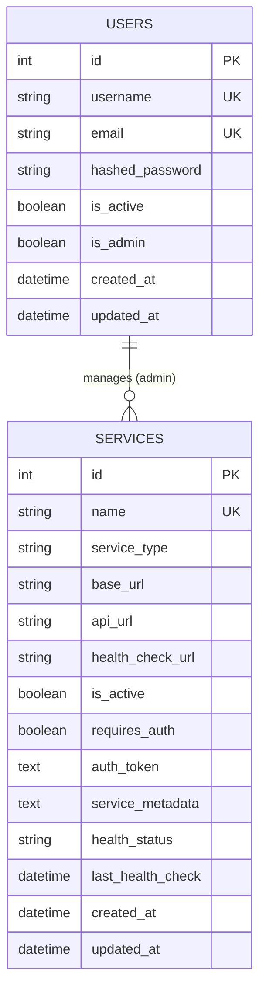

### Security Architecture Layers

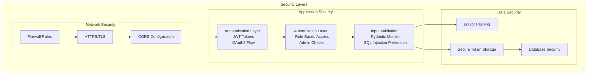

## Service Layer Architecture

### Service Integration Architecture

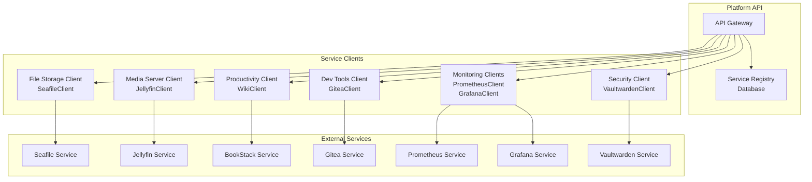

## Monitoring Architecture

### Observability Stack

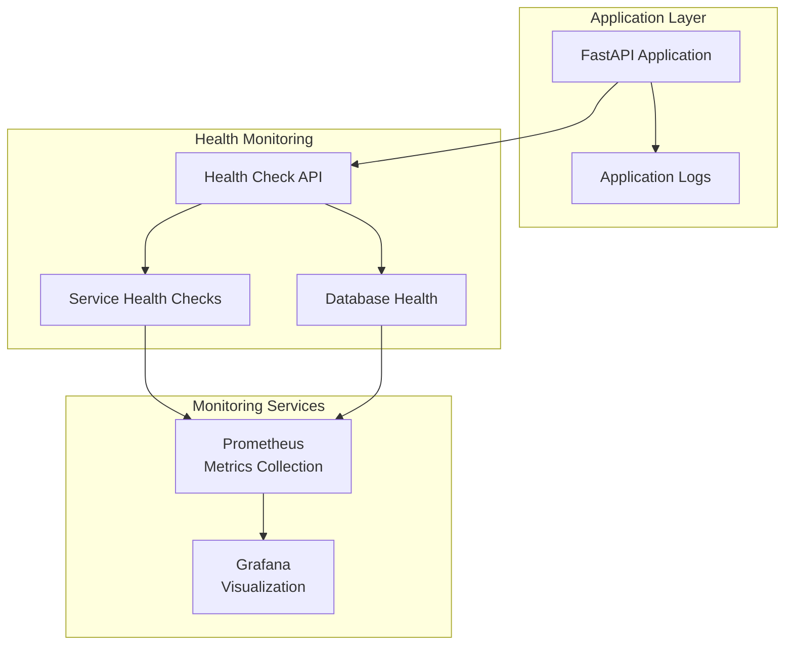

## Scalability Architecture

### Horizontal Scaling Design

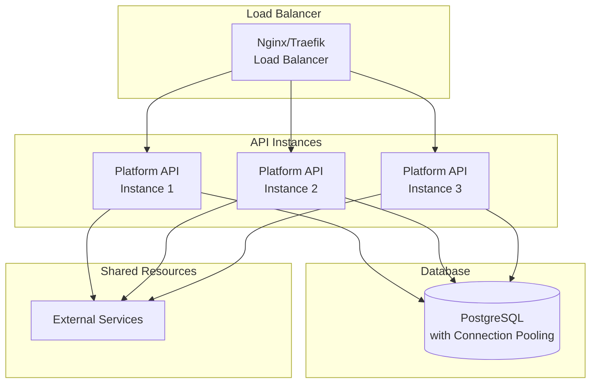

### Caching Strategy (Future)

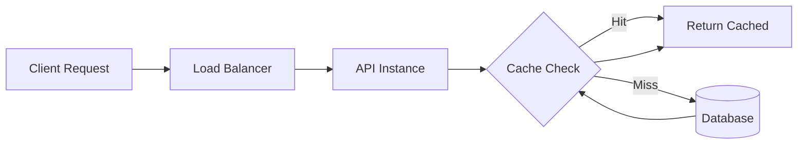

## Component Interaction Details

### Request Processing Flow

1. **Request Reception**: Nginx receives HTTP request
2. **Routing**: Nginx routes to appropriate upstream (Platform API or service)
3. **Authentication**: FastAPI middleware validates JWT token
4. **Authorization**: Check user permissions and roles
5. **Business Logic**: Execute route handler logic
6. **Data Access**: Query database via SQLAlchemy ORM
7. **Service Integration**: If gateway route, call service client
8. **Response**: Return JSON response to client

### Error Handling Architecture

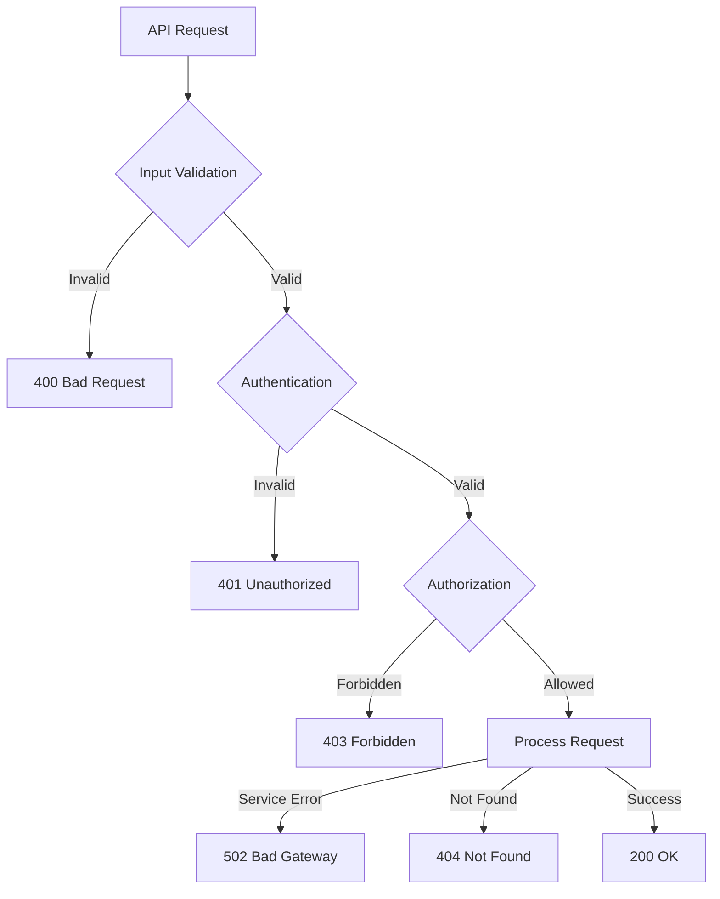

## Technology Stack

### Core Technologies

- **Framework**: FastAPI (Python 3.10+)
- **Database**: PostgreSQL 15+
- **ORM**: SQLAlchemy
- **Authentication**: JWT (JSON Web Tokens), OAuth2
- **Password Hashing**: bcrypt
- **HTTP Client**: httpx (async)
- **Reverse Proxy**: Nginx
- **Containerization**: Docker, Docker Compose

### Service Technologies

- **File Storage**: Seafile
- **Media Server**: Jellyfin
- **Wiki**: BookStack
- **Git Service**: Gitea
- **Monitoring**: Prometheus, Grafana
- **Password Manager**: Vaultwarden

## Future Enhancements

- Service discovery automation
- Rate limiting implementation
- Caching layer (Redis)
- WebSocket support for real-time updates
- Service mesh integration
- Multi-tenant support
- Advanced analytics and reporting
- Token refresh mechanism
- Audit logging system
- Automated backup system
