# Data Flow Documentation

## Overview

This document describes the detailed data flows and request processing sequences for the self-hosted platform integration system. It covers authentication, service requests, health checks, error handling, and gateway operations.

## Authentication Flow

### User Registration Flow

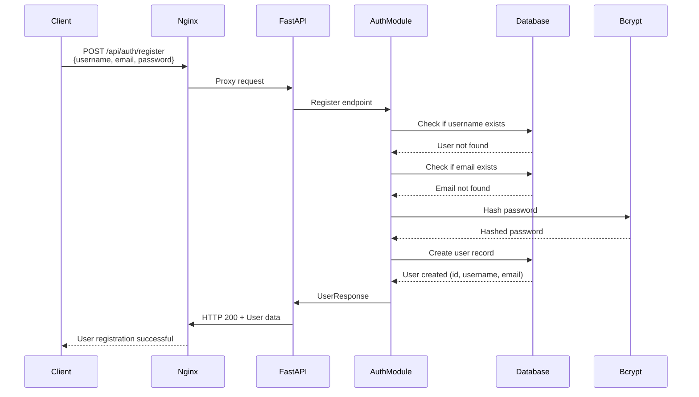

### User Login and Token Generation Flow

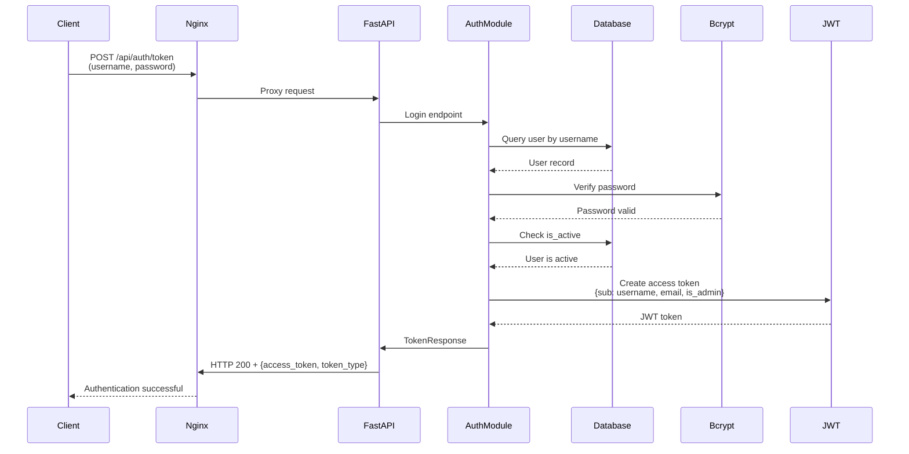

### Authenticated Request Flow

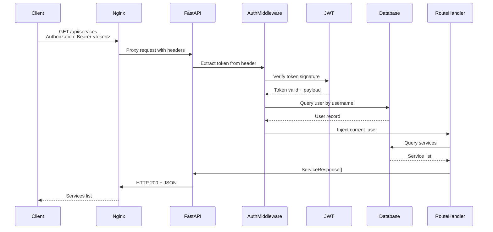

## Service Gateway Flow

### Service Request via Gateway

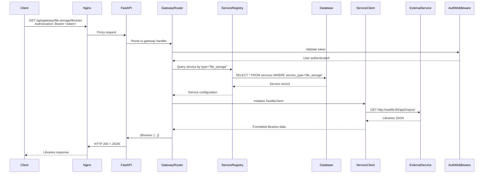

### Generic Proxy Request Flow

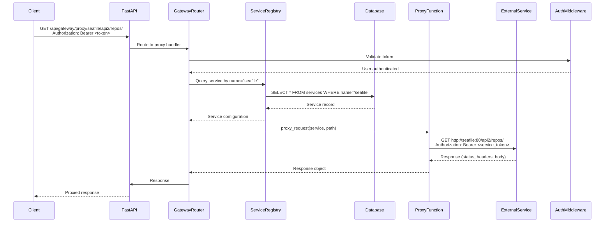

## Health Check Flow

### Service Health Check Flow

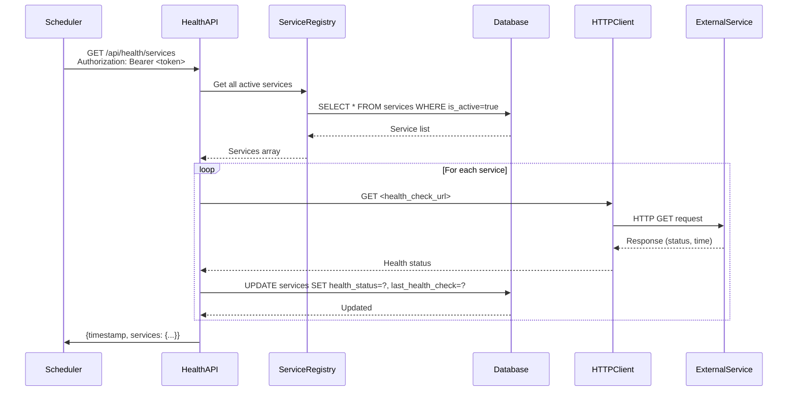

### Individual Service Health Check

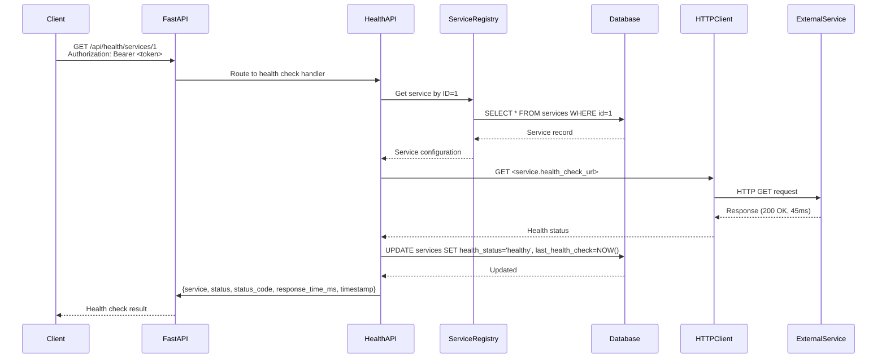

## Service Registration Flow

### Admin Service Registration

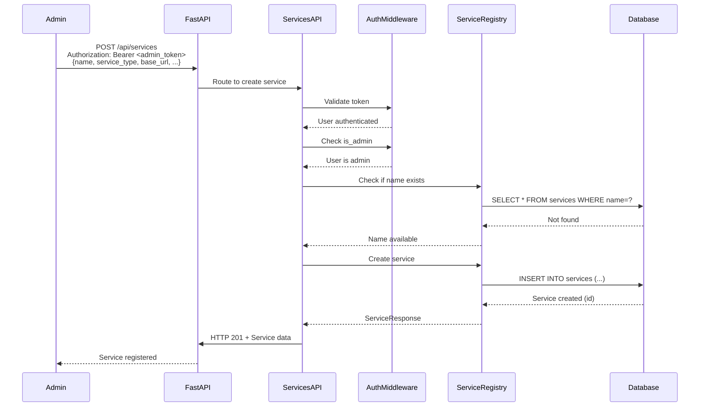

## Error Handling Flow

### Authentication Error Flow

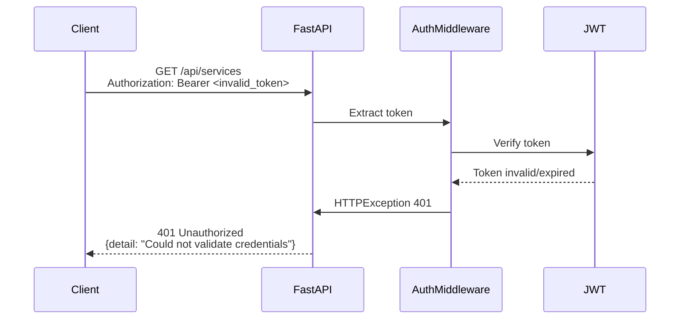

### Service Not Found Error Flow

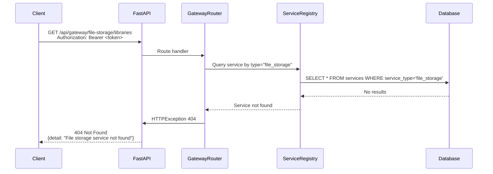

### Service Unavailable Error Flow

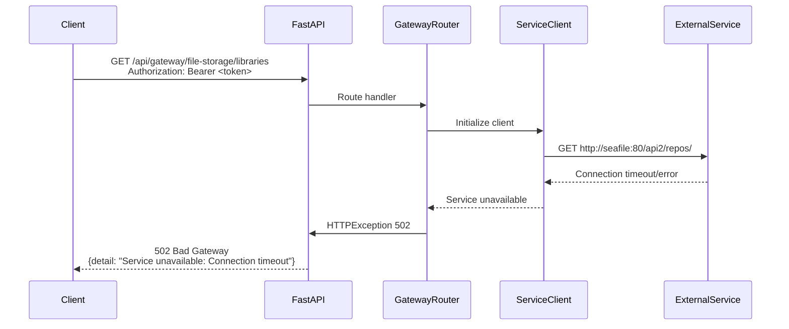

### Authorization Error Flow

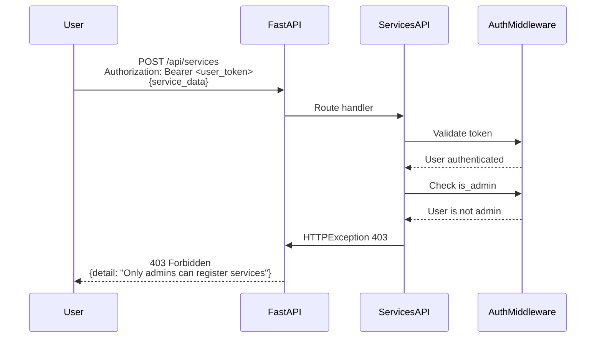

## Data Flow Patterns

### Read Operation Flow

1. **Request Reception**: Client sends HTTP GET request
2. **Authentication**: Token validated, user loaded
3. **Authorization**: Permissions checked
4. **Data Retrieval**: Query database or external service
5. **Response Formatting**: Data formatted as JSON
6. **Response**: HTTP 200 with JSON body

### Write Operation Flow

1. **Request Reception**: Client sends HTTP POST/PUT request
2. **Authentication**: Token validated, user loaded
3. **Authorization**: Permissions checked (admin for writes)
4. **Input Validation**: Pydantic model validation
5. **Business Logic**: Process request
6. **Data Persistence**: Write to database
7. **Response**: HTTP 201/200 with created/updated data

### Delete Operation Flow

1. **Request Reception**: Client sends HTTP DELETE request
2. **Authentication**: Token validated, user loaded
3. **Authorization**: Admin check
4. **Existence Check**: Verify resource exists
5. **Deletion**: Remove from database
6. **Response**: HTTP 204 No Content

## Request/Response Transformation

### Request Transformation

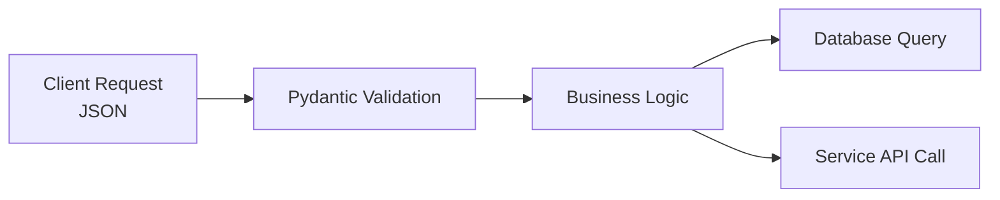

### Response Transformation

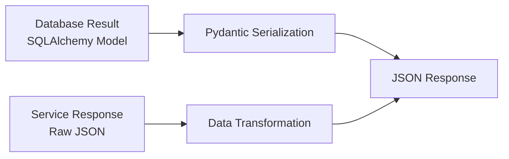

## Caching Flow (Future)

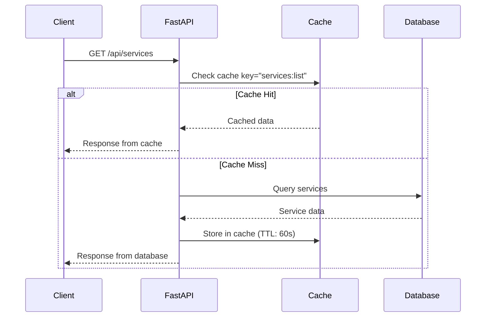

## Batch Operations Flow

### Bulk Health Check

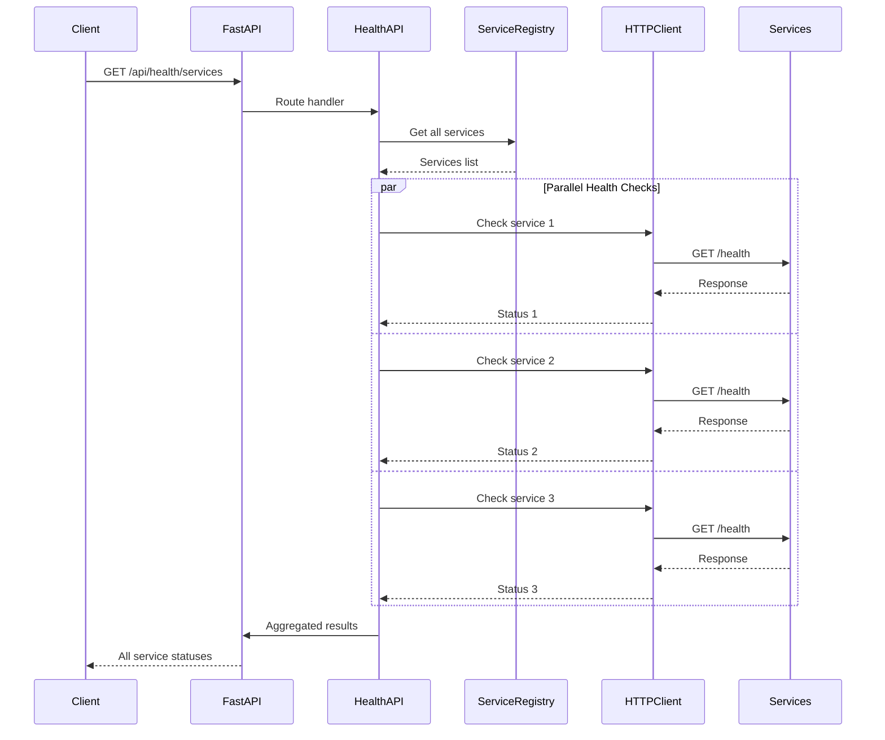

## See Also

- [Architecture Documentation](ARCHITECTURE.md) - System architecture overview
- [Service Integration Guide](SERVICE_INTEGRATION.md) - Service integration patterns
- [API Documentation](API.md) - API endpoint reference
