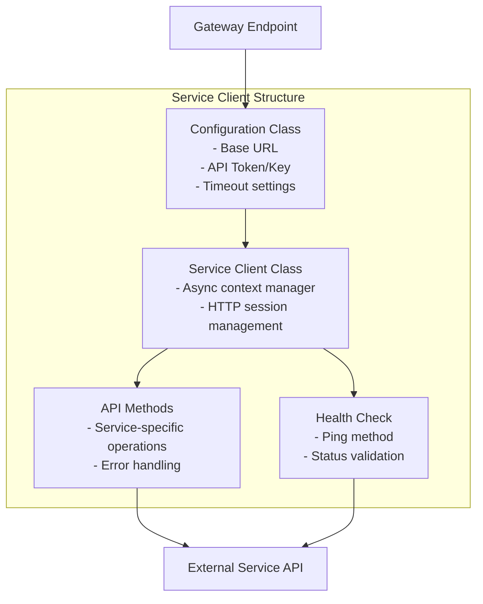
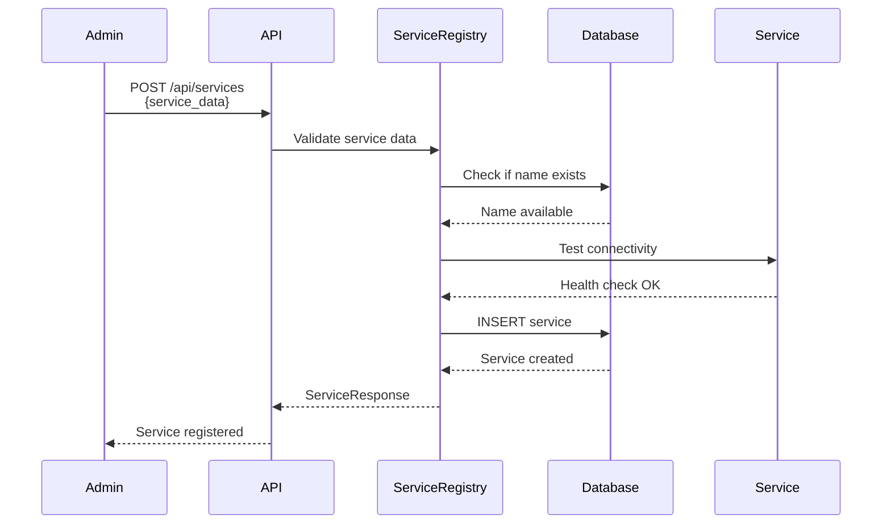

# Service Integration Documentation

## Overview

This document describes the service integration patterns, service client architecture, and provides a guide for adding new services to the platform.

## Service Integration Architecture

### Service Client Pattern

All service clients follow a consistent pattern for integration:



### Service Client Components

1. **Configuration Class** (`config.py`)
   - Loads settings from environment variables
   - Provides default values
   - Validates configuration

2. **Service Client Class** (`*_client.py`)
   - Async context manager for HTTP sessions
   - Base URL and authentication setup
   - Service-specific API methods
   - Health check capability

3. **Gateway Integration** (`app/api/gateway.py`)
   - Route handlers for service endpoints
   - Service registry lookup
   - Client instantiation and usage

## Service Client Pattern

### Standard Service Client Template

```python
"""Service API client."""

import httpx
from typing import Optional, Dict, List, Any
from services.service_name.config import ServiceConfig


class ServiceClient:
    """Client for interacting with Service API."""
    
    def __init__(self, config: Optional[ServiceConfig] = None):
        self.config = config or ServiceConfig()
        self.base_url = self.config.base_url.rstrip('/')
        self.api_token = self.config.api_token
        self._session: Optional[httpx.AsyncClient] = None
    
    async def __aenter__(self):
        """Async context manager entry."""
        headers = {}
        if self.api_token:
            headers["Authorization"] = f"Bearer {self.api_token}"
        
        self._session = httpx.AsyncClient(
            base_url=self.base_url,
            timeout=30.0,
            headers=headers
        )
        return self
    
    async def __aexit__(self, exc_type, exc_val, exc_tb):
        """Async context manager exit."""
        if self._session:
            await self._session.aclose()
    
    async def ping(self) -> bool:
        """Check if service is accessible."""
        try:
            async with httpx.AsyncClient(timeout=5.0) as client:
                response = await client.get(f"{self.base_url}/health")
                return response.status_code == 200
        except Exception:
            return False
    
    async def get_data(self) -> List[Dict[str, Any]]:
        """Get data from service."""
        if not self._session:
            async with self:
                return await self.get_data()
        
        try:
            response = await self._session.get("/api/endpoint")
            if response.status_code == 200:
                return response.json()
        except Exception:
            pass
        return []
```

### Configuration Pattern

```python
"""Service configuration."""

from pydantic_settings import BaseSettings
from typing import Optional


class ServiceConfig(BaseSettings):
    """Service configuration."""
    
    base_url: str = "http://service:8000"
    api_token: Optional[str] = None
    timeout: float = 30.0
    
    class Config:
        env_file = ".env"
        env_prefix = "SERVICE_"
```

## Existing Service Integrations

### File Storage - Seafile

**Location**: `services/file_storage/`

**Configuration**:
- `SEAFILE_URL`: Base URL (default: `http://seafile:8000`)
- `SEAFILE_API_TOKEN`: API authentication token

**Client Methods**:
- `ping()`: Health check
- `get_auth_token(username, password)`: Get authentication token
- `get_libraries()`: List all libraries
- `get_library_info(repo_id)`: Get library details
- `create_library(name, description)`: Create new library

**Gateway Endpoints**:
- `GET /api/gateway/file-storage/libraries`: List libraries

### Media Server - Jellyfin

**Location**: `services/media_server/`

**Configuration**:
- `JELLYFIN_URL`: Base URL (default: `http://jellyfin:8096`)
- `JELLYFIN_API_KEY`: API key for authentication

**Client Methods**:
- `ping()`: Health check
- `authenticate(username, password)`: Authenticate and get API key
- `get_server_info()`: Get server information
- `get_libraries()`: List media libraries
- `get_recent_items(limit)`: Get recently added items

**Gateway Endpoints**:
- `GET /api/gateway/media-server/libraries`: List libraries
- `GET /api/gateway/media-server/recent?limit=10`: Get recent items

### Productivity - BookStack

**Location**: `services/productivity/`

**Configuration**:
- `BOOKSTACK_URL`: Base URL
- `BOOKSTACK_API_TOKEN`: API token

**Client Methods**:
- `ping()`: Health check
- `get_pages()`: List pages

**Gateway Endpoints**:
- `GET /api/gateway/productivity/pages`: List pages

### Development Tools - Gitea

**Location**: `services/dev_tools/`

**Configuration**:
- `GITEA_URL`: Base URL (default: `http://gitea:3000`)
- `GITEA_API_TOKEN`: API token

**Client Methods**:
- `ping()`: Health check
- `get_repositories(page, limit)`: List repositories

**Gateway Endpoints**:
- `GET /api/gateway/dev-tools/repositories?page=1&limit=20`: List repositories

### Monitoring - Prometheus

**Location**: `services/monitoring/prometheus_client.py`

**Configuration**:
- `PROMETHEUS_URL`: Base URL (default: `http://prometheus:9090`)

**Client Methods**:
- `ping()`: Health check
- `query(promql)`: Execute PromQL query
- `list_metrics()`: List available metrics

**Gateway Endpoints**:
- `GET /api/gateway/monitoring/metrics?query=up`: Query metrics

### Monitoring - Grafana

**Location**: `services/monitoring/grafana_client.py`

**Configuration**:
- `GRAFANA_URL`: Base URL (default: `http://grafana:3000`)
- `GRAFANA_USERNAME`: Username
- `GRAFANA_PASSWORD`: Password

**Client Methods**:
- `ping()`: Health check
- `get_dashboards()`: List dashboards

**Gateway Endpoints**:
- `GET /api/gateway/monitoring/dashboards`: List dashboards

### Security - Vaultwarden

**Location**: `services/security/`

**Configuration**:
- `VAULTWARDEN_URL`: Base URL (default: `http://vaultwarden:80`)
- `VAULTWARDEN_ADMIN_TOKEN`: Admin token

**Client Methods**:
- `ping()`: Health check
- `get_stats()`: Get statistics (admin only)

**Gateway Endpoints**:
- `GET /api/gateway/security/stats`: Get statistics (admin only)

## Adding a New Service

### Step 1: Create Service Directory Structure

```bash
mkdir -p services/new_service
touch services/new_service/__init__.py
touch services/new_service/config.py
touch services/new_service/new_service_client.py
```

### Step 2: Create Configuration Class

Create `services/new_service/config.py`:

```python
"""New Service configuration."""

from pydantic_settings import BaseSettings
from typing import Optional


class NewServiceConfig(BaseSettings):
    """New Service configuration."""
    
    base_url: str = "http://new-service:8000"
    api_token: Optional[str] = None
    timeout: float = 30.0
    
    class Config:
        env_file = ".env"
        env_prefix = "NEW_SERVICE_"
```

### Step 3: Create Service Client

Create `services/new_service/new_service_client.py`:

```python
"""New Service API client."""

import httpx
from typing import Optional, Dict, List, Any
from services.new_service.config import NewServiceConfig


class NewServiceClient:
    """Client for interacting with New Service API."""
    
    def __init__(self, config: Optional[NewServiceConfig] = None):
        self.config = config or NewServiceConfig()
        self.base_url = self.config.base_url.rstrip('/')
        self.api_token = self.config.api_token
        self._session: Optional[httpx.AsyncClient] = None
    
    async def __aenter__(self):
        """Async context manager entry."""
        headers = {}
        if self.api_token:
            headers["Authorization"] = f"Bearer {self.api_token}"
        
        self._session = httpx.AsyncClient(
            base_url=self.base_url,
            timeout=self.config.timeout,
            headers=headers
        )
        return self
    
    async def __aexit__(self, exc_type, exc_val, exc_tb):
        """Async context manager exit."""
        if self._session:
            await self._session.aclose()
    
    async def ping(self) -> bool:
        """Check if service is accessible."""
        try:
            async with httpx.AsyncClient(timeout=5.0) as client:
                response = await client.get(f"{self.base_url}/health")
                return response.status_code == 200
        except Exception:
            return False
    
    async def get_items(self) -> List[Dict[str, Any]]:
        """Get items from service."""
        if not self._session:
            async with self:
                return await self.get_items()
        
        try:
            response = await self._session.get("/api/items")
            if response.status_code == 200:
                return response.json()
        except Exception as e:
            print(f"Error getting items: {e}")
        return []
```

### Step 4: Add Gateway Routes

Add routes to `app/api/gateway.py`:

```python
from services.new_service.new_service_client import NewServiceClient

@router.get("/new-service/items")
async def get_new_service_items(
    current_user: User = Depends(get_current_user),
    db: Session = Depends(get_db)
):
    """Get items from new service."""
    service = db.query(Service).filter(
        Service.service_type == "new_service",
        Service.is_active == True
    ).first()
    
    if not service:
        raise HTTPException(status_code=404, detail="New service not found")
    
    async with NewServiceClient() as client:
        items = await client.get_items()
        return {"items": items}
```

### Step 5: Update Configuration

Add environment variables to `.env.example`:

```bash
# New Service Configuration
NEW_SERVICE_URL=http://new-service:8000
NEW_SERVICE_API_TOKEN=your-token-here
```

### Step 6: Update Docker Compose

Add service to `docker-compose.yml`:

```yaml
new-service:
  image: new-service:latest
  container_name: platform-new-service
  environment:
    - SERVICE_CONFIG=value
  volumes:
    - new_service_data:/data
  ports:
    - "8003:8000"
  networks:
    - platform-network

volumes:
  new_service_data:
```

### Step 7: Update Nginx Configuration

Add routing to `nginx/nginx.conf`:

```nginx
upstream new-service {
    server new-service:8000;
}

location /new-service {
    rewrite ^/new-service(/.*)$ $1 break;
    proxy_pass http://new-service;
    proxy_set_header Host $host;
    proxy_set_header X-Real-IP $remote_addr;
    proxy_set_header X-Forwarded-For $proxy_add_x_forwarded_for;
    proxy_set_header X-Forwarded-Proto $scheme;
    proxy_set_header X-Forwarded-Host $host;
    proxy_redirect off;
}
```

### Step 8: Register Service

Register the service via API or script:

```bash
# Get admin token
TOKEN=$(curl -X POST http://localhost:8000/api/auth/token \
  -d "username=admin&password=password" | jq -r '.access_token')

# Register service
curl -X POST http://localhost:8000/api/services \
  -H "Authorization: Bearer $TOKEN" \
  -H "Content-Type: application/json" \
  -d '{
    "name": "new-service",
    "service_type": "new_service",
    "base_url": "http://new-service:8000",
    "api_url": "http://new-service:8000/api",
    "health_check_url": "http://new-service:8000/health",
    "requires_auth": true,
    "auth_token": "your-token-here"
  }'
```

### Step 9: Add Tests

Create test file `tests/unit/test_new_service_client.py`:

```python
"""Tests for New Service client."""

import pytest
from services.new_service.new_service_client import NewServiceClient
from services.new_service.config import NewServiceConfig


@pytest.mark.unit
class TestNewServiceClient:
    """Test New Service client."""
    
    def test_client_initialization(self):
        """Test client initialization."""
        client = NewServiceClient()
        assert client.base_url == "http://new-service:8000"
    
    @pytest.mark.asyncio
    async def test_ping(self):
        """Test ping method."""
        client = NewServiceClient()
        # Mock HTTP response
        result = await client.ping()
        assert isinstance(result, bool)
```

## Service Registration Flow

### Service Registration Process



### Service Discovery

Services are discovered through the service registry:

1. **By Service Type**: Query services by `service_type`
   ```python
   service = db.query(Service).filter(
       Service.service_type == "file_storage",
       Service.is_active == True
   ).first()
   ```

2. **By Service Name**: Query services by `name`
   ```python
   service = db.query(Service).filter(
       Service.name == "seafile",
       Service.is_active == True
   ).first()
   ```

3. **By ID**: Query service by primary key
   ```python
   service = db.query(Service).filter(Service.id == service_id).first()
   ```

## Service Health Check Patterns

### Health Check Implementation

All service clients should implement a `ping()` method:

```python
async def ping(self) -> bool:
    """Check if service is accessible."""
    try:
        async with httpx.AsyncClient(timeout=5.0) as client:
            response = await client.get(f"{self.base_url}/health")
            return response.status_code == 200
    except Exception:
        return False
```

### Health Check Endpoints

Common health check endpoints:
- `/health` - Standard health endpoint
- `/api/health` - API health endpoint
- `/ping` - Simple ping endpoint
- `/api2/ping/` - Service-specific endpoint (Seafile)

### Health Status Values

- `healthy`: Service is responding correctly
- `unhealthy`: Service is not responding or returning errors
- `unknown`: Health status not yet checked

## Service Authentication Patterns

### Token-Based Authentication

Most services use token-based authentication:

```python
headers = {
    "Authorization": f"Bearer {self.api_token}"
}
```

### API Key Authentication

Some services use API keys in headers:

```python
headers = {
    "X-API-Key": self.api_key
}
```

### Custom Authentication

Some services require custom headers:

```python
# Jellyfin example
headers = {
    "X-Emby-Authorization": "MediaBrowser Client=\"Platform\"...",
    "X-Emby-Token": self.api_key
}
```

## Error Handling Patterns

### Service Client Error Handling

```python
async def get_data(self) -> List[Dict[str, Any]]:
    """Get data with error handling."""
    if not self._session:
        async with self:
            return await self.get_data()
    
    try:
        response = await self._session.get("/api/endpoint")
        response.raise_for_status()  # Raise on HTTP errors
        return response.json()
    except httpx.HTTPStatusError as e:
        print(f"HTTP error: {e.response.status_code}")
        return []
    except httpx.RequestError as e:
        print(f"Request error: {e}")
        return []
    except Exception as e:
        print(f"Unexpected error: {e}")
        return []
```

### Gateway Error Handling

```python
@router.get("/service/endpoint")
async def get_service_data(
    current_user: User = Depends(get_current_user),
    db: Session = Depends(get_db)
):
    """Get service data with error handling."""
    service = db.query(Service).filter(
        Service.service_type == "service_type",
        Service.is_active == True
    ).first()
    
    if not service:
        raise HTTPException(status_code=404, detail="Service not found")
    
    try:
        async with ServiceClient() as client:
            data = await client.get_data()
            return {"data": data}
    except httpx.RequestError as e:
        raise HTTPException(
            status_code=502,
            detail=f"Service unavailable: {str(e)}"
        )
```

## Best Practices

### 1. Use Async Context Managers

Always use async context managers for HTTP sessions:

```python
async with ServiceClient() as client:
    data = await client.get_data()
```

### 2. Implement Health Checks

All services should have a `ping()` method for health checks.

### 3. Handle Errors Gracefully

Return empty lists/None instead of raising exceptions in client methods.

### 4. Use Configuration Classes

Load configuration from environment variables using Pydantic.

### 5. Set Appropriate Timeouts

- Health checks: 5 seconds
- API requests: 30 seconds
- Long operations: Configure per service

### 6. Log Errors

Log errors for debugging but don't expose internal details to clients.

### 7. Validate Service Availability

Check service exists and is active before making requests.

## Testing Service Clients

### Unit Tests

```python
@pytest.mark.unit
class TestServiceClient:
    """Test service client."""
    
    @pytest.mark.asyncio
    async def test_ping_success(self, mock_httpx):
        """Test successful ping."""
        mock_httpx.get.return_value.status_code = 200
        client = ServiceClient()
        result = await client.ping()
        assert result is True
    
    @pytest.mark.asyncio
    async def test_ping_failure(self, mock_httpx):
        """Test failed ping."""
        mock_httpx.get.side_effect = Exception()
        client = ServiceClient()
        result = await client.ping()
        assert result is False
```

## See Also

- [Architecture Documentation](ARCHITECTURE.md) - System architecture
- [Data Flow Documentation](DATA_FLOW.md) - Request flow patterns
- [API Documentation](API.md) - Gateway API endpoints
- [Development Guide](DEVELOPMENT.md) - Development setup