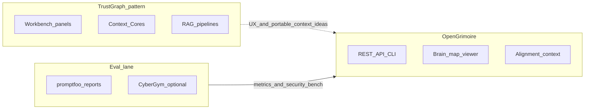

# External repos landscape — brainstorm (2026-03-23)

Canonical copy of the **repo landscape reflection** material: alignment matrix, diagram, assimilation, execution notes, and process transparency. The originating plan is `D:/software/.cursor/plans/repo_landscape_reflection_0a147e4f.plan.md` (do not treat this file as a substitute for git history of that plan).

---

## Transparency — what was efficient vs what was deferred

**Why things felt “thin” in the middle of the workflow**

- **MCP instability:** `scp_inspect` / `fetch_youtube_captions` sometimes aborted in the IDE, so work switched to **local Python** (`local-proto` + `scp` package). Same policy, different transport — easy to lose that detail in summaries.
- **README text:** The SCP combine used **short curated bullets** per repo (not full READMEs). Full upstream READMEs live on GitHub; reproducing them verbatim would bloat archives and duplicate licensing concerns. The **four-column matrix below** is the intended semantic capture.
- **One vault note vs “one note per repo”:** The plan allowed either; implementation used **one note + this brainstorm** to avoid six stubs with repeated SCP boilerplate. Per-repo nuance is in the matrix rows.
- **YouTube row in the matrix** originally said “unknown without transcript.” After captions + dedupe, the video is a **TrustGraph-style demo** (London pubs/restaurants context graph, explanability, natural-language queries such as craft beer / pubs). That **post-transcript update** is spelled out below so the matrix and reality stay aligned.

**Feedback to close the gap**

- Treat **this document** + `repo_landscape_scp_run.json` + `dedupe_landscape_transcript.py` as the **traceable bundle** for “what we ran and why.”
- When something must match Git **exactly**, diff against the plan file and upstream repos; do not rely on chat summaries alone.

---

## What

Structured comparison of TrustGraph, CyberGym, GSD, learn-claude-code, MoneyPrinterV2, and Maestro against OpenGrimoire / OpenHarness / local-proto intent, plus SCP-then-archive workflow for third-party text and YouTube transcripts.

## Why

- Borrow **UX and information architecture** (TrustGraph Workbench) without forking their stack.
- Separate **LLM output eval** (promptfoo trajectory, incl. DECIDE-SIM follow-on plans) from **agent security eval** (CyberGym) with clear CI boundaries.
- Bridge **GSD** and **learn-claude-code** into thin OpenHarness skills instead of duplicating upstream CLIs.

---

## Constraints (from original plan session)

- Third-party README excerpts and transcripts are **untrusted** at the harness boundary: use `scp_run_pipeline(content, sink='llm_context')` or the chain in `D:/portfolio-harness/OpenGrimoire/docs/agent/SCP_LLM_INGESTION_CHECKLIST.md` before LLM ingest or durable archive.
- **Operational note:** If MCP SCP/caption tools fail, run the same pipeline locally (`D:/scp/src`, `D:/local-proto/scripts/ai_trends_mcp.py`, `D:/software/docs/research/dedupe_landscape_transcript.py`).

---

## Full alignment matrix (from plan)

| Source | Core idea | Fits your intent | Contrast / risk |
|--------|-----------|------------------|-----------------|
| [TrustGraph](https://github.com/trustgraph-ai/trustgraph) | Full “context platform”: multi-model store (Cassandra, Qdrant, Pulsar, RAG flows), **Workbench** UI (~8888), **Context Cores** (versioned portable bundles), MCP | Strong conceptual overlap with **context + retrieval + agents**. Ideas to **assimilate**: Context Core = pin/version/rollback for “what agents know”; workbench **surface areas** (vector search, graph viz, flows, runtime prompts, MCP tools panel) map to improving **OpenGrimoire GUI philosophy** (operator clarity, staged knowledge, inspectable graphs). | Not a drop-in: OpenGrimoire is **API/contract-first** (`OpenGrimoire/docs/agent/INTEGRATION_PATHS.md`); TrustGraph is an **entire infra product**. Prefer **patterns and UX**, not fork-the-stack, unless you explicitly want Cassandra/Qdrant/Pulsar. |
| YouTube (`watch?v=sWc7mkhITIo`) | *(Plan text: unknown without transcript.)* | *(Plan text: likely TrustGraph/marketing or UX — tie to Workbench inspiration after transcript.)* | *(Plan text: fetch captions, SCP, vault note.)* |
| [CyberGym](https://github.com/sunblaze-ucb/cybergym) | Large-scale **agent security eval** (real vulns, PoC server, Docker) | Aligns with **verifiable agent capability** and **security** posture; complements **promptfoo**-style LLM evals (see also `D:/software/.cursor/plans/decide-sim_harness_follow-on_8c9b784d.plan.md` pointing at OpenGrimoire static JSON / reports) | **Heavy assets** (~240GB dataset, large server data); integration = **optional CI lane** or **referenced benchmark**, not full data in-repo |
| [get-shit-done](https://github.com/gsd-build/get-shit-done) | **Spec-driven** loop: discuss → plan → execute (waves) → verify; `.planning/` artifacts; XML tasks; multi-runtime installer | **Philosophy matches** OpenHarness: verifiable work, phases, atomic commits, context hygiene — comparable to portfolio `HANDOFF_FLOW`, **planning** / **qa-verifier** skills, critic + intent gates | GSD is **Claude Code–centric commands**; OpenHarness is **repo rules + skills + CI alignment**. A **skill** should **bridge** (when to use GSD vs native planning), not duplicate 40k lines |
| [learn-claude-code](https://github.com/shareAI-lab/learn-claude-code) | Pedagogical **harness** (loop, tools, subagents, skills, tasks, teams) | Aligns with `openharness/.cursor/skills/agent-native-architecture/SKILL.md` and “harness not intelligence” narrative | Reference implementation for **teaching**; optional **thin skill** that points to sessions s01–s12 + your existing patterns |
| [MoneyPrinterV2](https://github.com/FujiwaraChoki/MoneyPrinterV2) | Social/automation tooling (Twitter, Shorts, affiliate, outreach) | **Low alignment** with OpenGrimoire/OpenHarness **unless** you explicitly build growth automation | **AGPL-3.0** — license contagion if copied; ToS/automation ethics; treat as **out-of-stack comparison** only |
| [Maestro](https://github.com/mobile-dev-inc/Maestro) | YAML **mobile/web E2E**, resilient flows | **Already reflected** in OpenGrimoire: Playwright = CI truth; Maestro = optional YAML smoke — `INTEGRATION_PATHS.md`, `ARCHITECTURE_REST_CONTRACT.md` | No change required unless you want **more** Maestro coverage; keep **Playwright** as gate |

### Post-transcript update (YouTube row)

After captions were fetched and deduped, the video content is consistent with a **TrustGraph / context graph** walkthrough: example graph built from London-area pubs, restaurants, and event spaces; **explanability** of answers; natural-language questions (e.g. where to drink craft beer). SCP pipeline: `blocked: false`; SCP **tier** `hostile_ux` (informal speech in transcript; still passes for `llm_context`). Artifacts: `D:/software/docs/research/repo_landscape_scp_run.json`, `dedupe_landscape_transcript.py`.

---

## Diagram (from plan)



---

## Recommended assimilation (what to actually do) — full text from plan

1. **TrustGraph → OpenGrimoire GUI**
   - Borrow **information architecture**: one place for search, graph/relationships, library/staging, flows, prompts/schemas — without adopting their full backend.
   - Treat **Context Core** as a product metaphor: versioned, portable bundles tied to your **alignment context** / brain-map story (fits human-gated autonomy in consuming repos’ `.cursorrules`).
2. **CyberGym + promptfoo**
   - **promptfoo:** continue the trajectory in your existing plan (static JSON / HTML reports, optional OpenGrimoire UI).
   - **CyberGym:** define a **narrow** integration: e.g. document as **security eval reference**, run subset tasks in isolated CI, or link from OpenGrimoire “agent capabilities” docs — **not** full dataset vendoring.
3. **GSD + learn-claude-code → skills (openharness + local-proto)**
   - Add **gsd-workflow** (or `spec-driven-planning`) skill: when to use GSD commands vs `/workflows:plan` / OpenHarness planning skill; pointer to install (`npx get-shit-done-cc`); alignment with **atomic commits**, **verification**, **critic JSON**.
   - Add **learn-claude-code-harness** (thin): links to shareAI-lab repo + mapping table (s01–s12 → skills: secure-contain-protect, planning, agent-native-architecture).
   - **local-proto:** mirror or symlink skill stubs under `local-proto` only if that repo has `.cursor/skills`; otherwise document cross-repo pointer — implemented as `D:/local-proto/.cursor/skills/README.md`.
4. **MoneyPrinterV2**
   - **Brief only**: contrast with your stacks (no social monetization core in OpenGrimoire); **do not** merge code without explicit product decision and license review.
5. **Maestro**
   - **Brief**: confirm current docs remain source of truth; expand Maestro flows only where Playwright does not cover mobile.

---

## Execution sequence (from plan)

1. **SCP:** Run pipeline on **curated excerpts** (README bullets per repo + YouTube transcript if fetched).
2. **Obsidian:** One note per repo (or one note with sections) with wikilinks; include **source URL**, **SCP tier summary**, **alignment bullets**, **open questions** — implemented as `D:/Arc_Forge/ObsidianVault/research/2026-03-23-external-repos-landscape.md` plus this brainstorm.
3. **Brainstorm doc:** this file — **What / Why / Key decisions / Open questions** per brainstorming command, plus full matrix.
4. **Skills:** Thin skills under `openharness/.cursor/skills/`; **security-audit-rules** on new `SKILL.md` before merge (portfolio `.cursorrules`).

---

## Actionable paths (briefing) — from plan

| Priority | Path |
|----------|------|
| High | **GUI roadmap** for OpenGrimoire inspired by TrustGraph Workbench (panels, staging, inspectable graph, runtime prompts) — design doc first, no backend swap. |
| High | **Eval stack**: unify promptfoo + (optional) CyberGym references in OpenGrimoire/harness docs and CI story; align with existing promptfoo/DECIDE-SIM plan. |
| Medium | **Skills**: `gsd-workflow` + `learn-claude-code-harness` in openharness; wire local-proto pointer if you add `.cursor` there. |
| Medium | **YouTube**: transcript + SCP + one “design insight” bullet in vault. |
| Low / caution | MoneyPrinterV2: **no integration** unless scope explicitly expands; AGPL and product mismatch. |
| Done | Maestro: **document as already integrated** optionally; no mandatory change. |

---

## Key decisions (short summary)

1. **TrustGraph:** Patterns and UX in `GUI_WORKBENCH_PRINCIPLES.md` — REST/API contract stays source of truth.
2. **CyberGym:** Optional reference / isolated CI lane — no full dataset vendoring (~240GB).
3. **GSD / learn-claude-code:** Skills in `openharness/.cursor/skills/`; `local-proto/.cursor/skills/README.md` pointer.
4. **MoneyPrinterV2:** Out-of-stack; AGPL — contrast only.
5. **Maestro:** Documented; Playwright remains merge gate.

---

## SCP + artifacts

- Combined curated README bullets + **deduped** YouTube transcript (`sWc7mkhITIo`): tag strip, word-level dedupe (~14.4k → ~4.7k words), then `scp.scp_utils.run_pipeline(..., sink="llm_context")` — **blocked: false**, **tier:** `hostile_ux` (benign transcript; registry match — still passes pipeline).
- Regenerate: `python D:/software/docs/research/dedupe_landscape_transcript.py` with `AI_TRENDS_DATA` set.
- Machine-readable summary: [repo_landscape_scp_run.json](../research/repo_landscape_scp_run.json).

---

## Open questions (merged: plan + session)

- **Obsidian vault path:** `obsidian_cursor_integration` vs Arc_Forge — confirm where archived notes should live for your daily workflow.
- **TrustGraph depth:** UX-only vs any pilot integration (e.g. read-only API comparison spike).
- **CyberGym:** documentation-only vs CI subset (cost/maintenance).
- **GSD:** global install for your machine vs project-local only.

---

## Plan critic JSON (reproduced from plan)

```json
{
  "pass": true,
  "score": 0.82,
  "issues": [
    {"type": "dependency", "detail": "SCP MCP failed in-session; operator must verify pipeline locally before Obsidian."},
    {"type": "scope", "detail": "TrustGraph full stack not recommended without explicit infra decision."},
    {"type": "license", "detail": "MoneyPrinterV2 AGPL requires explicit boundary if any code reuse."}
  ],
  "fixes": [
    {"action": "verify_scp", "detail": "Run scp_run_pipeline on archived excerpts before vault write."},
    {"action": "narrow_cybergym", "detail": "Start with docs + optional tiny CI subset, not full dataset."}
  ]
}
```

---

## Implemented artifacts (links)

| Artifact | Path |
|----------|------|
| OpenGrimoire GUI principles | `D:/portfolio-harness/OpenGrimoire/docs/GUI_WORKBENCH_PRINCIPLES.md` |
| Eval: promptfoo + CyberGym + CI | `D:/portfolio-harness/OpenGrimoire/docs/EVAL_PROMPTFOO_CYBERGYM.md` |
| Skill: GSD | `D:/openharness/.cursor/skills/gsd-workflow/SKILL.md` |
| Skill: learn-claude-code | `D:/openharness/.cursor/skills/learn-claude-code-harness/SKILL.md` |
| local-proto pointer | `D:/local-proto/.cursor/skills/README.md` |
| Obsidian archive | `D:/Arc_Forge/ObsidianVault/research/2026-03-23-external-repos-landscape.md` |
| SCP JSON | `D:/software/docs/research/repo_landscape_scp_run.json` |

---

## Links

- Plan (reference): `D:/software/.cursor/plans/repo_landscape_reflection_0a147e4f.plan.md`
- DECIDE-SIM / promptfoo follow-on (referenced in matrix): `D:/software/.cursor/plans/decide-sim_harness_follow-on_8c9b784d.plan.md`
- HANDOFF_FLOW (portfolio): `D:/portfolio-harness/.cursor/HANDOFF_FLOW.md`
- INTEGRATION_PATHS: `D:/portfolio-harness/OpenGrimoire/docs/agent/INTEGRATION_PATHS.md`
