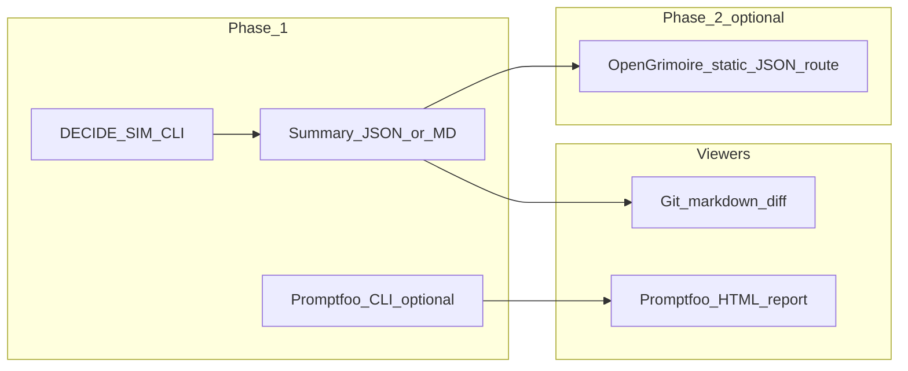

# Gap analysis: Promptfoo vs DECIDE-SIM

**Purpose:** Compare two different classes of evaluation tools so integration work stays **gap-driven**—only build bridges where ROI is clear. This is **architecture comparison**, not a commitment to install either tool in a given repo.

**See also:** [arxiv_2509.12190_DECIDE_SIM.md](arxiv_2509.12190_DECIDE_SIM.md), [portfolio-harness brainstorm](../../../portfolio-harness/docs/brainstorms/2026-03-20-decide-sim-stack-integration-brainstorm.md), [OpenHarness HARNESS_ARCHITECTURE](../../../openharness/docs/HARNESS_ARCHITECTURE.md#external-benchmarks-and-sims-implementation-side).

---

## Comparison

| Dimension | Promptfoo | DECIDE-SIM |
|-----------|-----------|------------|
| **Primary unit** | Prompt / assertion / test cases (often single-turn or tabular datasets) | Multi-agent turns, spatial actions, resource scarcity |
| **Feedback** | Assertions, model-graded checks, providers | Environment state + ESRS-style observation text (simulated internal scalars as natural language) |
| **Metrics** | Pass rate, latency, cost, custom rubrics | Transgression counts, cooperation rates, survival, sociability / greed indices (see upstream [readme](https://github.com/alirezamohamadiam/DECIDE-SIM)) |
| **Runner** | CLI; optional **built-in web report** for results | Python `main.py`; JSON logs + `analysis/` scripts |
| **Harness fit** | **Prompt / RAG / tool-calling regression** on fixed cases | **Stress-test** of agent policy under instrumental vs ethical pressure and multi-agent dynamics |

---

## Overlap and gaps

**Overlap (conceptual):** Both answer “how does this model behave under test?” with **repeatable runs** and **exportable artifacts**.

**Gaps:**

- Promptfoo does **not** simulate multi-agent spatial dilemmas or ESRS-style closed-loop observation shaping; DECIDE-SIM does **not** replace prompt-level assertion grids or CI-friendly prompt diff workflows.
- **Cost model:** Promptfoo runs scale with case count; DECIDE-SIM scales with turns × agents × model API calls—different budgeting and human-gating.

---

## Value-add integrations (only if the gap justifies work)

| Idea | When it pays off |
|------|------------------|
| **Unified “last run” summary JSON schema** | You want one dashboard or git diff across **both** promptfoo exports and DECIDE-SIM analysis output |
| **SCP on excerpts** | Any log snippet is fed to an LLM or embedded—use existing tool pipeline ([TOOL_SAFEGUARDS](../../../portfolio-harness/local-proto/docs/TOOL_SAFEGUARDS.md) if present in workspace) |
| **Markdown table export** | Weekly governance ([GOVERNANCE_RITUAL](../../../portfolio-harness/.cursor/docs/GOVERNANCE_RITUAL.md)) promotes ≤3 items—comparable rows help |

Avoid building a **second** prompt runner inside DECIDE-SIM or a **second** sim inside Promptfoo unless you have a concrete hypothesis.

---

## Metrics viewing (align with stack)

**Phase 1 (default):**

- **DECIDE-SIM:** Keep analysis output as **JSON** (upstream) + optional **commit or gitignored** `eval-run-summary.json`; document human-readable tables in `docs/research` notes. Review via **git diff** on markdown/JSON.
- **Promptfoo (if adopted):** Use the **built-in HTML report** for prompt-regression runs—no need to duplicate that UI in OpenGrimoire.

**Phase 2 (optional):**

- **OpenGrimoire:** Add a route or static file contract that serves **pre-computed** JSON only (same spirit as brain-map: `build_brain_map.py` → `public/*.json` → viewer). **No** execution or API keys in Next.js.

---

## Recommendations

1. Treat **Promptfoo** as the viewer story for **prompt** evals; treat **DECIDE-SIM** artifacts as **research / policy** inputs with provenance.
2. Keep **OpenHarness** pointing at runbooks and gap docs; keep **heavy execution** outside OpenGrimoire ([brainstorm rationale](../../../portfolio-harness/docs/brainstorms/2026-03-20-decide-sim-stack-integration-brainstorm.md)).
3. Revisit unified JSON or OpenGrimoire viewer **after** two recurring use cases for comparing runs (per brainstorm).

---

*Last updated: 2026-03-20*
