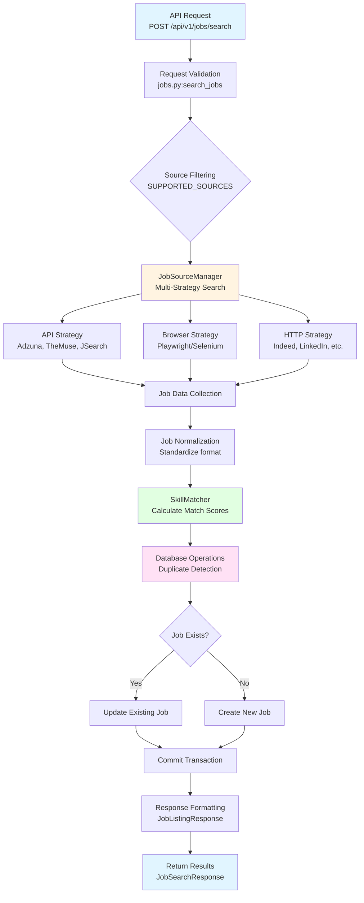

# Job Search Pipeline Flow Diagram

**Generated:** 2025-12-25 18:00:44

## Pipeline Overview

The job search pipeline processes requests from API endpoints through multiple stages to return matched and scored job listings.

## Flow Diagram



## Stage Descriptions

### 1. API Request Stage
- **Location:** `app/api/jobs.py:search_jobs`
- **Input:** `JobSearchRequest` (query, location, sources, limit, min_match_score)
- **Validation:** Source filtering, parameter validation
- **Output:** Filtered source list

### 2. JobSourceManager Stage
- **Location:** `app/services/job_source_manager.py`
- **Strategy:** Fallback chain (API → Browser → HTTP)
- **Sources:** Adzuna, TheMuse, JSearch, Indeed, LinkedIn, Glassdoor, ZipRecruiter
- **Output:** List of job dictionaries

### 3. SkillMatcher Stage
- **Location:** `app/services/skill_matcher.py`
- **Input:** Job descriptions, skill profile from database
- **Process:** 
  - Extract keywords and requirements
  - Match skills against profile
  - Calculate skill_match_score, experience_match_score, overall_match_score
- **Output:** Jobs with match scores (0.0-1.0)

### 4. Database Stage
- **Location:** `app/api/jobs.py` + `app/models/job_listing.py`
- **Process:**
  - Check for existing jobs (by source + source_id or title+company+url)
  - Create new job or update existing
  - Persist match scores, source attribution
  - Commit transaction
- **Output:** JobListing objects

### 5. Response Stage
- **Location:** `app/api/jobs.py`
- **Process:**
  - Filter by min_match_score
  - Format as JobListingResponse
  - Build JobSearchResponse with count and sources_searched
- **Output:** JSON response to client

## Data Flow

```
Request → Validation → Source Search → Normalization → Matching → Storage → Response
```

## Error Handling Points

1. **Source Failure:** Falls back to next strategy (API → Browser → HTTP)
2. **Matcher Failure:** Returns jobs without scores
3. **Database Failure:** Transaction rollback, returns partial results
4. **Validation Failure:** Returns error response immediately

## Key Components

- **JobSourceManager:** Orchestrates multi-source search with fallback
- **SkillMatcher:** Calculates relevance scores based on skill profile
- **Database Models:** JobListing, SkillProfile
- **API Schemas:** JobSearchRequest, JobSearchResponse, JobListingResponse

